## **TP-Report**

### **Universidad Peruana de Ciencias Aplicadas**

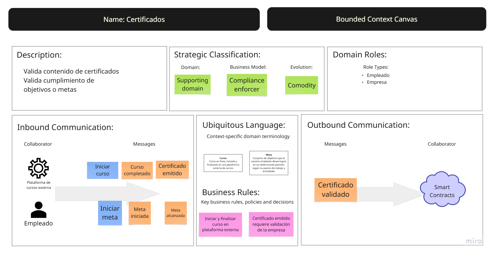

## 

#### **Ingeniería de Software**

# Arquitecturas De Software Emergentes

#### **Sección : 4281**

#### **Docente: Royer Edelwer Rojas Malasquez** 

#### **Informe TB2**

#### **Startup: TalentChain**

#### **Producto: SkillLedger**

### **Team Members**

\- Brayan Stiven Gamboa Delgado

\- Luiggi Jeremy Jouvenel Antonio Loayza

\- Rony Piero Ticona Luque

\- Luis Enrique Aquije Quiroga

\- Jorge Gerardo Quilla Luyo

2025

# Registro de Versiones del Informe

<table>
<colgroup>
<col style="width: 25%" />
<col style="width: 25%" />
<col style="width: 25%" />
<col style="width: 25%" />
</colgroup>
<thead>
<tr>
<th style="text-align: left;">Versión</th>
<th style="text-align: left;">Fecha</th>
<th style="text-align: left;">Autor</th>
<th style="text-align: left;">Descripción de modificación</th>
</tr>
<tr>
<th style="text-align: left;">0.1</th>
<th style="text-align: left;">21/04/2025</th>
<th>Rony Ticona</th>
<th style="text-align: left;">Diseño de Entrevista</th>
</tr>
<tr>
<th style="text-align: left;">0.2</th>
<th style="text-align: left;">22/04/2025</th>
<th>Rony Ticona</th>
<th style="text-align: left;">Registro de Entrevista segmento
Empresa</th>
</tr>
<tr>
<th style="text-align: left;">0.3</th>
<th style="text-align: left;">23/04/2025</th>
<th style="text-align: left;">Jorge Quilla</th>
<th>Registro de entrevistas Segmento Trabajador</th>
</tr>
<tr>
<th style="text-align: left;">0.4</th>
<th style="text-align: left;">23/04/2025</th>
<th>Jorge Quilla</th>
<th>Strategic-Level: Attribute-Driven Design y Domain-Driven Design</th>
</tr>
<tr>
<th style="text-align: left;">0.5</th>
<th style="text-align: left;">23/04/2025</th>
<th>Rony Ticona</th>
<th style="text-align: left;">User Persona y User Task Matrix</th>
</tr>
<tr>
<th style="text-align: left;">0.6</th>
<th style="text-align: left;">23/04/2025</th>
<th>Rony Ticona</th>
<th style="text-align: left;">Empathy mapping</th>
</tr>
<tr>
<th style="text-align: left;">0.7</th>
<th style="text-align: left;">23/04/2025</th>
<th>Brayan Gamboa</th>
<th style="text-align: left;">Software Architecture</th>
</tr>
<tr>
<th style="text-align: left;">0.8</th>
<th style="text-align: left;">23/04/2025</th>
<th>Jeremy Antonio</th>
<th style="text-align: left;">Capítulo 1, As Is, To be y revisión del
informe</th>
</tr>
<tr>
<th style="text-align: left;">0.9</th>
<th style="text-align: left;">23/04/2025</th>
<th>Luis Aquije</th>
<th style="text-align: left;">User Stories y Product Backlog</th>
</tr>
<tr>
<th style="text-align: left;">1.0</th>
<th style="text-align: left;">25/04/2025</th>
<th>Rony Ticona</th>
<th style="text-align: left;">Conclusiones</th>
</tr>
<tr>
<th style="text-align: left;">1.1</th>
<th style="text-align: left;">14/05/2025</th>
<th>Jorge Quilla</th>
<th style="text-align: left;">Bounded Context 1-3</th>
</tr>
<tr>
<th style="text-align: left;">1.2</th>
<th style="text-align: left;">14/05/2025</th>
<th>Brayan Gamboa</th>
<th style="text-align: left;">Bounded Context 4-6</th>
</tr>
<tr>
<th style="text-align: left;">1.3</th>
<th style="text-align: left;">14/05/2025</th>
<th>Luis Aquije</th>
<th style="text-align: left;">
Style Guidelines

Information Architecture
</th>
</tr>
<tr>
<th style="text-align: left;">1.4</th>
<th style="text-align: left;">14/05/2025</th>
<th>Jeremy Antonio</th>
<th style="text-align: left;">
Landing Page UI Design

Web Application Wireframes
</th>
</tr>
<tr>
<th style="text-align: left;">2.0</th>
<th style="text-align: left;">14/05/2025</th>
<th>Rony Ticona</th>
<th style="text-align: left;">Web Application Wireflow Diagrams</th>
</tr>
<tr>
<th style="text-align: left;">2.1</th>
<th style="text-align: left;">21/06</th>
<th>Jorge Quilla</th>
<th style="text-align: left;">Api Rest</th>
</tr>
<tr>
<th style="text-align: left;">2.2</th>
<th style="text-align: left;">21/06</th>
<th>Brayan Gamboa</th>
<th style="text-align: left;">Web Application</th>
</tr>
<tr>
<th style="text-align: left;">2.3</th>
<th style="text-align: left;">21/06</th>
<th>Luis Aquije</th>
<th style="text-align: left;">Api Rest</th>
</tr>
<tr>
<th style="text-align: left;">2.4</th>
<th style="text-align: left;">21/06</th>
<th>Jeremy Antonio</th>
<th style="text-align: left;">UX/UI Design</th>
</tr>
<tr>
<th style="text-align: left;">3.0</th>
<th style="text-align: left;">21/06</th>
<th>Rony Ticona</th>
<th style="text-align: left;">UX/UI Design</th>
</tr>
</thead>
<tbody>
</tbody>
</table>

# Project Report Collaboration Insights

# Contenido

[**Student Outcome 7**](#student-outcome)

[**Capítulo I: Introducción 11**](#capítulo-i-introducción)

> [1.1. Startup Profile 11](#startup-profile)
>
> [1.1.1. Descripción de la Startup 11](#descripción-de-la-startup)
>
> [1.2.1 Antecedentes y problemática 14](#antecedentes-y-problemática)
>
> [1.2.2 Lean UX Process 16](#lean-ux-process)
>
> [1.3. Segmentos objetivos 20](#segmentos-objetivos)

[**Capítulo II: Requirements Elicitation & Analysis
20**](#capítulo-ii-requirements-elicitation-analysis)

> [2.1. Competidores 20](#competidores)
>
> [2.1.1. Análisis competitivo 20](#análisis-competitivo)
>
> [2.1.2. Estrategias y tácticas frente a competidores
> 24](#estrategias-y-tácticas-frente-a-competidores)
>
> [2.2. Entrevistas 25](#entrevistas)
>
> [2.2.1. Diseño de entrevistas 25](#diseño-de-entrevistas)
>
> [2.2.2. Registro de entrevistas 27](#registro-de-entrevistas)
>
> [2.2.3. Análisis de entrevistas 30](#análisis-de-entrevistas)
>
> [2.3. Needfinding 32](#needfinding)
>
> [2.3.1. User Personas 32](#user-personas)
>
> [2.3.2. User Task Matrix 34](#user-task-matrix)
>
> [2.3.3. Empathy Mapping 35](#empathy-mapping)
>
> [2.3.4. As-is Scenario Mapping 37](#as-is-scenario-mapping)
>
> [2.4. Ubiquitous Language 38](#ubiquitous-language)

[**Capítulo III: Requirements Specification
40**](#capítulo-iii-requirements-specification)

> [3.1. To-Be Scenario Mapping 40](#to-be-scenario-mapping)
>
> [3.2. User Stories 41](#user-stories)
>
> [3.3. Impact Mapping 43](#impact-mapping)
>
> [3.4. Product Backlog 45](#product-backlog)

[**Capítulo IV: Strategic-Level Software Design
48**](#capítulo-iv-strategic-level-software-design)

> [4.1. Strategic-Level Attribute-Driven Design
> 48](#strategic-level-attribute-driven-design)
>
> [4.1.1. Design Purpose 48](#design-purpose)
>
> [4.1.2. Attribute-Driven Design Inputs
> 49](#attribute-driven-design-inputs)
>
> [4.1.2.1. Primary Functionality (Primary User Stories)
> 49](#primary-functionality-primary-user-stories)
>
> [4.1.2.2. Quality attribute Scenarios
> 51](#quality-attribute-scenarios)
>
> [4.1.2.3. Constraints 53](#constraints)
>
> [4.1.3. Architectural Drivers Backlog
> 55](#architectural-drivers-backlog)
>
> [4.1.4. Architectural Design Decisions
> 56](#architectural-design-decisions)
>
> [4.1.5. Quality Attribute Scenario Refinements
> 59](#quality-attribute-scenario-refinements)
>
> [4.2. Strategic-Level Domain-Driven Design
> 64](#strategic-level-domain-driven-design)
>
> [4.2.1. EventStorming 64](#eventstorming)
>
> [4.2.2. Candidate Context Discovery 67](#candidate-context-discovery)
>
> [4.2.3. Domain Message Flows Modeling
> 69](#domain-message-flows-modeling)
>
> [4.2.4. Bounded Context Canvases 70](#bounded-context-canvases)
>
> [4.2.5. Context Mapping 73](#context-mapping)
>
> [4.3. Software Architecture 74](#software-architecture)
>
> [4.3.1. Software Architecture System Landscape Diagram
> 74](#software-architecture-system-landscape-diagram)
>
> [4.3.1. Software Architecture Context Level Diagrams
> 76](#software-architecture-context-level-diagrams)
>
> [4.3.2. Software Architecture Container Level Diagrams
> 76](#software-architecture-container-level-diagrams)
>
> [4.3.3. Software Architecture Deployment Diagrams
> 77](#software-architecture-deployment-diagrams)

[**Capítulo V: Tactical-Level Software Design
78**](#capítulo-v-tactical-level-software-design)

> [5.1. Bounded Context: Smart Contracts
> 78](#bounded-context-smart-contracts)
>
> [5.1.1. Domain Layer 78](#domain-layer)
>
> [5.1.2. Interface Layer 78](#interface-layer)
>
> [5.1.3. Application Layer 79](#application-layer)
>
> [5.1.4. Infrastructure Layer 79](#infrastructure-layer)
>
> [5.1.6. Bounded Context Software Architecture Component Level Diagrams
> 81](#bounded-context-software-architecture-component-level-diagrams)
>
> [5.1.7. Bounded Context Software Architecture Code Level Diagrams
> 82](#bounded-context-software-architecture-code-level-diagrams)
>
> [5.1.7.1. Bounded Context Domain Layer Class Diagram
> 82](#bounded-context-domain-layer-class-diagram)
>
> [5.1.7.2. Bounded Context Database Design Diagram
> 83](#bounded-context-database-design-diagram)
>
> [5.2. Bounded Context: Rewards 83](#bounded-context-rewards)
>
> [5.2.1. Domain Layer 83](#domain-layer-1)
>
> [5.2.2. Interface Layer 84](#interface-layer-1)
>
> [5.2.3. Application Layer 84](#application-layer-1)
>
> [5.2.4. Infrastructure Layer 84](#infrastructure-layer-1)
>
> [5.2.6. Bounded Context Software Architecture Component Level Diagrams
> 86](#bounded-context-software-architecture-component-level-diagrams-1)
>
> [5.2.7. Bounded Context Software Architecture Code Level Diagrams
> 87](#bounded-context-software-architecture-code-level-diagrams-1)
>
> [5.2.7.1. Bounded Context Domain Layer Class Diagram
> 87](#bounded-context-domain-layer-class-diagram-1)
>
> [5.2.7.2. Bounded Context Database Design Diagram
> 87](#bounded-context-database-design-diagram-1)
>
> [5.3. Bounded Context: Rewards Catalog
> 88](#bounded-context-rewards-catalog)
>
> [5.3.1. Domain Layer 88](#domain-layer-2)
>
> [5.3.2. Interface Layer 88](#interface-layer-2)
>
> [5.3.3. Application Layer 88](#application-layer-2)
>
> [5.3.4. Infrastructure Layer 89](#infrastructure-layer-2)
>
> [5.3.6. Bounded Context Software Architecture Component Level Diagrams
> 90](#bounded-context-software-architecture-component-level-diagrams-2)
>
> [5.3.7. Bounded Context Software Architecture Code Level Diagrams
> 91](#bounded-context-software-architecture-code-level-diagrams-2)
>
> [5.3.7.1. Bounded Context Domain Layer Class Diagram
> 91](#bounded-context-domain-layer-class-diagram-2)
>
> [5.3.7.2. Bounded Context Database Design Diagram
> 91](#bounded-context-database-design-diagram-2)
>
> [5.4. Bounded Context: Authentication
> 92](#bounded-context-authentication)
>
> [5.4.1. Domain Layer 92](#domain-layer-3)
>
> [5.4.2. Interface Layer 92](#interface-layer-3)
>
> [5.4.3. Application Layer 92](#application-layer-3)
>
> [5.4.4. Infrastructure Layer 92](#infrastructure-layer-3)
>
> [5.4.6. Bounded Context Software Architecture Component Level Diagrams
> 93](#bounded-context-software-architecture-component-level-diagrams-3)
>
> [5.4.7. Bounded Context Software Architecture Code Level Diagrams
> 94](#bounded-context-software-architecture-code-level-diagrams-3)
>
> [5.4.7.1. Bounded Context Domain Layer Class Diagram
> 94](#bounded-context-domain-layer-class-diagram-3)
>
> [5.4.7.2. Bounded Context Database Design Diagram
> 94](#bounded-context-database-design-diagram-3)
>
> [5.5. Bounded Context: Profile 95](#bounded-context-profile)
>
> [5.5.1. Domain Layer 95](#domain-layer-4)
>
> [5.5.2. Interface Layer 95](#interface-layer-4)
>
> [5.5.3. Application Layer 95](#application-layer-4)
>
> [5.5.4. Infrastructure Layer 96](#infrastructure-layer-4)
>
> [5.5.6. Bounded Context Software Architecture Component Level Diagrams
> 96](#bounded-context-software-architecture-component-level-diagrams-4)
>
> [5.5.7. Bounded Context Software Architecture Code Level Diagrams
> 97](#bounded-context-software-architecture-code-level-diagrams-4)
>
> [5.5.7.1. Bounded Context Domain Layer Class Diagram
> 97](#bounded-context-domain-layer-class-diagram-4)
>
> [5.5.7.2. Bounded Context Database Design Diagram
> 97](#bounded-context-database-design-diagram-4)
>
> [5.6. Bounded Context: Reporting 97](#bounded-context-reporting)
>
> [5.6.1. Domain Layer 97](#domain-layer-5)
>
> [5.6.2. Interface Layer 98](#interface-layer-5)
>
> [5.6.3. Application Layer 98](#application-layer-5)
>
> [5.6.4. Infrastructure Layer 98](#infrastructure-layer-5)
>
> [5.6.6. Bounded Context Software Architecture Component Level Diagrams
> 99](#bounded-context-software-architecture-component-level-diagrams-5)
>
> [5.6.7. Bounded Context Software Architecture Code Level Diagrams
> 100](#bounded-context-software-architecture-code-level-diagrams-5)
>
> [5.6.7.1. Bounded Context Domain Layer Class Diagram
> 100](#bounded-context-domain-layer-class-diagram-5)
>
> [5.6.7.2. Bounded Context Database Design Diagram
> 100](#bounded-context-database-design-diagram-5)

[**Capítulo VI: Solution UX Design
101**](#capítulo-vi-solution-ux-design)

> [6.1. Style Guidelines 101](#style-guidelines)
>
> [6.1.1. General Style Guidelines 101](#general-style-guidelines)
>
> [6.1.2. Web, Mobile & Devices Style Guidelines
> 103](#web-mobile-devices-style-guidelines)
>
> [6.2. Information Architecture 105](#information-architecture)
>
> [6.2.1. Labeling Systems 105](#labeling-systems)
>
> [6.2.2. Searching Systems 105](#searching-systems)
>
> [6.2.3. SEO Tags and Meta Tags 106](#seo-tags-and-meta-tags)
>
> [6.2.4. Navigation Systems 107](#navigation-systems)
>
> [6.3. Landing Page UI Design 108](#landing-page-ui-design)
>
> [6.3.1. Landing Page Wireframe 108](#landing-page-wireframe)
>
> [6.3.2. Landing Page Mock-up 110](#landing-page-mock-up)
>
> [6.4. Applications UX/UI Design 113](#applications-uxui-design)
>
> [6.4.1. Applications Wireframes 113](#applications-wireframes)
>
> [6.4.2. Applications Wireframes 116](#applications-wireframes-1)
>
> [6.4.2. Applications Wireflow Diagrams
> 116](#applications-wireflow-diagrams)
>
> [6.4.3. Applications Mock-ups 118](#applications-mock-ups)
>
> [6.4.4. Applications User Flow Diagrams
> 121](#applications-user-flow-diagrams)
>
> [6.5. Applications Prototyping 123](#applications-prototyping)

[**Capítulo VII: Product Implementation, Validation & Deployment
123**](#capítulo-vii-product-implementation-validation-deployment)

> [7.1. Software Configuration Management
> 123](#software-configuration-management)
>
> [7.1.1. Software Development Environment Configuration
> 123](#software-development-environment-configuration)
>
> [7.1.2. Source Code Management 125](#source-code-management)
>
> [7.1.3. Source Code Style Guide & Conventions
> 126](#source-code-style-guide-conventions)
>
> [7.1.4. Software Deployment Configuration
> 128](#software-deployment-configuration)
>
> [7.2. Solution Implementation 129](#solution-implementation)
>
> [7.2.1. Sprint 1 129](#sprint-1)
>
> [7.2.1.1. Sprint Planning 1 129](#sprint-planning-1)
>
> [7.2.1.2. Sprint Backlog 1 130](#sprint-backlog-1)
>
> [7.2.1.3. Development Evidence for Sprint Review
> 131](#development-evidence-for-sprint-review)
>
> [7.2.1.4. Testing Suite Evidence for Sprint Review
> 131](#testing-suite-evidence-for-sprint-review)
>
> [7.2.1.5. Execution Evidence for Sprint Review
> 132](#execution-evidence-for-sprint-review)
>
> [7.2.1.6. Services Documentation Evidence for Sprint Review
> 133](#services-documentation-evidence-for-sprint-review)
>
> [7.2.1.7. Software Deployment Evidence for Sprint Review
> 135](#software-deployment-evidence-for-sprint-review)
>
> [7.2.1.8. Team Collaboration Insights during Sprint
> 136](#team-collaboration-insights-during-sprint)
>
> [7.3. Validation Interviews 137](#validation-interviews)
>
> [7.3.1. Diseño de Entrevistas 137](#diseño-de-entrevistas-1)
>
> [7.3.2. Registro de Entrevistas 137](#registro-de-entrevistas-1)
>
> [7.3.3. Evaluaciones según heurísticas
> 138](#evaluaciones-según-heurísticas)
>
> [7.4. Video About-the-Product 138](#video-about-the-product)
>
> [Conclusiones 138](#conclusiones)
>
> [Bibliografía 139](#bibliografía)
>
> [Anexos 140](#anexos)

#  

# Student Outcome

<table>
<colgroup>
<col style="width: 33%" />
<col style="width: 33%" />
<col style="width: 33%" />
</colgroup>
<thead>
<tr>
<th style="text-align: left;">Criterios específicos</th>
<th style="text-align: left;">Acciones realizadas</th>
<th style="text-align: left;">Conclusiones</th>
</tr>
<tr>
<th style="text-align: left;">Comunica oralmente sus ideas y/o
resultados con objetividad a público de diferentes especialidades y
niveles jerárquicos, en el marco del desarrollo de un proyecto en
ingeniería.</th>
<th style="text-align: left;">
Brayan Stiven Gamboa Delgado

TB1:

Se comunicó al equipo que realizar con plazos de tiempos y ayuda
constante en caso de errores.

TP1:Se realizó análisis de bounded context enfocados a la
autenticación y perfil del usuario. Se coordinó tareas con el
equipo.

Jeremy Antonio Loayza

TB1: Se realizó un brainstorming para plantear soluciones a la
problemática, se organizó todo en diagramas y se validó constantemente
con el equipo.

TP1:Se realizó realizó un análisis para determinar funciones y diseño
del app web en función a nuestras necesidades.

Luis Enrique Aquije Quiroga

TB1: Pude comunicar mis opiniones e ideas de forma clara y concisa en
el trabajo de modo que pueda darme a entender sin ambigüedades.

TP1: En las reuniones de grupo pude comunicar mis ideas o propuestas
satisfactoriamente dandome a entender y enriquecer aún más el
trabajo.

TB2: En las reuniones de equipo pude expresarme satisfactoriamente
para asi dar a conocer mejor mis ideas y aportar al trabajo.

Jorge Gerardo Quilla Luyo

TB1: Se realizó análisis de historias de usuario para definir drivers
arquitectónicos de nuestra aplicación. También, se realizó event
storming para definir los dominios.

TP1: Se realizó análisis de cada bounded context para definir sus
atributos e identificar la relación que tiene con otros contextos.

TB2: Se creó el repositorio del API, y se diseñó la arquitectura de
microservicios.

Rony Piero Ticona Luque

TB1: Se realizó funciones como user persona, empathy map y task
matrix. Además, se llevó a cabo una entrevista enfocada en el segmento
empresa.

TP1: En esta entrega apoye en la elaboración del figma para las
vistas de landing page, imágenes de primera edición wireframes y
mockups.

TB2: Se realizó funciones de diseño en figma de los principales
funciones y user flow como vistas principales y entrevistas.
</th>
<th style="text-align: left;">Durante el desarrollo del proyecto, se
demostró una comunicación clara y efectiva, adaptada a distintos niveles
y especialidades. El equipo coordinó tareas con plazos definidos,
resolvió errores colaborativamente y utilizó técnicas como
brainstorming, event storming y herramientas centradas en el usuario.
Estas acciones permitieron organizar y validar ideas de forma objetiva,
favoreciendo el entendimiento mutuo y el avance eficiente del
proyecto.</th>
</tr>
<tr>
<th style="text-align: left;">Comunica en forma escrita ideas y/o
resultados con objetividad a público de diferentes especialidades y
niveles jerárquicos, en el marco del desarrollo de un proyecto en
ingeniería.</th>
<th style="text-align: left;">
Brayan Stiven Gamboa Delgado

TB1:

En base a lo que pide el proyecto se establecieron definiciones y
límites en el proyecto para realizarlo de forma efectiva.

TP1:Se realizaron diagramas de bounded context enfocados a perfiles y
autenticación del usuario. Además, se realizaron diagramas de base datos
para definir los campos y relaciones entre entidades.

Jeremy Antonio Loayza

TB1: En base a todo lo recopilado se plantearon las bases del
producto, escalabilidad y requerimientos.

TP1:Planteé las bases para la creación de los wireframes del app
web.

Luis Enrique Aquije Quiroga

TB1: Redacte solo la información y el contenido solicitado para esta
entrega siendo muy breve pero lo suficiente

TP1: Agregué información y la sinteticé de modo que pueda dar un
aporte significativo al trabajo y que los miembros del grupo puedan
comprenderlo en su totalidad.

TB2: Pude aportar con mis ideas al informe de forma satisfactoria
para así hacer un trabajo mucho más completo

Jorge Gerardo Quilla Luyo

TB1: Se realizaron escenarios en base a historias de usuario para
definir los principales atributos de calidad. Se realizaron flujos y
conexiones para cada contexto o dominio identificado de nuestra
aplicación.

TP1: Se realizaron diagramas de componentes, diagrama de clases y
diagrama de base de datos. Por cada bounded context, se definieron sus
respectivos atributos, interfaces y endpoints disponibles para su
consumo.

TB2: Se desarrolló microservicio de autenticación de usuarios,
contiene seguridad con JWT y expone endpoints para consulta de otros
microservicios.

Rony Piero Ticona Luque

TB1: En base al proyecto se estableció un formato de entrevista para
cada segmento objetivo para identificar las historias de usuario,
empathy map y task matrix.

TP1: En esta entrega se realizó Figma para las vistas de landing
page, imágenes de primera edición del formato de la aplicación,
wireframes y mockups.

TB2: Se realizó funciones de diseño en figma de los principales
funciones y user flow como vistas principales y entrevistas.
</th>
<th style="text-align: left;">Durante el desarrollo del proyecto, se
logró una comunicación clara y objetiva. Se establecieron definiciones,
límites y bases del producto, considerando su escalabilidad y
requerimientos. La redacción fue precisa y enfocada en los contenidos
solicitados, asegurando claridad y concisión. Además, se estructuraron
escenarios, flujos y conexiones a partir de historias de usuario, así
como formatos de entrevista para los segmentos objetivo, lo que permitió
documentar eficazmente los avances del proyecto.</th>
</tr>
</thead>
<tbody>
</tbody>
</table>

#  

# **Capítulo I: Introducción**

## **1.1. Startup Profile**

### **1.1.1. Descripción de la Startup**

SkillLedger es una plataforma web que moderniza la forma en que las
empresas reconocen y premian a sus trabajadores, usando la tecnología
blockchain para asegurar transparencia y trazabilidad en cada logro.

Cada vez que una persona cumple objetivos, desarrolla nuevas habilidades
o demuestra actitudes alineadas con los valores de la empresa, puede
ganar monedas digitales. Estas monedas se canjean fácilmente por *ítems*
del catálogo interno: desde días libres y productos hasta experiencias o
reconocimientos especiales.

Todo el sistema funciona con contratos inteligentes, lo que automatiza
el proceso de forma segura. Además, incorporamos elementos de
gamificación y analítica para mejorar la participación y fortalecer la
cultura de reconocimiento en la organización.

Con SkillLedger, las empresas pueden crear un entorno donde se valora el
esfuerzo, se refuerzan los buenos hábitos y se construye una conexión
más fuerte entre trabajadores y compañía.

**Visión:  
**Diseñar una plataforma web accesible y efectiva que permita a las
empresas reconocer el esfuerzo de sus colaboradores mediante el registro
de logros, la entrega de recompensas y la gamificación del
reconocimiento, promoviendo así la motivación, el desarrollo profesional
y la retención del talento.

**Misión:  
**Transformar la forma en que las organizaciones valoran y fortalecen a
su talento, a través de una solución digital transparente, automatizada
y centrada en el crecimiento continuo, el reconocimiento significativo y
el compromiso sostenible.

**1.1.2. Perfiles de integrantes del equipo**

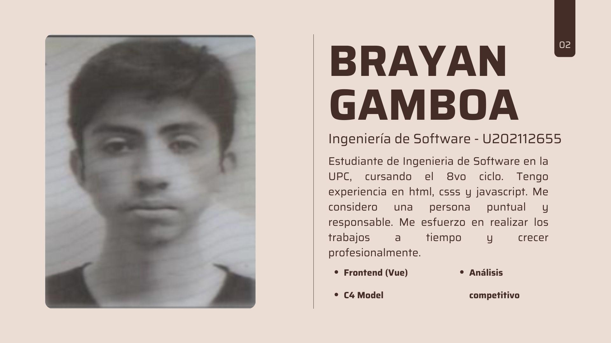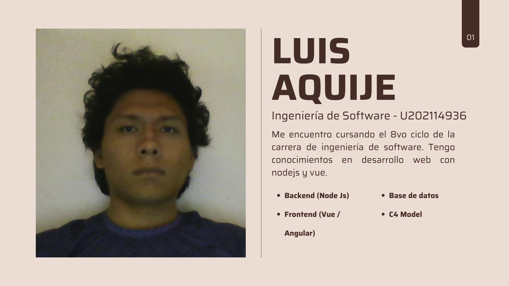  
**1.2. Solution Profile**

Nuestra solución frente a la problemática de la pérdida de talento, la
falta de motivación, la alta rotación de personal y el escaso impulso al
aprendizaje autónomo en las organizaciones, la solución será el
desarrollo de una plataforma web llamada **SkillLedger**, que promueve
una cultura de reconocimiento constante, transparente y automatizada,
usando tecnología blockchain y smart contracts.

### **1.2.1 Antecedentes y problemática**

**What? – ¿Qué?  
¿Cuál es el problema?  
**Muchas empresas pierden talento valioso por no contar con un sistema
claro para reconocer logros o fomentar el aprendizaje. A esto se suma la
falta de motivación entre los trabajadores y la ausencia de incentivos
que impulsen a ser autodidactas.

**When? – ¿Cuándo?  
¿Cuándo ocurre el problema?  
**Este problema aparece todos los días: cuando el trabajador se
esfuerza, cumple objetivos o aprende por su cuenta, pero no recibe
ningún tipo de reconocimiento. Esto afecta el ánimo, el compromiso y la
permanencia del colaborador en la empresa.

**Where? – ¿Dónde?  
¿Dónde se tomarán las medidas?  
**La plataforma se implementará en empresas de Lima Metropolitana,
aunque está pensada para escalar a nivel nacional. Es útil para
cualquier organización que quiera fortalecer su cultura interna y
mejorar cómo retiene y motiva a su equipo.

**Who? – ¿Quién?  
¿Quién lo usará? ¿Quién es el cliente de este producto?  
**El principal usuario será el trabajador, que podrá acumular logros y
canjearlos por recompensas. El cliente directo serán las áreas de
Recursos Humanos o las gerencias que estén buscando nuevas formas de
mejorar el clima laboral y el rendimiento de sus equipos.

**Why? – ¿Por qué?  
¿Por qué es necesario resolver esto?  
**Porque cuando el esfuerzo no se reconoce, las personas pierden el
interés y/o se desmotivan por ende buscan mejores oportunidades que sí
reconozcan su valor. Un sistema claro de reconocimiento ayuda a retener
talento y mantener a los equipos motivados.

**How? – ¿Cómo?  
¿Cómo se resolverá el problema?  
**Con SkillLedger, los logros de cada colaborador se registran y
recompensan automáticamente. Al completar objetivos, aprender nuevas
cosas o actuar según los valores de la empresa, ganan **monedas
digitales** que se canjean por beneficios del catálogo de la empresa.
Todo se gestiona con **smart contracts**, y el sistema incluye
gamificación y analítica para mantener el interés y facilitar la
gestión.

**How much? – ¿Cuánto?  
¿Cuánto costará resolver el problema?  
**El desarrollo e implementación de SkillLedger requiere una inversión
inicial en tecnología y diseño. El modelo se sostendrá con planes
mensuales para empresas interesadas. A futuro, se espera que la
plataforma crezca gracias a su impacto real en retención y clima
laboral.

**¿A cuántas personas beneficiará?  
**En una primera fase, beneficiará a trabajadores de empresas medianas
en Lima. Según la acogida se planea escalar y llegar a miles de
trabajadores en diferentes sectores.

### **1.2.2 Lean UX Process**

**1.2.2.1. Lean UX Problem Statements**

**Problem Statement:  
**En SkillLedger entendemos que muchas empresas pierden talento valioso
por no contar con un sistema claro y constante de reconocimiento, lo que
a su vez desmotiva a los trabajadores y desalienta el aprendizaje
autodidacta.

**Problema:  
**Hoy en día, muchas organizaciones dependen de métodos informales o
poco consistentes para reconocer los logros de sus trabajadores. Esto
genera desinterés, baja motivación y fuga de talento, especialmente en
equipos donde no se valora el constante esfuerzo ni el crecimiento
personal.

**Impacto:  
**La falta de reconocimiento impacta directamente en el clima laboral,
disminuye el compromiso de los equipos y limita el desarrollo continuo.
Además, obliga a las empresas a invertir más en procesos de reemplazo y
capacitación por alta rotación de personal

**1.2.2.2. Lean UX Assumptions**

**Business Assumptions:**

- Las empresas enfrentan una necesidad creciente de contar con
  soluciones más dinámicas, automatizadas y efectivas para reconocer los
  logros de sus trabajadores.

- Esta necesidad puede resolverse mediante una plataforma digital que
  permita registrar metas cumplidas, recompensar de forma personalizada
  y visualizar el desempeño de manera clara y motivadora.

- Nuestros clientes objetivo son las áreas de Recursos Humanos, así como
  líderes de equipos en empresas medianas y grandes, interesadas en
  fortalecer el compromiso y reducir la rotación de talento.

- El principal valor que ofreceremos será un sistema de reconocimiento
  transparente, constante y alineado con los valores corporativos, que
  impacte positivamente en el clima laboral.

- El modelo de ingresos estará basado en suscripciones mensuales,
  ajustadas a la cantidad de usuarios y el nivel de personalización
  requerido.

- Nuestra competencia directa incluye sistemas internos tradicionales y
  soluciones genéricas de gestión de recursos humanos que no están
  diseñadas específicamente para el reconocimiento de trabajadores.

- SkillLedger se diferenciará por ser una plataforma intuitiva, fácil de
  implementar, con experiencia de usuario amigable y respaldada por
  tecnología blockchain y smart contracts para asegurar trazabilidad y
  confianza..

- Para mitigar ese riesgo, nos enfocaremos en mostrar resultados
  tangibles de mejora en la motivación, retención y participación del
  talento, además de ofrecer funcionalidades visuales atractivas y
  personalizables que reflejen la cultura de cada empresa.

**User Assumptions:**

- ¿Quién es el usuario?  
  Trabajadores que buscan reconocimiento justo por su desempeño y áreas
  de RR.HH. de empresas medianas-grandes que requieren una herramienta
  para identificar logros y seguir el desarrollo personal de su equipo.

- ¿Qué problema tiene nuestro producto que queremos resolver?  
  El poco reconocimiento al esfuerzo de los trabajadores, la fuga de
  talento y la falta de herramientas que promuevan el autodesarrollo
  dentro de las empresas.

- ¿Qué características son importantes?  
  Recompensas canjeables, claridad en los criterios de reconocimiento,
  visualización de logros y gamificación.

- ¿Dónde encaja nuestro producto en su trabajo o vida?  
  En el día a día laboral, como parte del sistema de gestión del
  desempeño y bienestar interno.

- ¿Cuándo y cómo es usado nuestro producto?  
  Al cumplir objetivos, completar retos, adquirir habilidades y ser
  reconocido por los líderes. Usado desde la aplicación web.

- ¿Cómo debe verse y comportarse nuestro producto?  
  Con un diseño intuitivo, accesible, visualmente agradable, que cargue
  rápido, sea fácil de usar y que refuerce positivamente las acciones
  del usuario.

**Feature Assumptions:**

1.  **Recompensas canjeables con catálogo personalizado  
    **

    - *Hipótesis:* Creemos que un catálogo con beneficios reales y
      personalizables incentivará el compromiso y mejorará la motivación
      de los trabajadores.

    - *Experimento:* Probar dos versiones de catálogo (genérico vs.
      personalizado) y medir la tasa de canje y satisfacción percibida
      por los trabajadores.

2.  **Sistema de logros y gamificación  
    **

    - *Hipótesis:* Creemos que mostrar niveles, medallas y progreso
      motivará a los usuarios a participar más.

    - *Experimento:* Medir el impacto del sistema de logros en el tiempo
      de uso, la frecuencia de interacción y la percepción de motivación
      a través de encuestas.

3.  **Dashboard de desempeño visible para trabajadores y líderes  
    **

    - *Hipótesis:* Creemos que visualizar el progreso individual y de
      equipo aumentará la transparencia y sentido de avance.

    - *Experimento:* Implementar dashboards simples y medir percepción
      de utilidad mediante encuestas post-uso.

4.  **Reconocimiento entre pares  
    **

    - *Hipótesis:* Creemos que permitir que los trabajadores se
      reconozcan entre sí refuerza la cultura de equipo.

    - *Experimento:* Activar esta función y monitorear la cantidad de
      reconocimientos generados por mes.

**1.2.2.3. Lean UX Hypothesis Statements**

**Hypothesis Statement 01:  
**Creemos que SkillLedger será el canal principal de reconocimiento
dentro de las empresas.  
**Sabremos que hemos tenido éxito cuando:  
**Al menos el 40% de los reconocimientos mensuales sean realizados a
través de la plataforma durante tres meses, reflejando una buena acogida
por parte de los equipos.

**Hypothesis Statement 02:  
**Creemos que el sistema de recompensas canjeables mejorará la
motivación y retención.  
**Sabremos que hemos tenido éxito cuando:  
**El 70% de los trabajadores activos canjeen recompensas al menos una
vez por trimestre y reporten mayor satisfacción laboral.

**Hypothesis Statement 03:  
**Creemos que la gamificación aumentará la participación en actividades
de desarrollo y cumplimiento de metas.  
**Sabremos que hemos tenido éxito cuando:  
**Más del 50% de los usuarios completen retos internos o acumulen
insignias dentro del primer mes de uso.

**Hypothesis Statement 04:  
**Creemos que los líderes encontrarán útil el dashboard para tomar
decisiones sobre su equipo.  
**Sabremos que hemos tenido éxito cuando:  
**El 80% de los líderes que accedan al dashboard lo usen frecuentemente
y lo califiquen como herramienta valiosa en encuestas internas.

**1.2.2.4. Lean UX Canvas**

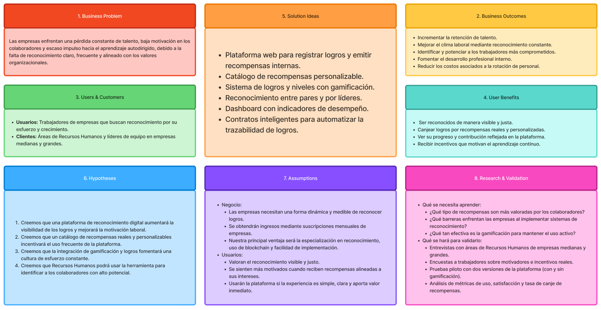

## **1.3. Segmentos objetivos**

**Segmento Empresas:**

Organizaciones que buscan mejorar la gestión del talento a través de
herramientas que les permitan reconocer, motivar y fidelizar a sus
trabajadores de manera eficiente y estructurada. La implementación y uso
de estas soluciones está a cargo, principalmente, del área de Recursos
Humanos, la cual busca facilitar la toma de decisiones basada en datos y
promover una cultura de reconocimiento y desarrollo continuo dentro de
la empresa.

**Segmento Empleados:**

Trabajadores que valoran el reconocimiento por su esfuerzo, desean hacer
visible su crecimiento profesional y acceder a incentivos que refuercen
su motivación. Están interesados en contar con medios que les permitan
registrar sus logros, recibir retroalimentación y tener mayor
visibilidad dentro de su entorno laboral.

# **Capítulo II: Requirements Elicitation & Analysis**

## **2.1. Competidores**

### **2.1.1. Análisis competitivo**

<table>
<colgroup>
<col style="width: 14%" />
<col style="width: 14%" />
<col style="width: 19%" />
<col style="width: 17%" />
<col style="width: 17%" />
<col style="width: 16%" />
</colgroup>
<thead>
<tr>
<th colspan="6" style="text-align: left;">Competitive Analysis
Landscape</th>
</tr>
<tr>
<th colspan="2" style="text-align: left;">¿Por qué llevar a cabo este
análisis?</th>
<th colspan="4" style="text-align: left;">Para conocer el valor que
ofrece cada uno de nuestros competidores en este sector</th>
</tr>
<tr>
<th colspan="2" style="text-align: left;">Nuestro Producto /
Competidores</th>
<th style="text-align: left;">SkillLedger</th>
<th style="text-align: left;">Opolis</th>
<th style="text-align: left;">BitDegree</th>
<th style="text-align: left;">HiFives</th>
</tr>
<tr>
<th rowspan="2" style="text-align: left;">Perfil</th>
<th style="text-align: left;">Overview</th>
<th style="text-align: left;">Plataforma web que usa blockchain para
ayudar a las empresas a reconocer, recompensar y retener talento.</th>
<th style="text-align: left;">Cooperativa digital para trabajadores
independientes. Ofrece beneficios laborales y control sobre la identidad
y datos laborales.</th>
<th style="text-align: left;">Plataforma educativa blockchain con cursos
en línea, recompensas gamificadas y certificados NFT.</th>
<th style="text-align: left;">
Plataforma

que permite a las organizaciones digitalizar, automatizar y
transformar la experiencia de sus empleados mediante programas de
recompensas y reconocimiento. Incorpora inteligencia artificial para
ofrecer insights y gamificación en el proceso de
reconocimiento.
</th>
</tr>
<tr>
<th style="text-align: left;">Ventaja competitiva ¿Qué valor ofrece a
los clientes?</th>
<th style="text-align: left;">
-Sistema gamificado de recompensas
interno personalizado para cada empresa.

-Smart contracts automatizan los acuerdos de aprendizaje y
premios.

-Historial de logros portable y transparente.

-Recompensas alineadas con los valores de la empresa (productos, días
libres, etc).
</th>
<th style="text-align: left;">-Permite portabilidad de beneficios y
datos laborales entre trabajos. -Incentiva la autonomía laboral.</th>
<th style="text-align: left;">
-Recompensas reales (criptomonedas)

- Aprendizaje gamificado y validación pública de habilidades en
blockchain.
</th>
<th style="text-align: left;">
-Integración de IA para análisis y
personalización de reconocimientos

-Plataforma altamente configurable que se adapta a las necesidades
específicas de cada organización
</th>
</tr>
<tr>
<th rowspan="2" style="text-align: left;">Perfil de marketing</th>
<th style="text-align: left;">Mercado Objetivo</th>
<th style="text-align: left;">Empresas medianas y grandes con enfoque en
innovación en RRHH, bienestar del talento y transformación digital.</th>
<th style="text-align: left;">
-Freelancers

-Trabajadores remotos
</th>
<th style="text-align: left;">Estudiantes, profesionales jóvenes,
aprendices Web3 y empresas tecnológicas</th>
<th style="text-align: left;">Empresas medianas y grandes que buscan
modernizar sus programas de reconocimiento y recompensas</th>
</tr>
<tr>
<th style="text-align: left;">Estrategia de Marketing</th>
<th style="text-align: left;">
– Contacto directo con departamentos de
RRHH.

–Participación en ferias de tecnología y Web3.
</th>
<th style="text-align: left;">
-Marketing comunitario (DAO-style)

-Conferencias Web3
</th>
<th style="text-align: left;">Alianzas con plataformas de educación y
campañas en redes Web3. Participación en hackathons y eventos de cripto
educación.</th>
<th style="text-align: left;">Marketing B2B enfocado en demostrar el
retorno de inversión de los programas de reconocimiento.</th>
</tr>
<tr>
<th rowspan="3" style="text-align: left;">Perfil del producto</th>
<th style="text-align: left;">Productos y servicios</th>
<th style="text-align: left;">
-Plataforma web para gestionar
recompensas y logros.

-Marketplace personalizable de recompensas.
</th>
<th style="text-align: left;">
-gestión de identidad profesional

-comunidad de soporte laboral
</th>
<th style="text-align: left;">Cursos interactivos, recompensas en
tokens, certificados NFT, rutas de aprendizaje personalizadas.</th>
<th style="text-align: left;">
-Plataforma web y aplicaciones móviles
para gestión de recompensas y reconocimiento.

-Panel administrativo para recursos humanos.
</th>
</tr>
<tr>
<th style="text-align: left;">Precios y costos</th>
<th style="text-align: left;">Subscripciones mensuales ajustadas a la
cantidad de trabajadores y el nivel de personalización requerido.</th>
<th style="text-align: left;">Subscripción mensual para miembros. Costos
asociados al uso de servicios administrativos y beneficios.</th>
<th style="text-align: left;">Muchos cursos gratuitos, otros pagos en
tokens.</th>
<th style="text-align: left;">Ofrece demostraciones gratuitas y opciones
de personalización según los requerimientos del cliente.</th>
</tr>
<tr>
<th style="text-align: left;">Canales de distribución</th>
<th style="text-align: left;">Web App (SaaS)</th>
<th style="text-align: left;">-Web (dashboard) -Integración con
wallets</th>
<th style="text-align: left;">Web y plataforma de cursos propia.
Integración con blockchain (wallet)</th>
<th style="text-align: left;">Plataforma web accesible globalmente y
aplicaciones móviles para Android e iOS.</th>
</tr>
<tr>
<th rowspan="4" style="text-align: left;">Análisis SWOT</th>
<th style="text-align: left;">Fortalezas</th>
<th style="text-align: left;">
-Historial de logros portable y
confiable

-Incentivos personalizables según cultura empresarial
</th>
<th style="text-align: left;">-Transparencia -Descentralización
-Portabilidad de identidad profesional</th>
<th style="text-align: left;">
-Interfaz gamificada

-comunidad activa

-Certificaciones NFT reconocidas.
</th>
<th style="text-align: left;">
-Plataforma escalable y
personalizable.

-Enfoque en la gamificación y reconocimiento social.
</th>
</tr>
<tr>
<th style="text-align: left;">Debilidades</th>
<th style="text-align: left;">
-Empresas tradicionales podrían dudar
en implementar tecnologías Blockchain.

-Conocimientos necesarios para implementación
</th>
<th style="text-align: left;">Enfocado principalmente en freelancers, no
en empleados tradicionales.</th>
<th style="text-align: left;">
-Foco limitado en el ámbito
educativo

-No incluye incentivos empresariales directos ni conexión con
empresas como empleadores
</th>
<th style="text-align: left;">
-No utiliza tecnología blockchain, lo
que podría limitar la transparencia y portabilidad de los logros.

-Dependencia de integraciones con sistemas existentes.
</th>
</tr>
<tr>
<th style="text-align: left;">Oportunidades</th>
<th style="text-align: left;">
-Creciente interés en bienestar laboral
y retención

-Empresas buscan formas de engagement no salariales
</th>
<th style="text-align: left;">Aprovechar el crecimiento del trabajo
remoto.</th>
<th style="text-align: left;">-Expandirse a certificaciones corporativas
o integraciones con empresas</th>
<th style="text-align: left;">
-Expansión a mercados emergentes que
buscan modernizar sus programas de reconocimiento.

-Incorporación de tecnologías emergentes como blockchain para mejorar
la transparencia y portabilidad de los logros.
</th>
</tr>
<tr>
<th style="text-align: left;">Amenazas</th>
<th style="text-align: left;">
-Competidores grandes podrían
desarrollar soluciones similares

-Rechazo a modelos de gamificación en entornos laborales
tradicionales
</th>
<th style="text-align: left;">Competencia de plataformas tradicionales
de payroll/beneficios.</th>
<th style="text-align: left;">-Competencia creciente de plataformas
educativas blockchain</th>
<th style="text-align: left;">-Competencia creciente de nuevas
plataformas que integran tecnologías emergentes.</th>
</tr>
</thead>
<tbody>
</tbody>
</table>

### **2.1.2. Estrategias y tácticas frente a competidores**

<table>
<colgroup>
<col style="width: 30%" />
<col style="width: 69%" />
</colgroup>
<thead>
<tr>
<th style="text-align: left;">Competidores</th>
<th style="text-align: left;">¿Qué se puede hacer para ganarle a la
competencia?</th>
</tr>
<tr>
<th style="text-align: left;">Competidor 1:BitDegree</th>
<th style="text-align: left;">
Enfocar el producto al sector
empresarial.

Ofrecer recompensas personalizadas internas.

Portabilidad del historial profesional.
</th>
</tr>
<tr>
<th style="text-align: left;">Competidor 2:Opolis</th>
<th style="text-align: left;">
Orientar la solución a empleados
internos.

Usar smart contracts en objetivos y recompensas.

Integración directa con la cultura empresarial.
</th>
</tr>
<tr>
<th style="text-align: left;">Competidor 3:HiFives</th>
<th style="text-align: left;">
Añadir transparencia y trazabilidad con
blockchain.

Logros portables entre empresas.

Crear economía de recompensas personalizada.
</th>
</tr>
</thead>
<tbody>
</tbody>
</table>

## **2.2. Entrevistas**

### **2.2.1. Diseño de entrevistas**

**Segmento Empresa:**

Introducción

Gracias por tu tiempo. Estamos desarrollando una plataforma que permite
a los trabajadores subir evidencias de sus logros, como cursos o
puntualidad, para que las empresas puedan reconocer y recompensar su
esfuerzo. Queremos conocer tu experiencia y tu opinión para construir
una solución que se adapte a las necesidades reales de las empresas.

1.  ¿Nos puede brindar sus nombres, cuál es el nombre de su empresa y a
    qué rubro pertenece?

2.  ¿Cuántos trabajadores tienen actualmente?

3.  ¿Cuál es su cargo dentro de la organización?

4.  ¿La empresa cuenta con un área de Recursos Humanos o Gestión del
    Talento?

5.  Actualmente su empresa utiliza algún tipo de sistema de
    reconocimiento o recompensas para los trabajadores ?

6.  ¿Por qué razones han decidido (o no) implementar un sistema de
    recompensas?

7.  ¿Qué tipos de logros o comportamientos consideran valiosos en sus
    trabajadores ?

8.  ¿Qué formas de recompensa cree que podrían motivar más al personal?

9.  ¿Cómo validan actualmente el desempeño o el desarrollo profesional
    de sus trabajadores ?

10. ¿Qué tan importante consideran el desarrollo profesional continuo de
    sus trabajadores ?

11. ¿Han considerado usar herramientas tecnológicas para facilitar la
    gestión del talento y el reconocimiento?

12. ¿Qué funcionalidades consideran necesarias o útiles en una
    plataforma que les permita visualizar logros y recompensar
    directamente a sus trabajadores?

13. ¿Qué tan dispuestos estarían a invertir en una solución que motive y
    ayude a desarrollar el potencial de sus equipos?

14. ¿Hay algo más que les gustaría compartir sobre cómo gestionan el
    talento o cómo visualizan el futuro del desarrollo profesional
    dentro de su empresa?

**Segmento Trabajador:**

Introducción

Gracias por participar. Estamos desarrollando una plataforma donde
podrás registrar tus logros, como cursos completados o puntualidad, para
que tu empresa pueda ver tu esfuerzo y reconocerlo con recompensas. Tu
opinión nos ayudará a crear una solución útil para ti y tus compañeros.

1.  ¿Nos puede brindar sus nombres y qué cargo desempeñas actualmente?

2.  ¿En qué tipo de empresa trabajas y cuántos años llevas ahí?

3.  ¿Tu empresa tiene un área de Recursos Humanos o algo parecido?

4.  ¿Has recibido alguna vez una recompensa o reconocimiento por tu
    trabajo o por mejorar tus habilidades?

5.  ¿Qué importancia le das al desarrollo profesional o capacitarte
    constantemente?

6.  ¿Qué tipo de acciones crees que deberían reconocerse en un
    trabajador?(Ej. puntualidad, desempeño, formación, iniciativa, etc.)

7.  ¿Qué tipo de recompensas te motivarían a seguir mejorando como
    profesional?(Económicas, días libres, reconocimiento, vales, etc.)

8.  ¿Cómo sueles demostrarle a tu empresa que estás progresando o
    aprendiendo cosas nuevas?

9.  ¿Has tenido dificultades para que tu esfuerzo o logros sean
    reconocidos dentro de la empresa?

10. ¿Te gustaría que existiera una herramienta donde puedas subir
    certificados, logros o datos sobre tu desempeño para que la empresa
    lo vea directamente?

11. ¿Qué cosas te gustaría que tenga esa herramienta para que sea útil
    para ti?

12. ¿Qué tan dispuesto estarías a usar una plataforma que te ayude a
    recibir recompensas o reconocimientos de manera más clara y directa?

13. ¿Hay algo más que te gustaría compartir sobre cómo se valora el
    esfuerzo en tu trabajo o cómo te gustaría que fuera?

### **2.2.2. Registro de entrevistas**

**Segmento Trabajador**

<table>
<colgroup>
<col style="width: 50%" />
<col style="width: 50%" />
</colgroup>
<thead>
<tr>
<th style="text-align: left;">Entrevista 1</th>
<th style="text-align: left;">Jair Velasquez Pizarro</th>
</tr>
<tr>
<th style="text-align: left;">Edad</th>
<th style="text-align: left;">22 años</th>
</tr>
<tr>
<th style="text-align: left;">Distrito</th>
<th style="text-align: left;">Comas</th>
</tr>
<tr>
<th style="text-align: left;">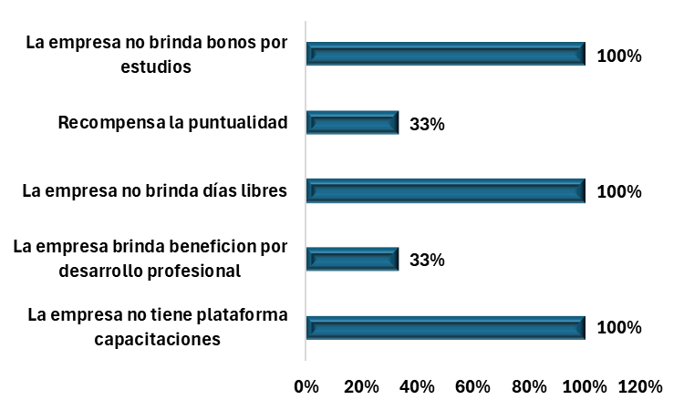</th>
<th style="text-align: left;">
Jair, un estudiante de séptimo ciclo de
Ingeniería de Software, trabaja y estudia al mismo tiempo. Aunque no ha
recibido recompensas formales en su trabajo actual, valora el
reconocimiento por aspectos como la puntualidad y el cumplimiento de
metas. Considera esencial el desarrollo profesional constante,
complementando su educación con cursos adicionales. Entre las
recompensas que más lo motivarían a seguir mejorando están los aumentos
salariales y los días libres.

A pesar de ser relativamente nuevo en su trabajo, Jair ha tenido la
oportunidad de demostrar sus avances y conocimientos a través de
reuniones con su superior. Aunque no ha tenido grandes logros, ha
recibido comentarios positivos. Está interesado en una aplicación que
permita gestionar y mostrar sus logros dentro de la empresa, lo cual
considera útil tanto para recibir reconocimiento como para mejorar sus
oportunidades laborales.
</th>
</tr>
<tr>
<th style="text-align: left;">URL de la grabación</th>
<th style="text-align: left;"><a
href="https://upcedupe-my.sharepoint.com/:v:/g/personal/u20211b197_upc_edu_pe/EeQ1IF9HGQFLtsfzLRhW3ecBTMeL3V_FecqQwp-fSE42mg?nav=eyJyZWZlcnJhbEluZm8iOnsicmVmZXJyYWxBcHAiOiJPbmVEcml2ZUZvckJ1c2luZXNzIiwicmVmZXJyYWxBcHBQbGF0Zm9ybSI6IldlYiIsInJlZmVycmFsTW9kZSI6InZpZXciLCJyZWZlcnJhbFZpZXciOiJNeUZpbGVzTGlua0NvcHkifX0&amp;e=k0Yidr"><u>Link
a la entrevista</u></a></th>
</tr>
<tr>
<th style="text-align: left;">Timing</th>
<th style="text-align: left;">00:40 - 4:19</th>
</tr>
</thead>
<tbody>
</tbody>
</table>

<table>
<colgroup>
<col style="width: 50%" />
<col style="width: 50%" />
</colgroup>
<thead>
<tr>
<th style="text-align: left;">Entrevista 2</th>
<th style="text-align: left;">Miguel Angel Ybañez Esquerre</th>
</tr>
<tr>
<th style="text-align: left;">Edad</th>
<th style="text-align: left;">22 años</th>
</tr>
<tr>
<th style="text-align: left;">Distrito</th>
<th style="text-align: left;">Rimac</th>
</tr>
<tr>
<th style="text-align: left;">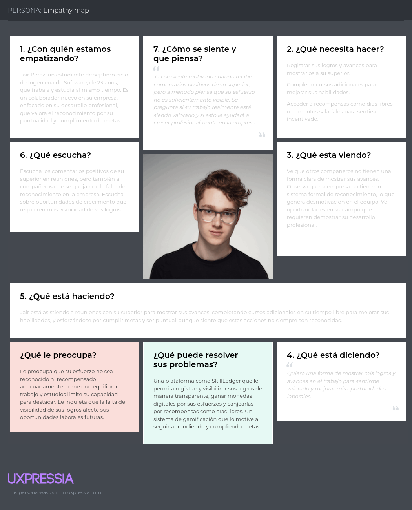</th>
<th style="text-align: left;">
Miguel Ángel, estudiante de Ingeniería
de Software, trabaja y estudia simultáneamente. Ha recibido un pequeño
aumento económico en su trabajo debido a su eficiencia, y considera que
el desarrollo profesional continuo es crucial, especialmente en un campo
tan cambiante como el software. Valora el reconocimiento por iniciativas
y el desempeño eficiente, y le motivarían recompensas como aumentos
salariales y días libres. Además, aplica constantemente sus nuevos
conocimientos en los proyectos en los que trabaja.

Aunque ha enfrentado dificultades para que se reconozcan sus logros,
especialmente al unirse a proyectos ya retrasados, Miguel Ángel cree que
una aplicación para gestionar logros y desempeño podría ayudar a mejorar
las oportunidades dentro de la empresa, como acceder a un nuevo puesto o
aumentar su salario. Está interesado en una plataforma que le permita
mostrar habilidades, logros y certificaciones, y le gustaría usarla para
recibir reconocimientos claros y directos por su trabajo.
</th>
</tr>
<tr>
<th style="text-align: left;">URL de la grabación</th>
<th style="text-align: left;"><a
href="https://upcedupe-my.sharepoint.com/:v:/g/personal/u20211b197_upc_edu_pe/EZ1xfeU6w6tDs8AXYhl71iMB-EFpJlacCVHIL63ztkN3Rg?nav=eyJyZWZlcnJhbEluZm8iOnsicmVmZXJyYWxBcHAiOiJPbmVEcml2ZUZvckJ1c2luZXNzIiwicmVmZXJyYWxBcHBQbGF0Zm9ybSI6IldlYiIsInJlZmVycmFsTW9kZSI6InZpZXciLCJyZWZlcnJhbFZpZXciOiJNeUZpbGVzTGlua0NvcHkifX0&amp;e=kzZtyH"><u>Link
a la entrevista</u></a></th>
</tr>
<tr>
<th style="text-align: left;">Timing</th>
<th style="text-align: left;">00:37 - 5:29</th>
</tr>
</thead>
<tbody>
</tbody>
</table>

| Entrevista 3 | Mario Eugenio Roncallo Machare |
|----|----|
| Edad | 22 años |
| Distrito | Breña |
| 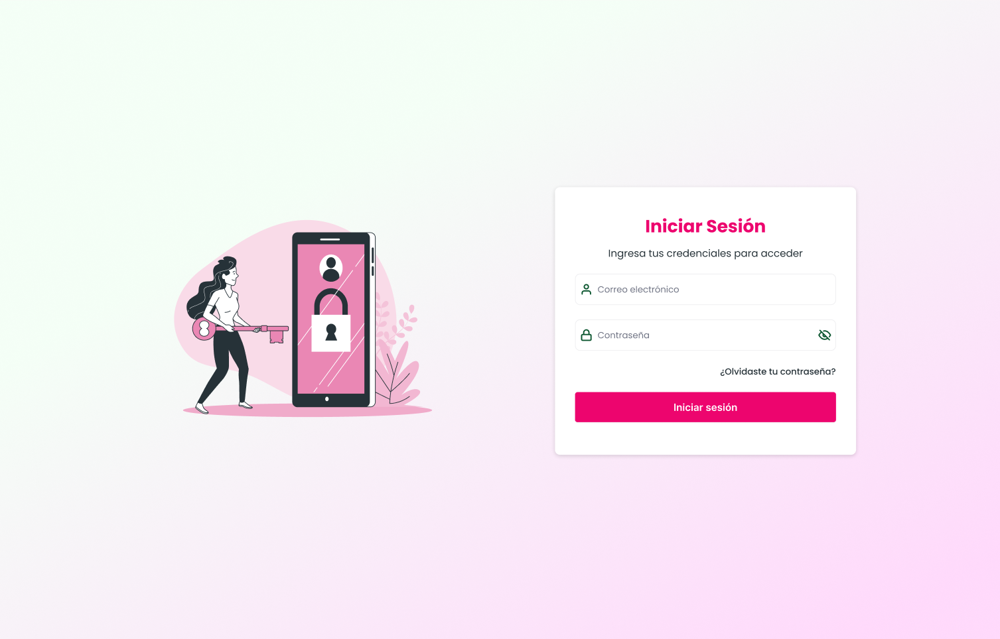 | Mario Eugenio Roncallo Machare, practicante pre profesional en una empresa comercializadora de materiales de construcción, valora mucho el desarrollo profesional y considera clave reconocer el desempeño, la iniciativa y las ganas de aprender. Aunque ha recibido un reconocimiento simbólico, señala que a veces su esfuerzo no es visible por ser practicante. Le motivan recompensas económicas, vales o capacitaciones, y suele demostrar su progreso aplicando lo aprendido y proponiendo mejoras. Estaría muy dispuesto a usar una herramienta como SkillLedger, siempre que sea fácil de usar, permita subir certificados, recibir feedback y visibilizar su crecimiento de forma clara. |

**  
Segmento Empresa**

<table>
<colgroup>
<col style="width: 50%" />
<col style="width: 50%" />
</colgroup>
<thead>
<tr>
<th style="text-align: left;">Entrevista 1</th>
<th style="text-align: left;">Rosmel Gomez Benancio</th>
</tr>
<tr>
<th style="text-align: left;">Edad</th>
<th style="text-align: left;">22</th>
</tr>
<tr>
<th style="text-align: left;">Distrito</th>
<th style="text-align: left;">Lima</th>
</tr>
<tr>
<th style="text-align: left;">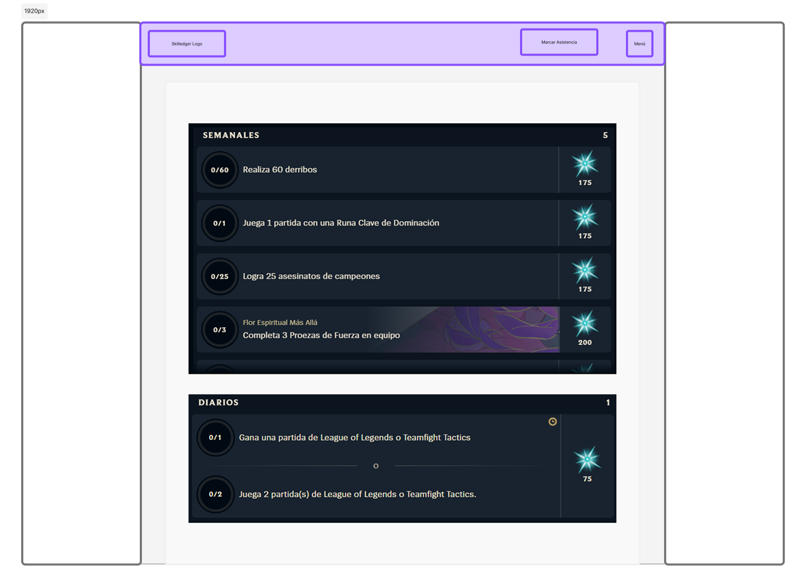</th>
<th style="text-align: left;">
Rosmel Gomez Benancio, trabajador del
área de recursos humanos en su empresa. Tienen un programa interno donde
los líderes asignan puntos mensuales que luego podrán canjear por gift
cards para fomentar la cultura de reconocimiento. En su empresa creen
que la mejor forma de motivar a su personal son recompensas en forma de
días libres adicionales, cursos pagados o acceso a conferencias
internacionales.

Consideran utilizar herramientas tecnológicas para facilitar la
gestión del talento y el reconocimiento como SaaS (Software as a
Service). Funcionalidades útiles para visualizar los logros y
recompensar directamente a sus colaboradores son, dashboard en tiempo
real, los catálogos de recompensas y smarts contracts para beneficios.
Se muestra interesado en la inversión de esta iniciativa si demuestra
reducción de rotación y la mejora de productividad.
</th>
</tr>
<tr>
<th style="text-align: left;">URL de la grabación</th>
<th style="text-align: left;"><a
href="https://youtu.be/JtG7V8uwZuA"><u>Link a la entrevista</u></a></th>
</tr>
<tr>
<th style="text-align: left;">Timing</th>
<th style="text-align: left;">4:51</th>
</tr>
</thead>
<tbody>
</tbody>
</table>

<table>
<colgroup>
<col style="width: 50%" />
<col style="width: 50%" />
</colgroup>
<thead>
<tr>
<th style="text-align: left;">Entrevista 2</th>
<th style="text-align: left;">Alexandra Mariella Cabezas</th>
</tr>
<tr>
<th style="text-align: left;">Edad</th>
<th style="text-align: left;">29 años</th>
</tr>
<tr>
<th style="text-align: left;">Distrito</th>
<th style="text-align: left;">Breña</th>
</tr>
<tr>
<th style="text-align: left;">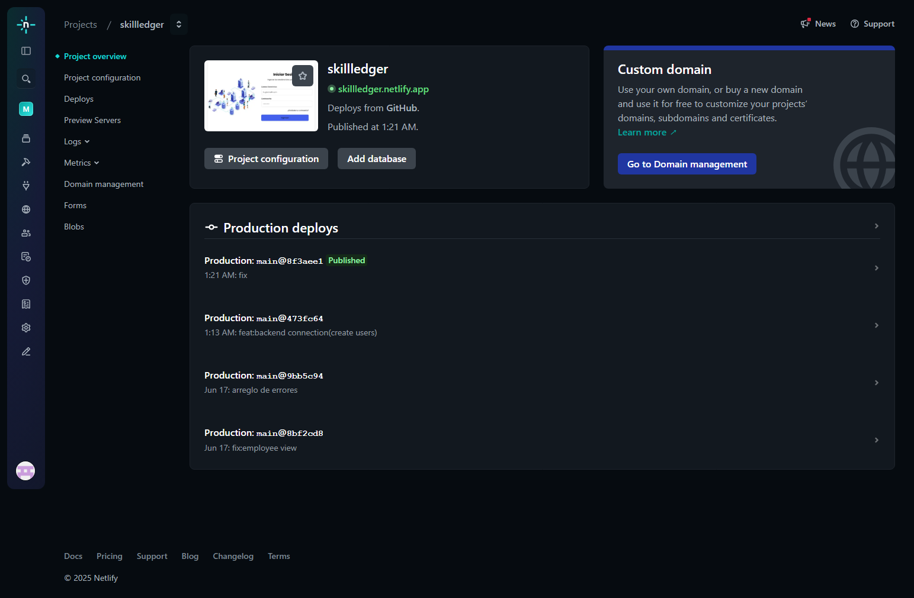</th>
<th style="text-align: left;">
Alexandra Cabezas, Supervisora en el
sector educativo, trabaja en Learning SAC, una empresa que gestiona
matrículas y fomenta el desarrollo profesional de sus trabajadores. Con
más de 200 empleados, la compañía utiliza Moodle para capacitar a su
equipo, centrando los incentivos en la productividad y ofreciendo la
oportunidad de estudiar carreras online sin costo, salvo el título
profesional.

Alexandra considera que el desarrollo profesional continuo es vital,
especialmente en un entorno orientado a ventas educativas, donde la
persuasión y el conocimiento sólido son esenciales. Valora la
puntualidad, el cumplimiento de metas ambiciosas y el progreso constante
como indicadores clave del desempeño. Piensa que una plataforma que
permita a los trabajadores registrar sus logros y certificaciones, y que
visibilice su curva de aprendizaje, podría motivar al equipo y mejorar
su rendimiento.

A pesar de ciertos retos como el ausentismo, la empresa está
interesada en explorar herramientas tecnológicas para gestionar el
talento y recompensar logros de forma más efectiva. Alexandra ve estas
soluciones como una oportunidad para fortalecer tanto el desempeño
individual como colectivo, y para consolidar el compromiso hacia el
aprendizaje continuo y la excelencia operativa.
</th>
</tr>
<tr>
<th style="text-align: left;">URL de la grabación</th>
<th style="text-align: left;"><a
href="https://upcedupe-my.sharepoint.com/:v:/g/personal/u201420422_upc_edu_pe/ER8S-jzjq89Cuwo3GHRfVbwBA_95_OidWtqzMGT5k6Qi0Q?nav=eyJyZWZlcnJhbEluZm8iOnsicmVmZXJyYWxBcHAiOiJPbmVEcml2ZUZvckJ1c2luZXNzIiwicmVmZXJyYWxBcHBQbGF0Zm9ybSI6IldlYiIsInJlZmVycmFsTW9kZSI6InZpZXciLCJyZWZlcnJhbFZpZXciOiJNeUZpbGVzTGlua0NvcHkifX0&amp;e=1ARCmV"><u>Link
a la entrevista</u></a></th>
</tr>
<tr>
<th style="text-align: left;">Timing</th>
<th style="text-align: left;">12:53</th>
</tr>
</thead>
<tbody>
</tbody>
</table>

### **2.2.3. Análisis de entrevistas**

- **Segmento Trabajador:**

Jair, Miguel Ángel y Mario valoran el desarrollo profesional constante y
consideran fundamental el reconocimiento por su desempeño. Las
recompensas más motivadoras para ellos incluyen aumentos salariales,
días libres y beneficios como vales o capacitaciones. Aunque han
recibido algunos reconocimientos, enfrentan dificultades para que su
esfuerzo sea visibilizado de forma adecuada.

Todos muestran interés en una plataforma como SkillLedger para gestionar
logros, certificaciones y recibir feedback. Subrayan la importancia de
que la herramienta sea intuitiva, promueva el reconocimiento directo y
facilite mejores oportunidades laborales dentro de sus empresas.

Datos estadísticos de las entrevistas

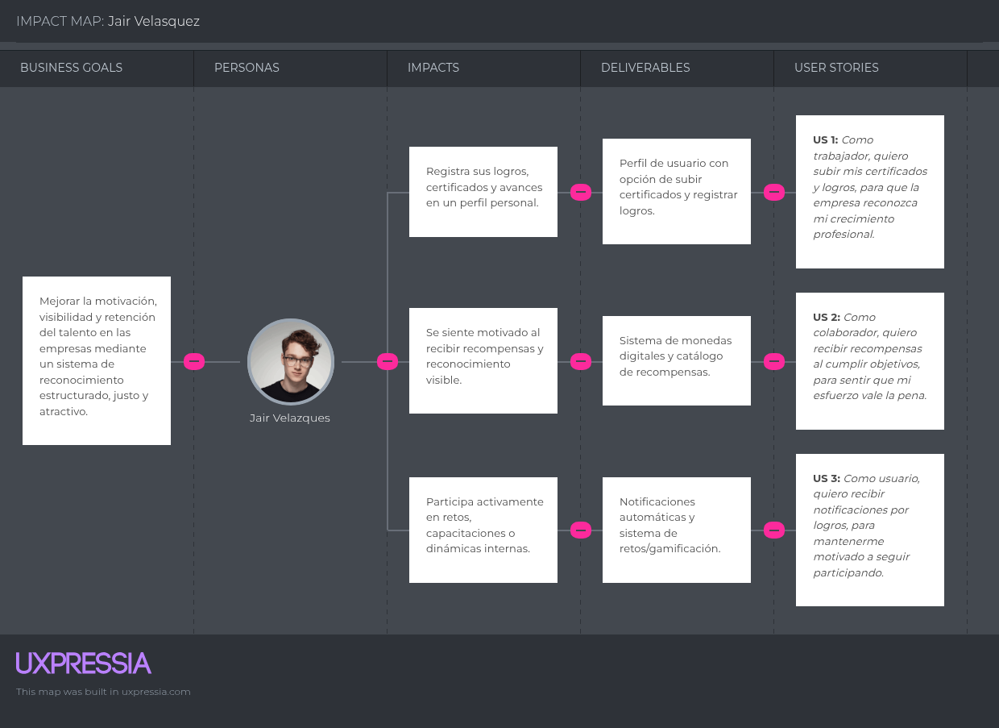

- **Segmento Empresa:**

Alexandra y Rosmel trabajan en empresas que valoran el desarrollo
profesional y el reconocimiento del desempeño como pilares fundamentales
para motivar a sus equipos. Ambas organizaciones cuentan con programas
de incentivos: una utiliza plataformas como Moodle y carreras online,
mientras que la otra implementa sistemas de puntos canjeables por
recompensas.

Coinciden en que herramientas tecnológicas, como plataformas para
registrar logros y ofrecer recompensas mediante dashboards o catálogos,
podrían optimizar la gestión del talento. Ven estas soluciones como
oportunidades para fortalecer la motivación, reducir la rotación de
personal y mejorar la productividad organizacional.

Datos estadísticos de las entrevistas

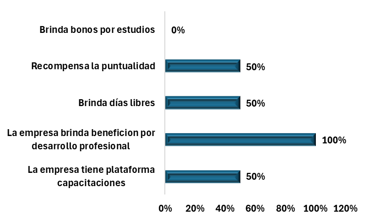

## **2.3. Needfinding**

### **2.3.1. User Personas**

Los user personas nos ayudan a reunir las características más relevantes
de cada segmento objetivo, representadas a través de una persona
ficticia. En este caso, los datos se obtuvieron a partir de las
entrevistas realizadas en las etapas anteriores.

- Segmento Trabajador

> 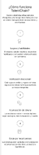

- Segmento Empresa

> 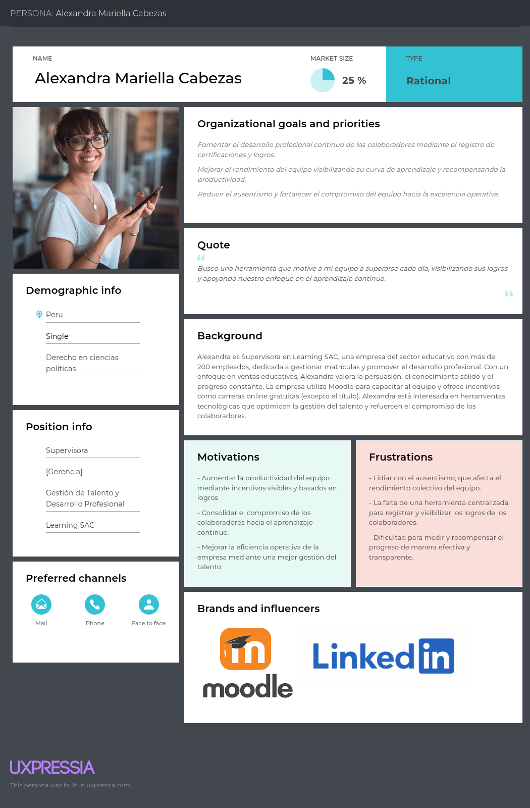

### **2.3.2. User Task Matrix**

Los User Task Matrix identifican las tareas que los usuarios realizarán
en la aplicación y, para cada segmento objetivo, especifica la
frecuencia y relevancia asociadas a estas tareas. Esto facilita la
validación de la prioridad de cada funcionalidad dentro de la
aplicación.

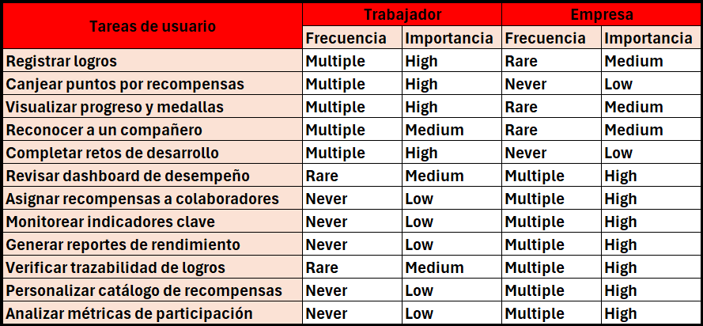

### **2.3.3. Empathy Mapping**

Lo siguiente a evaluar como parte del proceso de needfinding en
TalentChain es analizar nuestros segmentos objetivos mediante empathy
mapping. Este enfoque busca profundizar en el entendimiento de nuestros
usuarios para identificar oportunidades de mejora, plantear nuevos
enfoques y definir herramientas adecuadas que respondan a sus
necesidades específicas dentro del ecosistema del proyecto.

- Segmento Trabajador

>  style="width:6.27083in;height:6.92708in" />

- Segmento Empresa

> 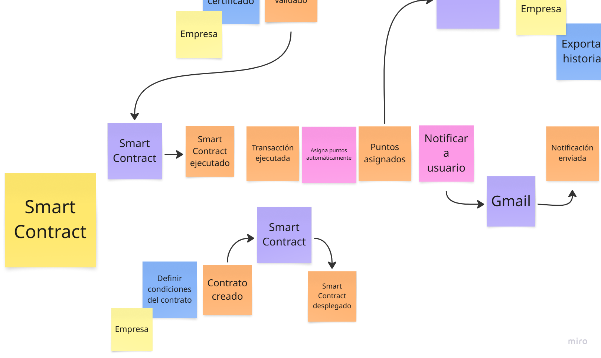 style="width:6.27083in;height:7.20833in" />

### **2.3.4. As-is Scenario Mapping**

**Segmento Trabajador:**

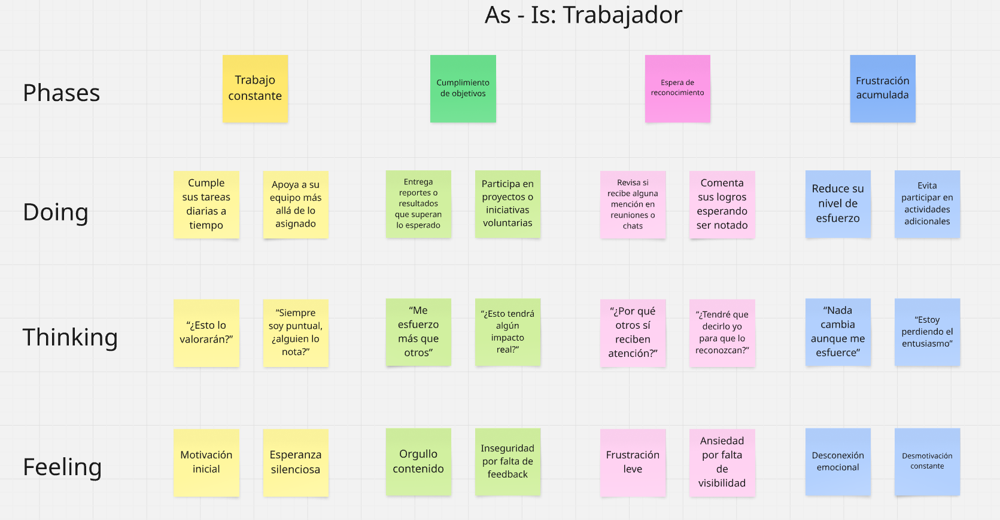

**Segmento Empresas:**

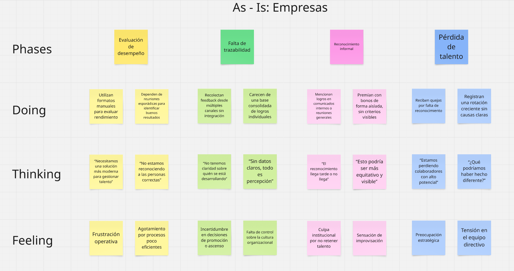

## **2.4. Ubiquitous Language**

- Blockchain

> Definición: Tecnología de registro distribuido utilizada para
> garantizar la transparencia y trazabilidad de los logros y
> recompensas.

- Contrato Inteligente (Smart Contract)

> Definición: Automatización programable que regula y ejecuta los
> acuerdos dentro de la plataforma, como la asignación de monedas
> digitales al completar logros.

- Gamificación

> Definición: Aplicación de mecánicas de juego, como niveles, medallas y
> retos, para incentivar la participación y el aprendizaje.

- Monedas Digitales

> Definición: Unidades virtuales emitidas como recompensa por logros y
> acciones específicas; pueden canjearse por beneficios en el catálogo.

- Catálogo de Recompensas

> Definición: Lista personalizada de beneficios que los trabajadores
> pueden obtener, incluyendo productos, días libres, experiencias y
> reconocimientos especiales.

- Dashboard de Desempeño

> Definición: Interfaz visual que permite a trabajadores y líderes
> monitorear progreso, logros y métricas clave de rendimiento.

- Reconocimiento entre Pares

> Definición: Función que permite a los trabajadores otorgar
> reconocimientos a sus compañeros, promoviendo una cultura de equipo.

- Logro

> Definición: Resultado obtenido por un colaborador tras cumplir un
> objetivo, adquirir una nueva habilidad o demostrar valores alineados
> con la empresa.

- Retención de Talento

> Definición: Capacidad de una empresa para mantener a sus trabajadores
> a través de motivación, recompensas y una cultura positiva.

- Motivación Laboral

> Definición: Nivel de compromiso y entusiasmo de los trabajadores,
> influido por el reconocimiento constante y significativo.

- Achievement Wallet

> Definición: Un repositorio digital personal donde los trabajadores
> almacenan sus logros, habilidades y recompensas adquiridas, todo
> respaldado por tecnología blockchain.

- Recognition Framework

> Definición: El conjunto de reglas y métricas definidas por la empresa
> para determinar cómo se asignan los logros y recompensas en la
> plataforma.

# **Capítulo III: Requirements Specification**

## **3.1. To-Be Scenario Mapping**

**Segmento Trabajador:**

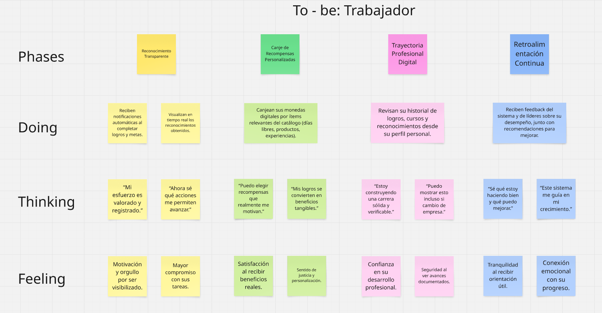

**Segmento Empresas:**

## **3.2. User Stories**

<table>
<colgroup>
<col style="width: 14%" />
<col style="width: 21%" />
<col style="width: 23%" />
<col style="width: 40%" />
</colgroup>
<thead>
<tr>
<th style="text-align: center;">Epic / Story ID</th>
<th style="text-align: center;">Título</th>
<th style="text-align: center;">Descripción</th>
<th style="text-align: center;">Criterio de aceptación</th>
</tr>
<tr>
<th colspan="4">Epic 1: Gestión de Usuarios y Perfiles</th>
</tr>
<tr>
<th>E1-US001</th>
<th>Registro de empleados</th>
<th><strong>Como</strong> administrador, <strong>quiero</strong>
registrar nuevos empleados en la plataforma <strong>para</strong> que
puedan empezar a usar el sistema de recompensas.</th>
<th>
<strong>Escenario N°1:</strong> Administrador registra nuevos
empleados

<strong>Dado</strong> que el formulario de registro debe permitir
ingresar datos básicos como nombre, correo, cargo y área.

<strong>Entonces</strong> el sistema debe enviar un correo de
bienvenida con instrucciones de acceso.

<strong>Y</strong> el nuevo empleado debe aparecer en la lista de
usuarios activos.
</th>
</tr>
<tr>
<th>E1-US002</th>
<th style="text-align: left;">Completar perfil profesional</th>
<th style="text-align: left;"><strong>Como</strong> empleado,
<strong>quiero</strong> completar mi perfil profesional
<strong>para</strong> que la empresa pueda reconocer mis logros y
formación.</th>
<th style="text-align: left;">
<strong>Escenario N°1:</strong> El
empleado quiere completar su perfil profesional

<strong>Dado que</strong> el usuario debe poder ingresar y actualizar
datos como habilidades, cursos completados y certificaciones.

<strong>Cuando</strong> el sistema guarda los cambios
automáticamente.

<strong>Entonces</strong> el perfil debe poder visualizarse desde el
panel del administrador.
</th>
</tr>
<tr>
<th>E1-US003</th>
<th style="text-align: left;">Asignación de roles</th>
<th style="text-align: left;"><strong>Como</strong> administrador,
<strong>quiero</strong> asignar roles a los usuarios
<strong>para</strong> controlar el acceso a las diferentes
funcionalidades de la plataforma.</th>
<th style="text-align: left;">
<strong>Escenario N°1:</strong> El
administrador quiere asignar roles a los usuarios

<strong>Dado que</strong> debe existir al menos dos roles:
"administrador" y "empleado".

<strong>Cuando</strong> los administradores modifiquen roles desde el
panel de usuarios.

<strong>Entonces</strong> los empleados no podrán acceder a funciones
administrativas.
</th>
</tr>
<tr>
<th colspan="4">Epic 2: Logros y trayectorias</th>
</tr>
<tr>
<th>E2-US004</th>
<th>Registro de cumplimiento de metas</th>
<th style="text-align: left;"><strong>Como</strong> empleado,
<strong>quiero</strong> registrar el cumplimiento de una meta o
actividad <strong>para</strong> recibir recompensas si corresponde.</th>
<th style="text-align: left;">
<strong>Escenario 1:</strong> El
empleado quiere registrar el cumplimiento de una meta y recibir
recompensas

<strong>Dado que</strong> el usuario puede seleccionar una meta de su
ruta y marcarla como completada.

<strong>Entonces</strong> el sistema debe solicitar evidencia
(archivo, enlace o comentario).

<strong>Y</strong> el administrador debe validar el cumplimiento
antes de aprobar la recompensa.
</th>
</tr>
<tr>
<th>E2-US005</th>
<th>Definicion de rutas de desarrollo</th>
<th style="text-align: left;"><strong>Como</strong> administrador,
<strong>quiero</strong> definir rutas de desarrollo o aprendizaje
<strong>para</strong> que los empleados sepan qué logros alcanzar.</th>
<th style="text-align: left;">
<strong>Escenario N°1:</strong> El
administrador quiere definir el camino a seguir en el desarrollo.

<strong>Dado que</strong> el administrador puede crear, editar o
eliminar rutas.

<strong>Cuando</strong> cada ruta incluye una serie de metas u
objetivos claros.

<strong>Entonces</strong> las rutas pueden ser asignadas a uno o más
empleados.
</th>
</tr>
<tr>
<th>E2-US006</th>
<th>Visualización de logros</th>
<th style="text-align: left;"><strong>Como</strong> empleado,
<strong>quiero</strong> visualizar mis logros alcanzados y los
pendientes <strong>para</strong> motivarme a avanzar.</th>
<th style="text-align: left;">
<strong>Escenario N°1:</strong> El
empleado desea ver sus logros y pendientes

<strong>Dado que</strong> el usuario puede ver un panel con sus
logros completados y los que tiene en progreso.

<strong>Entonces</strong> cada logro debe mostrar su descripción,
estado, y fecha de validación.

<strong>Y</strong> el panel debe actualizarse automáticamente tras la
validación de un logro.
</th>
</tr>
<tr>
<th colspan="4">Epic 3: Integración con blockchain y smart
contracts</th>
</tr>
<tr>
<th>E3-US007</th>
<th>Registro de logros en blockchain</th>
<th style="text-align: left;"><strong>Como</strong> sistema,
<strong>quiero</strong> registrar los logros validados en la blockchain
<strong>para</strong> garantizar transparencia e inmutabilidad.</th>
<th style="text-align: left;">
<strong>Escenario N°1:</strong> El
sistema debe poder registrar en la blockchain exitosamente.

<strong>Dado que</strong> cada logro validado debe generar una
transacción en la blockchain.

<strong>Y</strong> el registro incluye información del empleado, tipo
de logro y fecha.

<strong>Entonces</strong> los datos serán visibles desde un visor de
logros con trazabilidad blockchain.
</th>
</tr>
<tr>
<th>E3-US008</th>
<th>Automatización con smart contracts</th>
<th style="text-align: left;"><strong>Como</strong> administrador,
<strong>quiero</strong> establecer reglas en smart contracts
<strong>para</strong> automatizar la entrega de recompensas.</th>
<th style="text-align: left;">
<strong>Escenario N°1:</strong> El
administrador quiere establecer ciertas normas en los contratos
inteligentes.

<strong>Dado que</strong> el administrador puede definir condiciones
específicas (por ejemplo: “si completa la ruta A, recibe 100
tokens”).

<strong>Cuando</strong> el sistema deba desplegar automáticamente un
smart contract con esas reglas.

<strong>Entonces</strong> la recompensa se otorga sin intervención
manual.
</th>
</tr>
<tr>
<th>E3-US009</th>
<th>Consulta de trazabilidad de logros</th>
<th style="text-align: left;"><strong>Como</strong> empleado,
<strong>quiero</strong> consultar la trazabilidad de mis logros en la
blockchain <strong>para</strong> asegurar su autenticidad.</th>
<th style="text-align: left;">
<strong>Escenario N°1:</strong> Ya que
el empleado quiere consultar la trazabilidad de sus logros en la
blockchain.

<strong>Dado que</strong> el usuario puede acceder a un historial de
logros registrado en la blockchain.

<strong>Entonces</strong> debe mostrarse un enlace o hash verificable
para cada registro.

<strong>Y</strong> la interfaz debe ser clara y comprensible incluso
para usuarios sin experiencia técnica.
</th>
</tr>
</thead>
<tbody>
</tbody>
</table>

## **3.3. Impact Mapping**

**Segmento Trabajador**

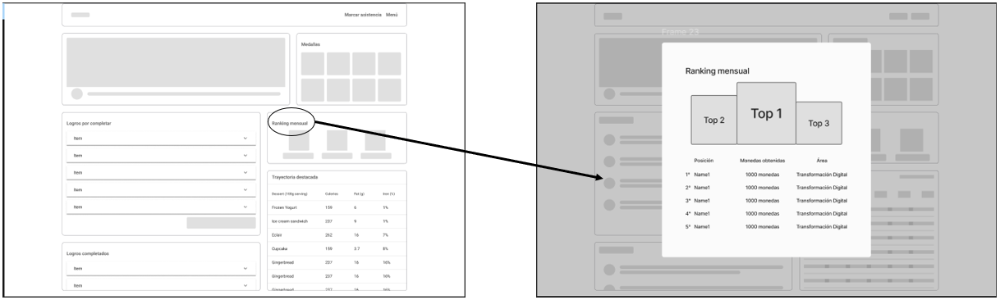

**Segmento Empresa**

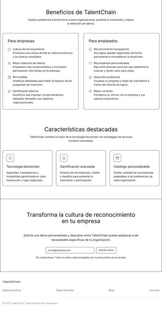

## **3.4. Product Backlog**

| **\#Orden** | **User Story ID** | **Título** | **Descripción** | **Story Points** |
|----|----|----|----|----|
| 1 | HU001 | Registro de empleados | **Como** administrador, **quiero** registrar nuevos empleados en la plataforma **para** que puedan empezar a usar el sistema de recompensas. | 3 |
| 2 | HU002 | Completar perfil profesional | **Como** empleado, **quiero** completar mi perfil profesional **para** que la empresa pueda reconocer mis logros y formación. | 5 |
| 3 | HU003 | Asignación de roles | **Como** administrador, **quiero** asignar roles a los usuarios **para** controlar el acceso a las diferentes funcionalidades de la plataforma. | 2 |
| 4 | HU004 | Registro de cumplimiento de metas | **Como** empleado, **quiero** registrar el cumplimiento de una meta o actividad **para** recibir recompensas si corresponde. | 5 |
| 5 | HU005 | Definición de rutas de desarrollo | **Como** administrador, **quiero** definir rutas de desarrollo o aprendizaje **para** que los empleados sepan qué logros alcanzar. | 3 |
| 6 | HU006 | Visualización de logros | **Como** empleado, **quiero** visualizar mis logros alcanzados y los pendientes **para** motivarme a avanzar. | 2 |
| 7 | HU007 | Registro de logros en blockchain | **Como** sistema, **quiero** registrar los logros validados en la blockchain **para** garantizar transparencia e inmutabilidad. | 8 |
| 8 | HU008 | Automatización con smart contracts | **Como** administrador, **quiero** establecer reglas en smart contracts **para** automatizar la entrega de recompensas. | 5 |
| 9 | HU009 | Consulta de trazabilidad de logros | **Como** empleado, **quiero** consultar la trazabilidad de mis logros en la blockchain **para** asegurar su autenticidad. | 3 |

#  

# **Capítulo IV: Strategic-Level Software Design**

## **4.1. Strategic-Level Attribute-Driven Design**

En esta sección, se describe el proceso de diseño arquitectónico basado
en atributos de calidad que hemos identificado de acuerdo a la solución
propuesta, estos deben garantizar transparencia, seguridad,
escalabilidad, entre otros, dentro de nuestra aplicación.

### **4.1.1. Design Purpose**

La aplicación web propuesta aborda una problemática centrada en el
reconocimiento y retención del talento mediante un sistema gamificado
basado en blockchain. A partir del análisis funcional, se han
identificado diversos requerimientos agrupados en épicas, lo que ha
permitido definir con claridad los módulos del sistema.

Para el desarrollo del backend, se ha optado por una arquitectura de
microservicios, dado que la solución involucra dominios funcionales
complejos y bien delimitados, como el sistema de logros y recompensas,
la gestión de usuarios, el catálogo de incentivos, y la integración con
blockchain mediante smart contracts. Esta separación por dominios no
solo favorece la escalabilidad y mantenibilidad, sino que también
permite que los equipos de desarrollo trabajen de manera independiente,
reduciendo el acoplamiento entre frontend y backend.

Además, se está tomando en cuenta la interacción con servicios externos,
lo cual exige una arquitectura resiliente ante posibles fallos o
latencias en esos sistemas. En consecuencia, cada microservicio deberá
cumplir con sus respectivas reglas de negocio, establecer mecanismos de
comunicación adecuados (como APIs REST o eventos), y garantizar los
atributos de calidad requeridos mediante el uso de herramientas,
patrones y buenas prácticas arquitectónicas.

### **4.1.2. Attribute-Driven Design Inputs**

En esta sección, tomaremos decisiones arquitectónicas en base a
elementos recolectados, es decir, nuestras historias de usuario.
Tomaremos en cuenta distintos criterios de calidad, como la
escalabilidad, disponibilidad y rendimiento.

#### **4.1.2.1. Primary Functionality (Primary User Stories)**

A continuación, presentamos historias de usuario que tienen mayor
relevancia y complejidad a nivel de desarrollo. Estas presentan
características que requieren nuestra atención para asegurar su correcto
funcionamiento.

<table>
<colgroup>
<col style="width: 15%" />
<col style="width: 17%" />
<col style="width: 27%" />
<col style="width: 20%" />
<col style="width: 20%" />
</colgroup>
<thead>
<tr>
<th style="text-align: left;">
Epic /

User Story ID
</th>
<th style="text-align: left;">Título</th>
<th style="text-align: left;">Descripción</th>
<th style="text-align: left;">Criterios de aceptación</th>
<th style="text-align: left;">Relacionado con (Epic ID)</th>
</tr>
<tr>
<th style="text-align: left;">HU004</th>
<th style="text-align: left;">Registro de cumplimiento de metas</th>
<th style="text-align: left;"><strong>Como</strong> empleado,
<strong>quiero</strong> registrar el cumplimiento de una meta o
actividad <strong>para</strong> recibir recompensas si corresponde</th>
<th style="text-align: left;">
<strong>Escenario 1:</strong> El
empleado quiere registrar el cumplimiento de una meta y recibir
recompensas

<strong>Dado que</strong> el usuario puede seleccionar una meta de su
ruta y marcarla como completada.

<strong>Entonces</strong> el sistema debe solicitar evidencia
(archivo, enlace o comentario).

<strong>Y</strong> el administrador debe validar el cumplimiento
antes de aprobar la recompensa.
</th>
<th style="text-align: left;">2</th>
</tr>
<tr>
<th style="text-align: left;">HU007</th>
<th style="text-align: left;">Registro de logros en blockchain</th>
<th style="text-align: left;"><strong>Como</strong> sistema,
<strong>quiero</strong> registrar los logros validados en la blockchain
<strong>para</strong> garantizar transparencia e inmutabilidad.</th>
<th style="text-align: left;">
<strong>Escenario N°1:</strong> El
sistema debe poder registrar en la blockchain exitosamente.

<strong>Dado que</strong> cada logro validado debe generar una
transacción en la blockchain.

<strong>Y</strong> el registro incluye información del empleado, tipo
de logro y fecha.

<strong>Entonces</strong> los datos serán visibles desde un visor de
logros con trazabilidad blockchain
</th>
<th style="text-align: left;">3</th>
</tr>
<tr>
<th style="text-align: left;">HU008</th>
<th style="text-align: left;">Automatización con smart contracts</th>
<th style="text-align: left;"><strong>Como</strong> administrador,
<strong>quiero</strong> establecer reglas en smart contracts
<strong>para</strong> automatizar la entrega de recompensas.</th>
<th style="text-align: left;">
<strong>Escenario N°1:</strong> El
administrador quiere establecer ciertas normas en los contratos
inteligentes.

<strong>Dado que</strong> el administrador puede definir condiciones
específicas (por ejemplo: “si completa la ruta A, recibe 100
tokens”).

<strong>Cuando</strong> el sistema deba desplegar automáticamente un
smart contract con esas reglas.

<strong>Entonces</strong> la recompensa se otorga sin intervención
manual.
</th>
<th style="text-align: left;">3</th>
</tr>
<tr>
<th style="text-align: left;">HU009</th>
<th style="text-align: left;">Consulta de trazabilidad de logros</th>
<th style="text-align: left;"><strong>Como</strong> empleado,
<strong>quiero</strong> consultar la trazabilidad de mis logros en la
blockchain <strong>para</strong> asegurar su autenticidad.</th>
<th style="text-align: left;">
<strong>Escenario N°1:</strong> Ya que
el empleado quiere consultar la trazabilidad de sus logros en la
blockchain.

<strong>Dado que</strong> el usuario puede acceder a un historial de
logros registrado en la blockchain.

<strong>Entonces</strong> debe mostrarse un enlace o hash verificable
para cada registro.

<strong>Y</strong> la interfaz debe ser clara y comprensible incluso
para usuarios sin experiencia técnica.
</th>
<th style="text-align: left;">3</th>
</tr>
</thead>
<tbody>
</tbody>
</table>

#### **4.1.2.2. Quality attribute Scenarios**

Las historias de usuario seleccionadas necesitan, en su mayoría, del uso
de Blockchain y Smart Contracts, los cuales, al ser sistemas externos,
debemos asegurar el correcto acceso a estos y cumplir con la
implementación en nuestra solución. También, tenemos historias de
usuario en donde el módulo de Catálogo de recompensas es imprescindible
para ejecutar los principales beneficios de usar nuestra aplicación para
el usuario empleado.

<table style="width:100%;">
<colgroup>
<col style="width: 14%" />
<col style="width: 14%" />
<col style="width: 14%" />
<col style="width: 14%" />
<col style="width: 14%" />
<col style="width: 14%" />
<col style="width: 14%" />
</colgroup>
<thead>
<tr>
<th style="text-align: left;">Atributo</th>
<th style="text-align: left;">Fuente</th>
<th style="text-align: left;">Estímulo</th>
<th style="text-align: left;">Artefacto</th>
<th style="text-align: left;">Entorno</th>
<th style="text-align: left;">Respuesta</th>
<th style="text-align: left;">Medida</th>
</tr>
<tr>
<th style="text-align: left;">Usabilidad</th>
<th style="text-align: left;">Usuario Empleado</th>
<th style="text-align: left;">Registrar el cumplimiento de un
certificado, meta, objetivos, etc., y recibir una recompensa</th>
<th style="text-align: left;">Apartado de registro de metas, objetivos,
certificados, etc.</th>
<th style="text-align: left;">Aplicación web</th>
<th style="text-align: left;">
La interfaz es intuitiva.

El sistema cuenta con una guía para subir evidencia de sus
logros
</th>
<th style="text-align: left;">
Evaluar la eficiencia, es decir que
tanto demora el usuario empleado en subir la evidencia de sus
logros.

El usuario registra sus logros y sube su evidencia en menos de 90
segundos.
</th>
</tr>
<tr>
<th colspan="7" style="text-align: left;">Scenario: Registro eficiente
de cumplimiento de metas</th>
</tr>
<tr>
<th style="text-align: left;">Confiabilidad</th>
<th style="text-align: left;">Sistema</th>
<th style="text-align: left;">Validación de la meta, objetivos,
certificado de un empleado</th>
<th style="text-align: left;">Smart Contract desplegado</th>
<th style="text-align: left;">Conexión activa con el sistema de
blockchain</th>
<th style="text-align: left;">Transacción es guardada en la cadena de
bloques y se vuelve inmutable</th>
<th style="text-align: left;">
El 100% de los certificados, metas,
logros, etc. son veraces.

La confirmación de la transacción se realiza en menos de 5
segundos
</th>
</tr>
<tr>
<th colspan="7" style="text-align: left;">Scenario: Transacción de
puntos es confiable y trazable</th>
</tr>
<tr>
<th style="text-align: left;">Seguridad</th>
<th style="text-align: left;">Usuario no autorizado o atacante</th>
<th style="text-align: left;">Intento registrar metas, certificados,
etc. sin que haya sido validado por el sistema</th>
<th style="text-align: left;">Validación y registro en blockchain</th>
<th style="text-align: left;">Operación manual por el usuario
Empresa</th>
<th style="text-align: left;">Bloqueo del registro y transacción
detenida.</th>
<th style="text-align: left;">El 100% de las evidencias son registradas
y han sido validadas de manera oficial.</th>
</tr>
<tr>
<th colspan="7" style="text-align: left;">Scenario: Prevención de
certificados o evidencias fraudulentas en blockchain</th>
</tr>
<tr>
<th style="text-align: left;">Modificabilidad</th>
<th style="text-align: left;">Usuario Empresa (Administrador)</th>
<th style="text-align: left;">Definir reglas y condiciones para ejecutar
la transacción de un Smart Contract</th>
<th style="text-align: left;">Módulo de creación de Smart Contract</th>
<th style="text-align: left;">Usuario empresa con los permisos
necesarios para la creación de contratos</th>
<th style="text-align: left;">El sistema permite definir las reglas o
condiciones del contrato sin afectar el funcionamiento de otros
módulos</th>
<th style="text-align: left;">El proceso de creación de Smart Contracts
debe estar 100% libre de errores tras realizar esa operación</th>
</tr>
<tr>
<th colspan="7" style="text-align: left;">Scenario: Modificabilidad en
la definición de reglas de Smart Contract</th>
</tr>
<tr>
<th style="text-align: left;">Seguridad</th>
<th style="text-align: left;">Usuario no autorizado</th>
<th style="text-align: left;">Intenta crear un smart contract</th>
<th style="text-align: left;">Módulo de creación de Smart Contract</th>
<th style="text-align: left;">Acceso restringido a usuarios sin
credenciales de administrador</th>
<th style="text-align: left;">El sistema bloquea el intento no
autorizado de creación de contratos</th>
<th style="text-align: left;">El 100% de los intentos deben ser
bloqueados.</th>
</tr>
<tr>
<th colspan="7" style="text-align: left;">Scenario: Creación segura de
Smart Contracts</th>
</tr>
<tr>
<th style="text-align: left;">Usabilidad</th>
<th style="text-align: left;">Empleado</th>
<th style="text-align: left;">Verificar la trazabilidad de sus logros en
los registros del blockchain</th>
<th style="text-align: left;">Historial de transacciones, filtrado por
el usuario correspondiente</th>
<th style="text-align: left;">Consulta de registros</th>
<th style="text-align: left;">Historial de transacciones con un enlace
verificables a cada registro</th>
<th style="text-align: left;">
Tasa de éxito de consulta mayor a
90%.

Satisfacción del cliente indicando claridad y facilidad de
uso.
</th>
</tr>
<tr>
<th colspan="7" style="text-align: left;">Scenario: Consulta de
transacciones clara y verificable</th>
</tr>
</thead>
<tbody>
</tbody>
</table>

#### **4.1.2.3. Constraints**

En esta sección vamos definir restricciones, las cuales nos ayudarán a
identificar y minimizar riesgos, costos, etc. Entre las principales
restricciones tenemos:

- El contexto Blockchain debe asegurar rendimiento ante la demanda de
  creación de contratos

- Los empleados autorizados pueden visualizar el historial de sus logros

- Visualización en tiempo real de las transacciones

<table>
<colgroup>
<col style="width: 20%" />
<col style="width: 20%" />
<col style="width: 20%" />
<col style="width: 20%" />
<col style="width: 20%" />
</colgroup>
<thead>
<tr>
<th style="text-align: left;">Technical Story ID</th>
<th style="text-align: left;">Título</th>
<th style="text-align: left;">Descripción</th>
<th style="text-align: left;">Criterios de aceptación</th>
<th style="text-align: left;">Relacionado con (Epic ID)</th>
</tr>
<tr>
<th style="text-align: left;">TS001</th>
<th style="text-align: left;">Capacidad de la red blockchain</th>
<th style="text-align: left;">La red blockchain debe poder manejar de
manera eficiente las transacciones de logros, sin afectación del
rendimiento general.</th>
<th style="text-align: left;">
- La red debe soportar al menos 1,000
transacciones simultáneas.

- El tiempo de respuesta de transacciones no debe superar los 3
segundos.
</th>
<th style="text-align: left;">3</th>
</tr>
<tr>
<th style="text-align: left;">TS002</th>
<th style="text-align: left;">Autenticación y control de acceso</th>
<th style="text-align: left;">Solo los empleados autenticados deben
tener acceso a su trazabilidad de logros.</th>
<th style="text-align: left;">
- Todos los empleados deben
autenticarse antes de consultar su historial.

- Los permisos deben ser verificados antes de permitir el
acceso.
</th>
<th style="text-align: left;">1</th>
</tr>
<tr>
<th style="text-align: left;">TS003</th>
<th style="text-align: left;">Tiempo de validación de logros</th>
<th style="text-align: left;">El sistema debe validar rápidamente los
logros para asegurar recompensas oportunas.</th>
<th style="text-align: left;">
- El tiempo de validación no debe
exceder los 5 segundos.

- El sistema debe confirmar el cumplimiento antes de aprobar la
recompensa.
</th>
<th style="text-align: left;">2</th>
</tr>
<tr>
<th style="text-align: left;">TS004</th>
<th style="text-align: left;">Escalabilidad del sistema</th>
<th style="text-align: left;">El sistema debe ser capaz de manejar un
creciente número de contratos inteligentes sin afectar el
rendimiento.</th>
<th style="text-align: left;">- El sistema debe ser capaz de manejar al
menos 1,000 contratos inteligentes por minuto sin degradación del
rendimiento.</th>
<th style="text-align: left;">3</th>
</tr>
<tr>
<th style="text-align: left;">TS005</th>
<th style="text-align: left;">Monitoreo en tiempo real de la
blockchain</th>
<th style="text-align: left;">El sistema debe permitir la visualización
en tiempo real de los logros registrados en la blockchain.</th>
<th style="text-align: left;">
- La interfaz de monitoreo debe mostrar
los logros en tiempo real con un retraso máximo de 5 segundos.

- Los logros deben ser accesibles desde la interfaz de consulta en
todo momento.
</th>
<th style="text-align: left;">3</th>
</tr>
</thead>
<tbody>
</tbody>
</table>

### **4.1.3. Architectural Drivers Backlog**

| Driver ID | Título de Driver | Descripción | Importancia para Stakeholders (High, Medium, Low) | Impacto en Architecture Technical Complexity (High, Medium, Low) |
|----|----|----|----|----|
| 1 | Registro inmutable y confiable en Blockchain | Las transacciones deben registrarse de forma confiable y verificable en blockchain para asegurar su autenticidad | High | High |
| 2 | Prevención de registros fraudulentos | El sistema debe evitar que usuarios no autorizados registren metas o logros sin validación previa. | High | Medium |
| 3 | Modificabilidad de reglas en smart contracts | El sistema debe permitir definir y actualizar reglas o condiciones para smart contracts sin afectar otras funciones | Medium | High |
| 4 | Seguridad en creación de smart contracts | Solo usuarios autorizados pueden crear o modificar contratos inteligentes | High | Medium |
| 5 | Interfaz intuitiva para subir y evidenciar logros | La interfaz de registro debe ser clara y eficiente para que los empleados suban evidencia de logros facilmente | High | Medium |
| 6 | Consulta clara y verificable de transacciones | Los empleados deben poder ver las transacciones en el apartado correspondiente | High | Medium |
| 7 | Rendimiento de la red Blockchain | La red blockchain debe soportar una alta demanda de transacciones sin afectar el rendimiento del sistema | High | High |
| 8 | Escalabilidad del sistema | El sistema debe escalar a medida que aumente el número de usuarios, logros y contratos registrados. | High | High |
| 9 | Visualización en tiempo real de transacciones | Los usuarios deben ver las transacciones en la red blockchain de inmediato | High | High |

### **4.1.4. Architectural Design Decisions**

| Driver ID | Título de Driver | Pattern 1: Blockchain pública |  | Pattern 2: Blockchain privada |  | Pattern 3: Blockchain híbrida |  |
|----|----|----|----|----|----|----|----|
|  |  | Pro | Con | Pro | Con | Pro | Con |
| 1 | Registro inmutable y confiable en Blockchain | Alta transparencia e inmutabilidad garantizada por una red descentralizada | Costos por transacción (gas fees) y menor control sobre la red | Mayor control sobre los datos y sin tarifas por transacción. | Confianza limitada fuera de la organización, menos descentralizada. | Combina trazabilidad pública con control privado y rendimiento. | Mayor complejidad técnica en sincronización y gestión de nodos. |
| 7 | Rendimiento de la red Blockchain | Infraestructura robusta y probada a escala global. | Latencias variables y saturación de red en horas pico. | Alta velocidad de transacción y bajo tiempo de respuesta. | Escala limitada a la infraestructura local o de la empresa. | Permite optimizar el rendimiento en red privada con respaldo público. | Requiere lógica adicional de sincronización y validación cruzada. |
| 9 | Visualización en tiempo real de transacciones | Herramientas ya existentes como exploradores (etherscan, polygonscan). | Dependencia de nodos externos o APIs públicas, posibles demoras. | Control total de los eventos y visualización interna en tiempo real. | Se necesita construir desde cero la interfaz de consulta. | Puedes tener visualización interna rápida y pruebas de integridad pública. | La sincronización entre capas puede generar inconsistencias temporales. |

| Driver ID | Título de Driver | Pattern 1: Validación de roles y lógica en el backend |  | Pattern 2: Validación embebida en Smart Contracts |  | Pattern 3: Autenticación externa (OAuth2 + JWT) |  |
|----|----|----|----|----|----|----|----|
|  |  | Pro | Con | Pro | Con | Pro | Con |
| 2 | Prevención de registros fraudulentos | Permite lógica flexible, actualizable sin redeploy. | Si el backend es comprometido, la seguridad se ve afectada. | Regla inmutable directamente en la blockchain, imposible de eludir. | Difícil de modificar; requiere redeploy si cambia la lógica. | Seguridad escalable y estándar de la industria. | Requiere gestión robusta de tokens y expiración; agrega complejidad externa. |
| 4 | Seguridad en creación de smart contracts | Control total de permisos desde el sistema central. | Puede ser menos confiable si se produce una brecha de seguridad. | Solo usuarios específicos pueden ejecutar funciones críticas (ej. requiere(owner) en Solidity). | Difícil de actualizar permisos sin redeploy | Permite integrar servicios corporativos (Google, Azure AD). | Introduce dependencia en un sistema externo para crear contratos. |

| Driver ID | Título de Driver | Pattern 1: Contratos parametrizables |  | Pattern 2: Versionado con re-deploy por reglas |  | Pattern 3: Oráculos externos |  |
|----|----|----|----|----|----|----|----|
|  |  | Pro | Con | Pro | Con | Pro | Con |
| 3 | Modificabilidad de reglas en smart contracts | Permite cambiar reglas sin necesidad de re-deployar el contrato completo. | Mayor complejidad lógica dentro del contrato, puede haber errores al manejar parámetros. | Claridad y trazabilidad de versiones del contrato, fácil de auditar. | Implica reescribir y migrar contratos antiguos, lo que puede ser costoso y lento. | Permite integrar datos del mundo real, mayor flexibilidad. | Dependiendo de un servicio externo, puede generar puntos de fallo si el oráculo no está disponible. |

| Driver ID | Título de Driver | Pattern 1: Interfaz con pasos guiados |  | Pattern 2: Drag & Drop con validación inmediata |  | Pattern 3: Historial con enlaces de trazabilidad directa |  |
|----|----|----|----|----|----|----|----|
|  |  | Pro | Con | Pro | Con | Pro | Con |
| 5 | Interfaz intuitiva para subir y evidenciar logros | Muy fácil de usar, guía paso a paso al usuario, adecuado para novatos. | Puede ser tedioso si no está bien diseñado, mayor número de clics. | Muy rápida y visual, mejora la experiencia de usuario. | Requiere mayor complejidad en frontend y posibles limitaciones de navegador. | Total transparencia, el usuario puede verificar todo de forma directa. | Puede ser complicado para usuarios sin experiencia, requiere educación. |
| 6 | Consulta clara y verificable de transacciones | Facilidad de uso, el usuario tiene clara la navegación. | Menos flexible si el usuario sabe lo que busca (un click para acceder). | Rápido, más moderno y familiar para los usuarios. | No es ideal para la consulta de información, más útil para cargar evidencia. | Total transparencia, fácil para el usuario verificar la autenticidad. | Requiere educación, puede ser técnico para usuarios sin experiencia. |

| Driver ID | Título de Driver | Pattern 1: Microservicios con orquestación |  | Pattern 2: Arquitectura monolítica |  | Pattern 3: Serverless |  |
|----|----|----|----|----|----|----|----|
|  |  | Pro | Con | Pro | Con | Pro | Con |
| 8 | Escalabilidad del sistema | Escala horizontal de cada servicio de forma independiente; facilita despliegue continuo. | Mayor complejidad operativa (DevOps intensivo), overhead de red entre servicios. | Arquitectura más simple inicialmente; las colas absorben picos de carga sin cambiar código. | Difícil de escalar por componente; el monolito se vuelve un cuello de botella a gran escala. | Escalado automático sin gestión de servidores; pago por uso real. | Límites de ejecución / cold starts; puede resultar costoso bajo carga constante alta. |

### **4.1.5. Quality Attribute Scenario Refinements**

<table>
<colgroup>
<col style="width: 24%" />
<col style="width: 24%" />
<col style="width: 50%" />
</colgroup>
<thead>
<tr>
<th colspan="3" style="text-align: left;">Scenario Refinement for
Scenario 1</th>
</tr>
<tr>
<th colspan="2" style="text-align: left;">Scenario(s):</th>
<th style="text-align: left;">Registro eficiente de cumplimiento de
metas</th>
</tr>
<tr>
<th colspan="2" style="text-align: left;">Business Goals:</th>
<th style="text-align: left;">Agilizar la entrega de recompensas al
validar metas cumplidas, mejorar la experiencia del usuario.</th>
</tr>
<tr>
<th colspan="2" style="text-align: left;">Relevant Quality
Attributes:</th>
<th style="text-align: left;">Usabilidad</th>
</tr>
<tr>
<th rowspan="6" style="text-align: left;">Scenario Components</th>
<th style="text-align: left;">Stimulus:</th>
<th style="text-align: left;">Registrar el cumplimiento de metas,
objetivos o certificados y subir evidencia.</th>
</tr>
<tr>
<th style="text-align: left;">Stimulus Source:</th>
<th style="text-align: left;">Usuario empleado</th>
</tr>
<tr>
<th style="text-align: left;">Environment:</th>
<th style="text-align: left;">Aplicación web</th>
</tr>
<tr>
<th style="text-align: left;">Artifact (if known):</th>
<th style="text-align: left;">Módulo de registro de metas, objetivos o
certificados</th>
</tr>
<tr>
<th style="text-align: left;">Response:</th>
<th style="text-align: left;">La interfaz guía al usuario con claridad,
permitiéndole subir la evidencia de manera intuitiva.</th>
</tr>
<tr>
<th style="text-align: left;">Response Measure:</th>
<th style="text-align: left;">El proceso debe completarse en menos de 90
segundos por el usuario.</th>
</tr>
<tr>
<th colspan="2" style="text-align: left;">Questions:</th>
<th style="text-align: left;">
¿La interfaz es lo suficientemente
clara para nuevos usuarios?

¿El proceso tiene validaciones efectivas de campos?
</th>
</tr>
<tr>
<th colspan="2" style="text-align: left;">Issues:</th>
<th style="text-align: left;">Posible abandono por procesos largos o
confusos. Dificultad en la carga de evidencia desde el móvil.</th>
</tr>
</thead>
<tbody>
</tbody>
</table>

<table>
<colgroup>
<col style="width: 24%" />
<col style="width: 24%" />
<col style="width: 50%" />
</colgroup>
<thead>
<tr>
<th colspan="3" style="text-align: left;">Scenario Refinement for
Scenario 2</th>
</tr>
<tr>
<th colspan="2" style="text-align: left;">Scenario(s):</th>
<th style="text-align: left;">Transacción de puntos es confiable y
trazable</th>
</tr>
<tr>
<th colspan="2" style="text-align: left;">Business Goals:</th>
<th style="text-align: left;">Garantizar que los logros validados se
registren de forma inmutable y verificable para mantener la confianza en
el sistema</th>
</tr>
<tr>
<th colspan="2" style="text-align: left;">Relevant Quality
Attributes:</th>
<th style="text-align: left;">Confiabilidad</th>
</tr>
<tr>
<th rowspan="6" style="text-align: left;">Scenario Components</th>
<th style="text-align: left;">Stimulus:</th>
<th style="text-align: left;">Validación de una meta, objetivo o
certificado de un empleado</th>
</tr>
<tr>
<th style="text-align: left;">Stimulus Source:</th>
<th style="text-align: left;">Sistema</th>
</tr>
<tr>
<th style="text-align: left;">Environment:</th>
<th style="text-align: left;">Conexión activa con el sistema
Blockchain</th>
</tr>
<tr>
<th style="text-align: left;">Artifact (if known):</th>
<th style="text-align: left;">Smart contract desplegado que registra el
logro</th>
</tr>
<tr>
<th style="text-align: left;">Response:</th>
<th style="text-align: left;">La transacción es correctamente procesada,
almacenada en blockchain y disponible para trazabilidad</th>
</tr>
<tr>
<th style="text-align: left;">Response Measure:</th>
<th style="text-align: left;">El 100% de los logros registrados deben
ser válidos y la transacción debe confirmarse en menos de 5
segundos</th>
</tr>
<tr>
<th colspan="2" style="text-align: left;">Questions:</th>
<th style="text-align: left;">
¿Qué pasa si la red blockchain tiene
latencia?

¿Cómo se maneja una transacción fallida o pendiente?
</th>
</tr>
<tr>
<th colspan="2" style="text-align: left;">Issues:</th>
<th style="text-align: left;">Posibles fallos en el tiempo de
confirmación o problemas de conectividad con la red blockchain</th>
</tr>
</thead>
<tbody>
</tbody>
</table>

<table>
<colgroup>
<col style="width: 24%" />
<col style="width: 24%" />
<col style="width: 50%" />
</colgroup>
<thead>
<tr>
<th colspan="3" style="text-align: left;">Scenario Refinement for
Scenario 3</th>
</tr>
<tr>
<th colspan="2" style="text-align: left;">Scenario(s):</th>
<th style="text-align: left;">Prevención de certificados o evidencias
fraudulentas en blockchain</th>
</tr>
<tr>
<th colspan="2" style="text-align: left;">Business Goals:</th>
<th style="text-align: left;">Proteger la integridad del sistema,
garantizando que solo logros validados y verificados sean
registrados.</th>
</tr>
<tr>
<th colspan="2" style="text-align: left;">Relevant Quality
Attributes:</th>
<th style="text-align: left;">Seguridad</th>
</tr>
<tr>
<th rowspan="6" style="text-align: left;">Scenario Components</th>
<th style="text-align: left;">Stimulus:</th>
<th style="text-align: left;">Intento de registrar metas, certificados o
evidencias sin validación oficial</th>
</tr>
<tr>
<th style="text-align: left;">Stimulus Source:</th>
<th style="text-align: left;">Usuario no autorizado o atacante</th>
</tr>
<tr>
<th style="text-align: left;">Environment:</th>
<th style="text-align: left;">Operación manual dentro del sistema por
parte del usuario (empresa o externo)</th>
</tr>
<tr>
<th style="text-align: left;">Artifact (if known):</th>
<th style="text-align: left;">Módulo de validación y registro en
blockchain</th>
</tr>
<tr>
<th style="text-align: left;">Response:</th>
<th style="text-align: left;">El sistema bloquea el intento y no genera
ninguna transacción en la blockchain</th>
</tr>
<tr>
<th style="text-align: left;">Response Measure:</th>
<th style="text-align: left;">El 100% de los registros deben ser
validados oficialmente antes de ser aceptados y registrados</th>
</tr>
<tr>
<th colspan="2" style="text-align: left;">Questions:</th>
<th style="text-align: left;">
¿Cómo se valida que un usuario tenga
permisos adecuados?

¿Se registran los intentos fallidos en logs?
</th>
</tr>
<tr>
<th colspan="2" style="text-align: left;">Issues:</th>
<th style="text-align: left;">Posibles brechas de seguridad si hay
errores en la lógica de validación o configuración de roles.</th>
</tr>
</thead>
<tbody>
</tbody>
</table>

<table>
<colgroup>
<col style="width: 24%" />
<col style="width: 24%" />
<col style="width: 50%" />
</colgroup>
<thead>
<tr>
<th colspan="3" style="text-align: left;">Scenario Refinement for
Scenario 4</th>
</tr>
<tr>
<th colspan="2" style="text-align: left;">Scenario(s):</th>
<th style="text-align: left;">Modificabilidad en la definición de reglas
de Smart Contract</th>
</tr>
<tr>
<th colspan="2" style="text-align: left;">Business Goals:</th>
<th style="text-align: left;">Permitir al administrador adaptar las
reglas del sistema de recompensas de forma flexible, sin interrumpir el
servicio.</th>
</tr>
<tr>
<th colspan="2" style="text-align: left;">Relevant Quality
Attributes:</th>
<th style="text-align: left;">Modificabilidad</th>
</tr>
<tr>
<th rowspan="6" style="text-align: left;">Scenario Components</th>
<th style="text-align: left;">Stimulus:</th>
<th style="text-align: left;">Necesidad de definir o actualizar las
reglas y condiciones de ejecución de un contrato inteligente</th>
</tr>
<tr>
<th style="text-align: left;">Stimulus Source:</th>
<th style="text-align: left;">Usuario empresa (Administrador)</th>
</tr>
<tr>
<th style="text-align: left;">Environment:</th>
<th style="text-align: left;">Acceso administrativo al sistema y
permisos habilitados para modificación de contratos</th>
</tr>
<tr>
<th style="text-align: left;">Artifact (if known):</th>
<th style="text-align: left;">Módulo de creación y edición de Smart
Contracts</th>
</tr>
<tr>
<th style="text-align: left;">Response:</th>
<th style="text-align: left;">El sistema permite modificar las
condiciones sin afectar el funcionamiento general del sistema</th>
</tr>
<tr>
<th style="text-align: left;">Response Measure:</th>
<th style="text-align: left;">El proceso de modificación debe estar 100%
libre de errores y no requerir reinicio del sistema</th>
</tr>
<tr>
<th colspan="2" style="text-align: left;">Questions:</th>
<th style="text-align: left;">
¿Las reglas pueden actualizarse sin
re-deployar el contrato?

¿Existe control de versiones y validaciones?
</th>
</tr>
<tr>
<th colspan="2" style="text-align: left;">Issues:</th>
<th style="text-align: left;">Riesgo de errores en lógica contractual o
pérdida de trazabilidad si no hay control de versiones adecuado</th>
</tr>
</thead>
<tbody>
</tbody>
</table>

<table>
<colgroup>
<col style="width: 24%" />
<col style="width: 24%" />
<col style="width: 50%" />
</colgroup>
<thead>
<tr>
<th colspan="3" style="text-align: left;">Scenario Refinement for
Scenario 5</th>
</tr>
<tr>
<th colspan="2" style="text-align: left;">Scenario(s):</th>
<th style="text-align: left;">Creación segura de Smart Contracts</th>
</tr>
<tr>
<th colspan="2" style="text-align: left;">Business Goals:</th>
<th style="text-align: left;">Asegurar que solo administradores
autorizados puedan crear o modificar contratos inteligentes, evitando
accesos maliciosos.</th>
</tr>
<tr>
<th colspan="2" style="text-align: left;">Relevant Quality
Attributes:</th>
<th style="text-align: left;">Seguridad</th>
</tr>
<tr>
<th rowspan="6" style="text-align: left;">Scenario Components</th>
<th style="text-align: left;">Stimulus:</th>
<th style="text-align: left;">Intento de creación de un Smart
Contract</th>
</tr>
<tr>
<th style="text-align: left;">Stimulus Source:</th>
<th style="text-align: left;">Usuario no autorizado</th>
</tr>
<tr>
<th style="text-align: left;">Environment:</th>
<th style="text-align: left;">Acceso restringido a usuarios sin
credenciales administrativas</th>
</tr>
<tr>
<th style="text-align: left;">Artifact (if known):</th>
<th style="text-align: left;">Módulo de creación de Smart Contracts</th>
</tr>
<tr>
<th style="text-align: left;">Response:</th>
<th style="text-align: left;">El sistema detecta el intento, lo bloquea
y registra el evento</th>
</tr>
<tr>
<th style="text-align: left;">Response Measure:</th>
<th style="text-align: left;">El 100% de los intentos no autorizados
deben ser bloqueados y registrados en un log de auditoría</th>
</tr>
<tr>
<th colspan="2" style="text-align: left;">Questions:</th>
<th style="text-align: left;">
¿Qué nivel de autenticación se usa?

¿El sistema tiene mecanismos de auditoría y alertas activas?
</th>
</tr>
<tr>
<th colspan="2" style="text-align: left;">Issues:</th>
<th style="text-align: left;">Fallos en la gestión de roles o en el
sistema de autenticación podrían permitir accesos indebidos</th>
</tr>
</thead>
<tbody>
</tbody>
</table>

<table>
<colgroup>
<col style="width: 24%" />
<col style="width: 24%" />
<col style="width: 50%" />
</colgroup>
<thead>
<tr>
<th colspan="3" style="text-align: left;">Scenario Refinement for
Scenario 6</th>
</tr>
<tr>
<th colspan="2" style="text-align: left;">Scenario(s):</th>
<th style="text-align: left;">Consulta de transacciones clara y
verificable</th>
</tr>
<tr>
<th colspan="2" style="text-align: left;">Business Goals:</th>
<th style="text-align: left;">Asegurar que los empleados puedan
verificar sus logros registrados en blockchain de forma comprensible y
transparente</th>
</tr>
<tr>
<th colspan="2" style="text-align: left;">Relevant Quality
Attributes:</th>
<th style="text-align: left;">Usabilidad</th>
</tr>
<tr>
<th rowspan="6" style="text-align: left;">Scenario Components</th>
<th style="text-align: left;">Stimulus:</th>
<th style="text-align: left;">El empleado desea consultar la
trazabilidad de sus logros</th>
</tr>
<tr>
<th style="text-align: left;">Stimulus Source:</th>
<th style="text-align: left;">Usuario empleado</th>
</tr>
<tr>
<th style="text-align: left;">Environment:</th>
<th style="text-align: left;">Interfaz de consulta desde web o
móvil</th>
</tr>
<tr>
<th style="text-align: left;">Artifact (if known):</th>
<th style="text-align: left;">Historial de transacciones filtrado por
usuario</th>
</tr>
<tr>
<th style="text-align: left;">Response:</th>
<th style="text-align: left;">El sistema muestra una lista clara de
logros con enlaces o hashes verificables por cada registro</th>
</tr>
<tr>
<th style="text-align: left;">Response Measure:</th>
<th style="text-align: left;">Tasa de éxito de consulta ≥ 90% y
satisfacción del usuario ≥ 4.5/5 en claridad de uso</th>
</tr>
<tr>
<th colspan="2" style="text-align: left;">Questions:</th>
<th style="text-align: left;">
¿La interfaz explica qué es un hash o
enlace de verificación?

¿Se puede acceder desde cualquier dispositivo?
</th>
</tr>
<tr>
<th colspan="2" style="text-align: left;">Issues:</th>
<th style="text-align: left;">Confusión del usuario si el lenguaje es
técnico; riesgo de abandono si la interfaz no es intuitiva</th>
</tr>
</thead>
<tbody>
</tbody>
</table>

## **4.2. Strategic-Level Domain-Driven Design**

En esta sección, vamos a definir los dominios de nuestra solución,
tomaremos en cuenta eventos, actores, acciones, políticas, etc. para
dividir las responsabilidades de cada módulo y lograr un diseño
escalable, fácil de entender y desacoplado.

### **4.2.1. EventStorming**

Para simplificar el esfuerzo que conlleva elaborar distintos diagramas y
lograr obtener los requisitos funcionales de una solución de software,
se utilizará EventStorming. Según Bagocius (2022): “Es una técnica para
descubrir el comportamiento de un negocio o los requerimientos del
mismo. Es decir, permite recopilar eventos que se producen, los actores
involucrados, servicios de terceros implicados y comandos o acciones
para ejecutar las reglas de negocio” (párr. 3).

Step 1: Domain Events

Step 2: Add Actors and Commands

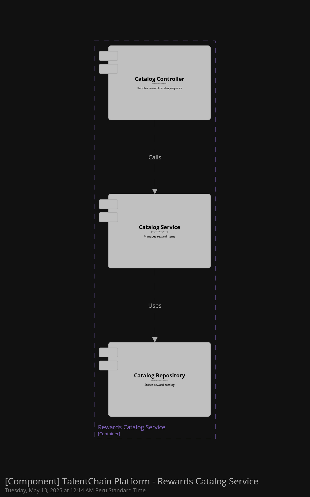

Step 3: Policies and External Systems

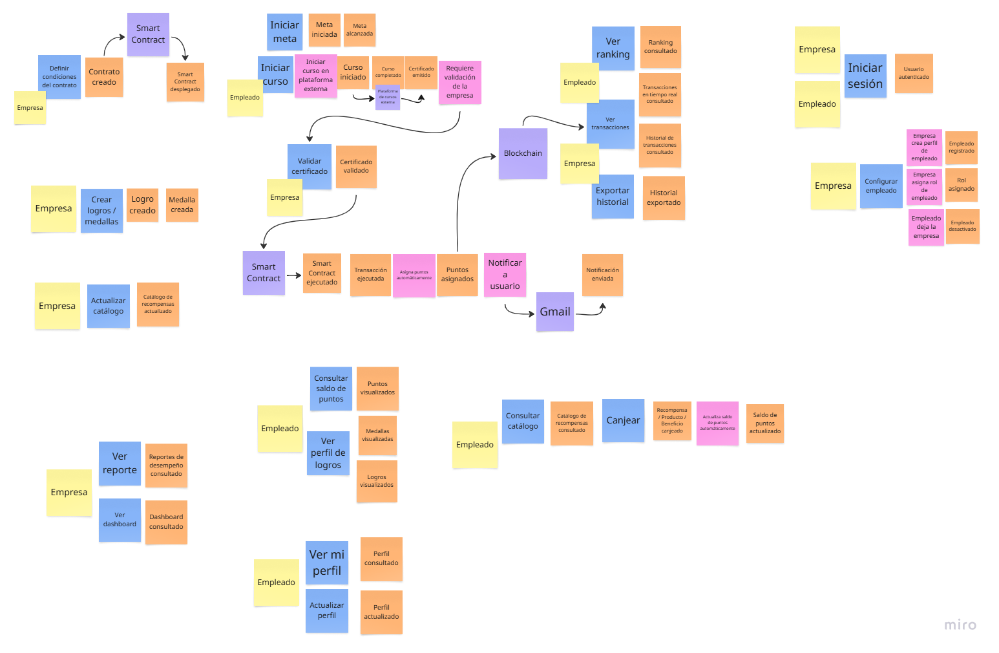

Step 4: Aggregates

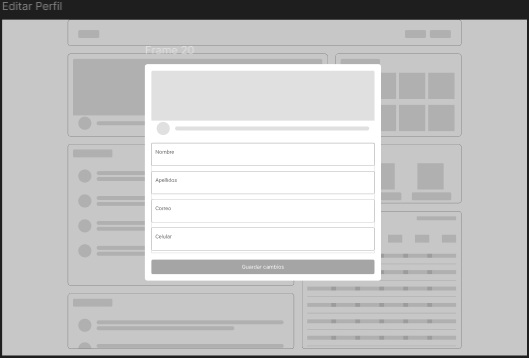

Step 5: Bounded Context

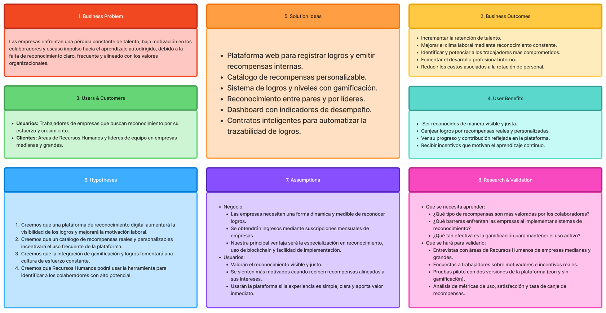

Link al Miro:

[<u>https://miro.com/app/board/uXjVIA4OirY=/?moveToWidget=3458764625401649245&cot=14</u>](https://miro.com/app/board/uXjVIA4OirY=/?moveToWidget=3458764625401649245&cot=14)

### **4.2.2. Candidate Context Discovery**

Certificados: Este Bounded Context se encargará de la revisión de
certificados de cursos y metas que el empleado quiere lograr de acuerdo
al puesto de trabajo en el que se encuentre. La opción de trayectoria
que elija tendrá que ser completada por el mismo empleado, y la empresa
será la encargada de validar el certificado. Esta etapa del flujo
principal de nuestra aplicación es importante para cumplir las
condiciones necesarias y así el empleado pueda demostrar su valía,
compromiso y esfuerzo dentro de la empresa.

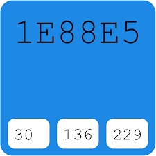

Smart Contract: Este Bounded Context es el encargado de crear y
desplegar los Smart Contracts, el cual forma parte de la tecnología
Blockchain, además de ser el desencadenante de transacciones automáticas
si es que se cumplen ciertas condiciones. Se realizarán las respectivas
notificaciones al empleado.

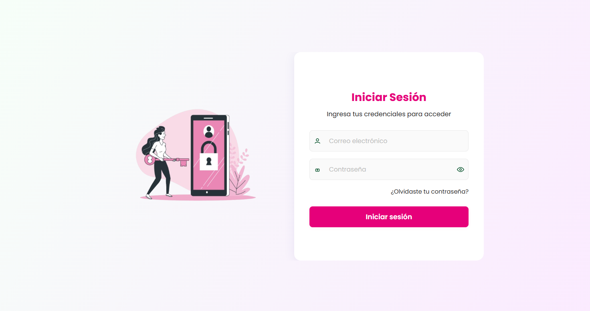

Transacciones: Este Bounded Context se encarga de cumplir con uno de los
objetivos de la aplicación, el cual es la transparencia entre sus
empleados. A través de la tecnología blockchain se podrá visualizar los
registros inmutables de cada transacción, la cual fue ejecutada por el
Smart Contract con anterioridad, fomentando así la competencia a nivel
interno.

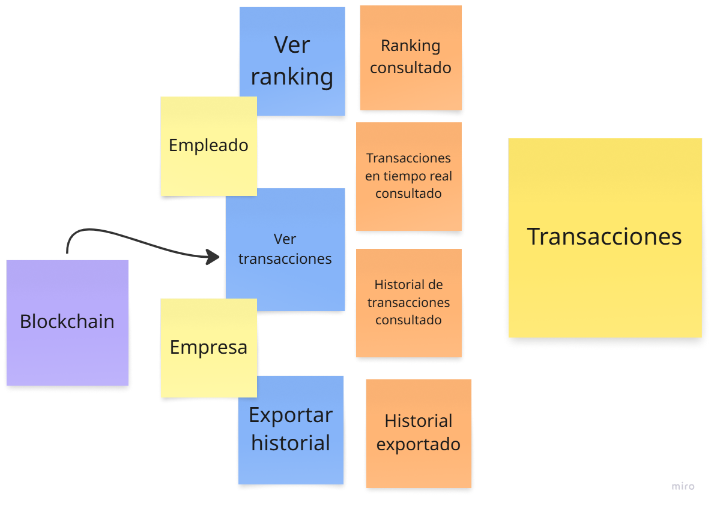

Catálogo de recompensas: Este Bounded Context se centra en las
recompensas que puede obtener el empleado cuando realiza sus
actividades, completa cursos, alcanza sus metas, etc. Podrá canjear sus
puntos obtenidos con productos, beneficios y otras cosas que la empresa
ofrezca.

### **4.2.3. Domain Message Flows Modeling**

Evento: Transacción de puntos a empleado

Este evento se ejecuta cuando el empleado finaliza un curso pertinente
para su puesto de trabajo actual. Este curso debe ser completado en
alguna plataforma web de cursos, y el certificado debe ser revisado por
el equipo correspondiente de la empresa. Una vez validado se ejecuta
automáticamente el smart contract, el cual contiene requisitos para que
se realice la transacción de puntos al empleado. Finalmente, por medio
de la aplicación web se podrá visualizar en tiempo real la transacción
realizada a ese empleado.

Link al Miro:

[<u>https://miro.com/app/board/uXjVIA4OirY=/?moveToWidget=3458764625558054083&cot=14</u>](https://miro.com/app/board/uXjVIA4OirY=/?moveToWidget=3458764625558054083&cot=14)

Evento: Canje de puntos en catálogo de recompensas

Este evento ocurre cuando el usuario empleado desea canjear sus puntos
obtenidos en el catálogo de recompensas que tiene integrado nuestra
aplicación. Este catálogo necesita ser actualizado con productos,
beneficios, entre otros, los cuales deben ser ingresados por el usuario
empresa.

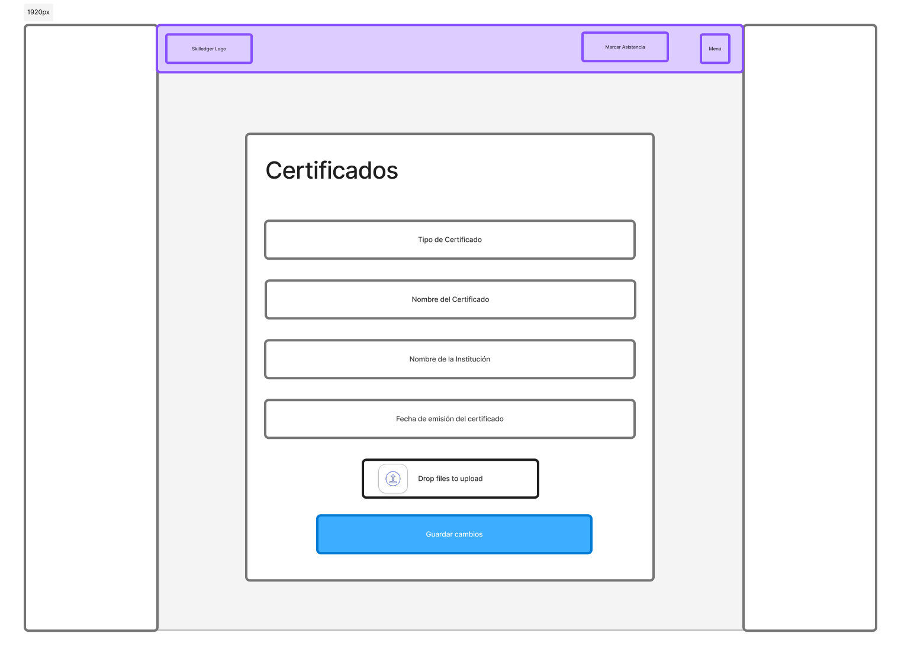

Link al Miro: [<u>Domain Message Flow Modelling Scenario
2</u>](https://miro.com/app/board/uXjVIA4OirY=/?moveToWidget=3458764625562354338&cot=14)

### **4.2.4. Bounded Context Canvases**

Certificados Context

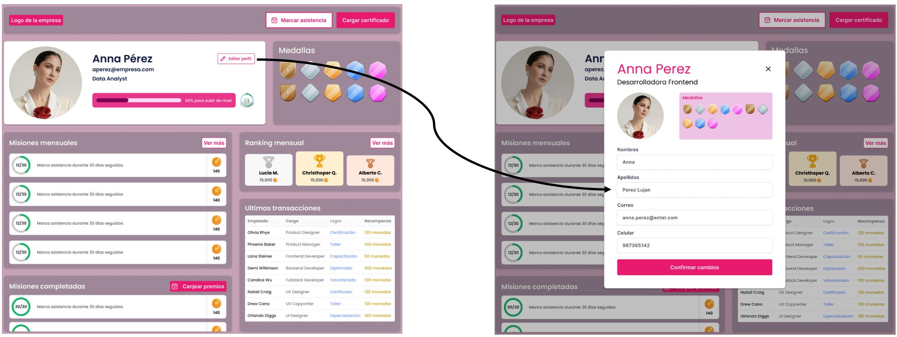

Smart Contracts Context

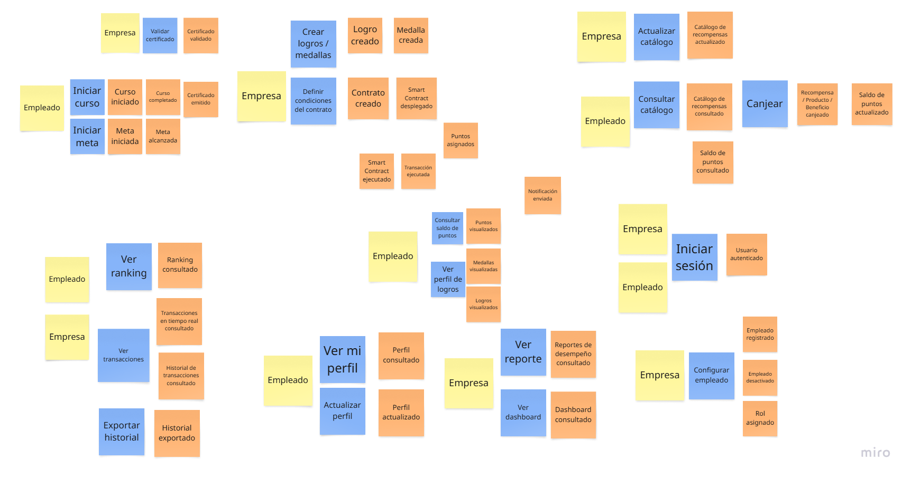

Transacciones Context

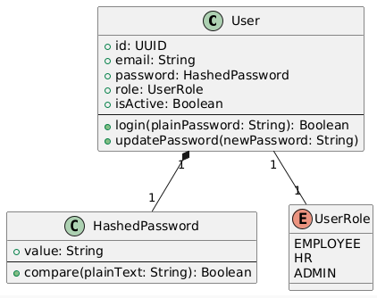

Usuarios Context

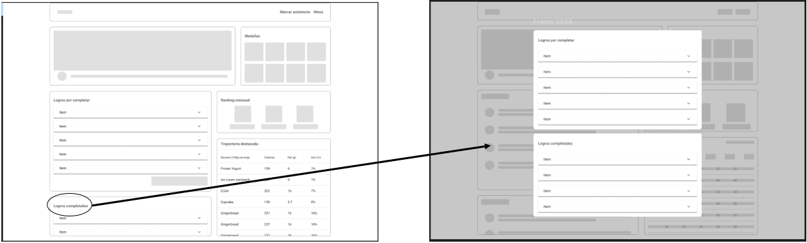

Catálogo de recompensas Context

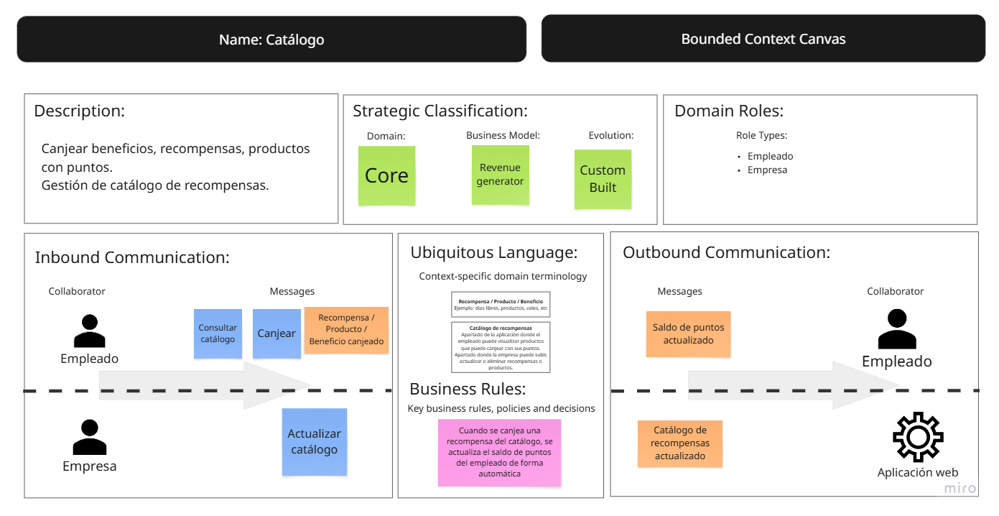

Premios Context

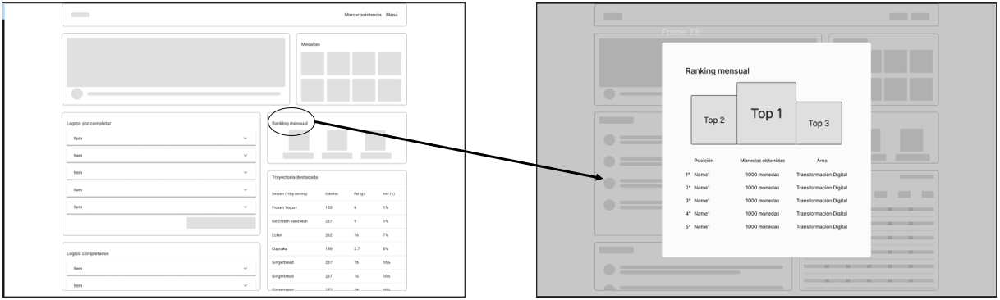

### **4.2.5. Context Mapping**

- Todos los bounded context cuentan con una interfaz gráfica en la
  aplicación web, por tal motivo es que se agregan íconos de usuarios,
  ya que será un sistema centrado en interacción humana.

- El bounded context Certificados tiene una coordinación del tipo débil
  con el bounded context Smart Contracts, ya que smart contracts solo
  necesita un resultado de Certificados. Además, se establece una capa
  de anticorrupción (ACL) para proteger las reglas de negocio de Smart
  Contracts.

- El bounded context Smart Contracts tiene una fuerte relación con el
  bounded context Transacciones. Ambos pueden compartir algunos modelos
  o reglas de negocio para realizar sus debidas operaciones.

- La relación entre Usuarios y Smart Contracts nos indica que Smart
  Contracts necesita datos del usuario para definir los respectivos
  contratos. Además, se usa una capa ACL para evitar contaminar el
  contexto.

- El bounded context de Catálogo ofrece APIs o servicios para que el
  bounded context de Usuarios pueda consumirlos. El contexto de Usuarios
  tiene una capa ACL para que las reglas de negocio del mismo contexto
  no sean expuestas al Catálogo.

- La relación entre el contexto Premios y Usuarios indica que el
  contexto Premios está en constante colaboración con el usuario y se
  adapta según las necesidades.

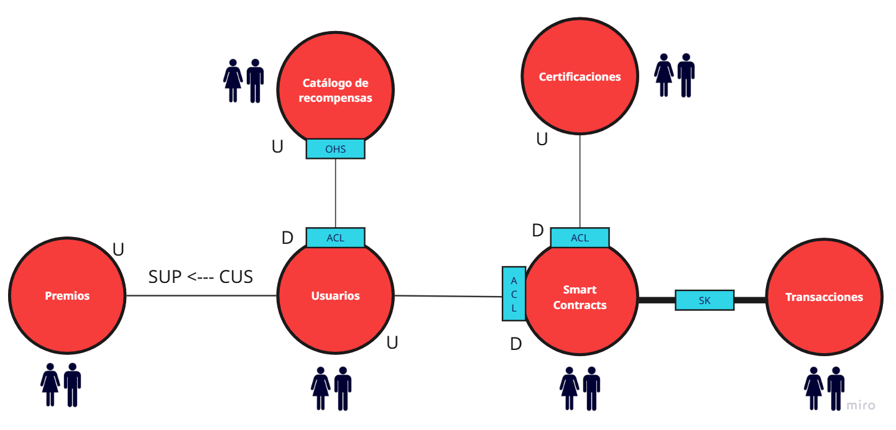

Link al Miro: [<u>Context
Mapping</u>](https://miro.com/app/board/uXjVIA4OirY=/?moveToWidget=3458764625826801771&cot=14)

## **4.3. Software Architecture**

### **4.3.1. Software Architecture System Landscape Diagram**

SkillLedger es una plataforma que permite a empresas reconocer el
talento de sus empleados a través de recompensas en blockchain. El
sistema interactúa con tres tipos de usuarios: empleados, recursos
humanos, y administradores.

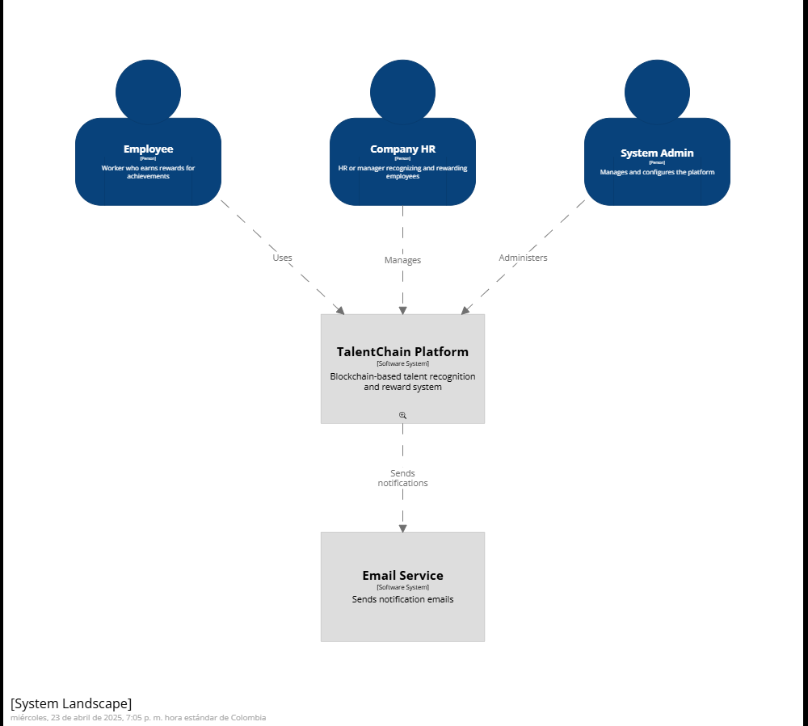

### **4.3.1. Software Architecture Context Level Diagrams**

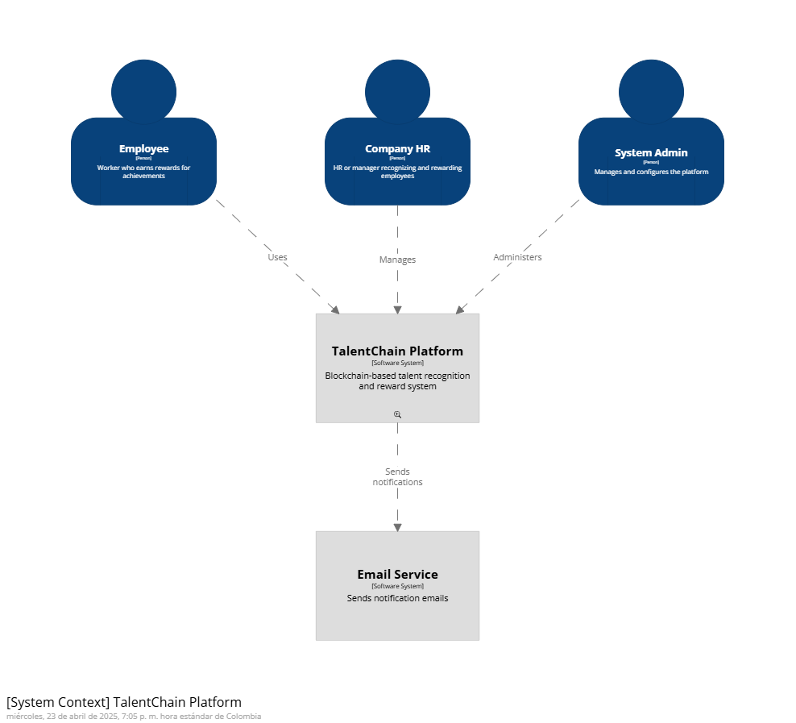

### **4.3.2. Software Architecture Container Level Diagrams**

Los empleados y el HR acceden por la web, ambos se comunican con el
sistema a través del API Gateway, que enruta las solicitudes según el
contexto (autenticación, recompensas, perfiles).

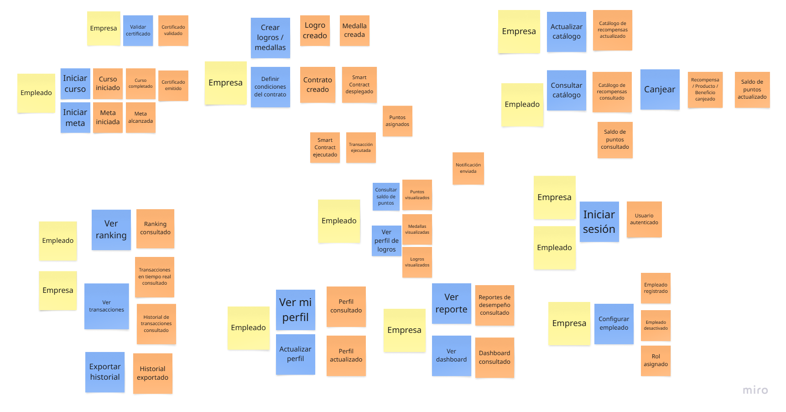

### **4.3.3. Software Architecture Deployment Diagrams**

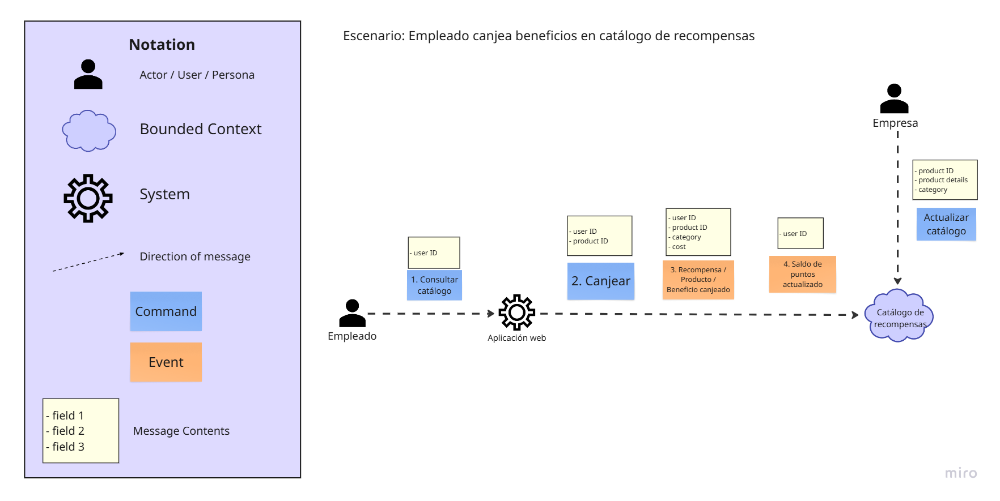

# **Capítulo V: Tactical-Level Software Design**

## 5.1. Bounded Context: Smart Contracts

### 5.1.1. Domain Layer

- Entidades:

> **Certificate**: Agregado raíz para certificados.
>
> Atributos:
>
> id: UUID
>
> metadata: Contenido
>
> status: Estado de validez (ACTIVE, REVOKED)
>
> Reglas:
>
> Solo el servicio de certificados puede revocar certificados

**PointsWallet**: Gestión de puntos.

> Atributos:
>
> walletAddress: Dirección blockchain del empleado
>
> pointsBalance: Saldo actual
>
> Reglas:
>
> Las transferencias requieren firma del propietario

- Value Objects:

> **BlockchainStamp**: Sello blockchain (txHash + blockTimestamp)

### 5.1.2. Interface Layer

- Endpoints REST:

> **POST** /api/certificates: Emite nuevo certificado (retorna txHash)
>
> **GET** /api/certificates/{id}/verify: Verifica validez en blockchain
>
> **POST** /api/points/mint: Minting de puntos (usar RewardService)
>
> **POST** /api/points/transfer: Transferencia entre wallets

- Eventos:

> **CertificateIssuedEvent**: Cuando se emite un nuevo certificado
>
> **PointsTransferredEven**t: Al completarse transferencias

### 5.1.3. Application Layer

- Servicios:

**CertificateOrchestrato**r: Coordina emisión + registro blockchain

Flujo:

> Valida datos
>
> Sube metadata
>
> Ejecuta smart contract

**PointsManager**: Administración de puntos tokenizados

> Funciones::
>
> Minting por logros
>
> Transferencias

### 5.1.4. Infrastructure Layer

- Repositorios:

**CertificateRepository**: Almacena metadatos off-chain (PostgreSQL)

Estructura:

> id (UUID)
>
> employee_id (UUID)
>
> ipfs_hash (VARCHAR)
>
> tx_hash (VARCHAR)
>
> status (ENUM)

- Clientes externos:

**Web3Gateway**: Adaptador para Ethereum (Web3j)

> Métodos clave:
>
> deployContract(bytecode, abi)
>
> callContractFunction(address, functionName, params)
>
> queryContractState(address, functionName)
>
> IPFSClient: Subida/descarga de contenido (imagenes, JSON, etc)

### 5.1.6. Bounded Context Software Architecture Component Level Diagrams

### 5.1.7. Bounded Context Software Architecture Code Level Diagrams

#### 5.1.7.1. Bounded Context Domain Layer Class Diagram

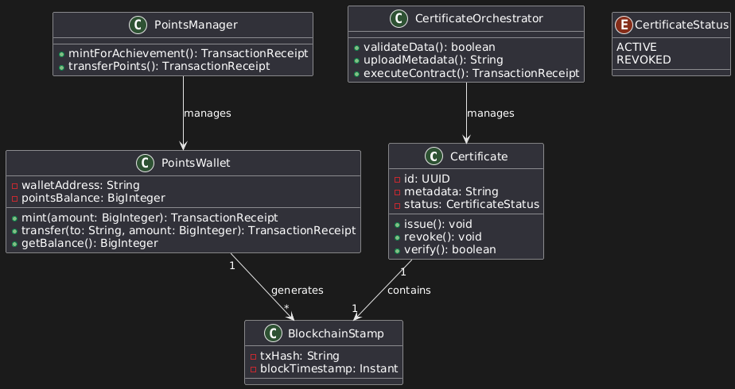

#### 5.1.7.2. Bounded Context Database Design Diagram

## 5.2. Bounded Context: Rewards

### 5.2.1. Domain Layer

- Entidades:

> **Redemption**: Agregado raíz para recompensas redimidas.
>
> Atributos:
>
> pointsUsed: Cantidad de puntos consumido
>
> deliveryStatus: Estado de entrega (PENDING, SHIPPED)
>
> blockchainProof: TxHash de la transacción

- Value Objects:

> **PointsAmount**: Valor numérico con validación
>
> **RedemptionCode**: Código alfanumérico para reclamación

### 5.2.2. Interface Layer

- Endpoints REST:

> **POST** /api/redeem: Inicia redención (consume puntos)
>
> **GET** /api/redeem/history: Historial por empleado
>
> **PATCH** /api/redeem/{id}/fulfill: Marca como completado

- Eventos:

> **RedemptionStartedEvent**: Al crear nueva redención
>
> **RedemptionCompletedEvent**: Cuando se entrega la recompensa

### 5.2.3. Application Layer

- Servicios:

**RedemptionProcessor**:

Flujo:

> Verifica saldo (via Smart Contracts Bounded Context)
>
> Crea registro de redención
>
> Utiliza puntos (tx blockchain)
>
> Notifica a Catalog Service

**PointsCalculator**: Lógica de conversión puntos-producto

### 5.2.4. Infrastructure Layer

- Repositorios:

> **RedemptionRepository**:
>
> employee_id: Auth Service
>
> reward_item_id: Catalog Service
>
> tx_hash: Blockchain

- Clientes externos:

> **SmartContractsClient**: Consume API de Smart Contracts Bounded
> Context
>
> **EmailServiceClient**: Notificaciones a empleados

### 5.2.6. Bounded Context Software Architecture Component Level Diagrams

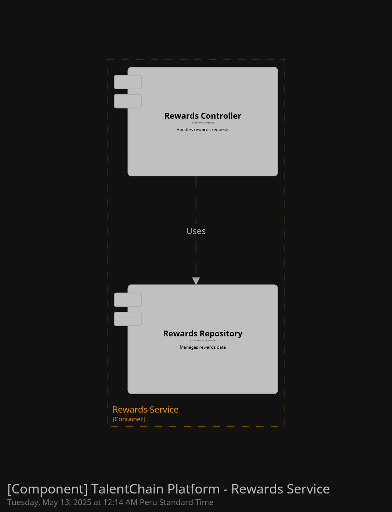

### 5.2.7. Bounded Context Software Architecture Code Level Diagrams

#### 5.2.7.1. Bounded Context Domain Layer Class Diagram

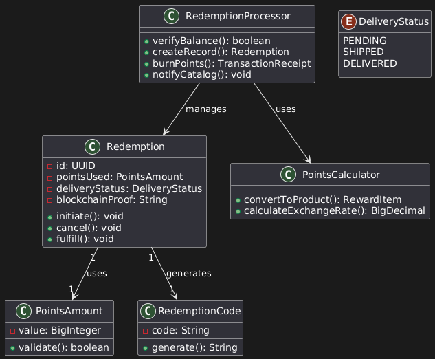

#### 5.2.7.2. Bounded Context Database Design Diagram

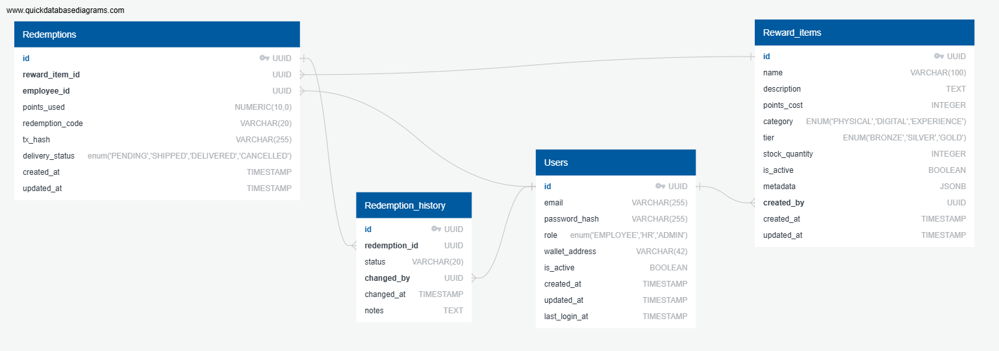

## 5.3. Bounded Context: Rewards Catalog

### 5.3.1. Domain Layer

- Entidades:

**RewardItem**: Agregado raíz para ítems del catálogo.

> Atributos:
>
> stock: Cantidad disponible
>
> category: Clasificación (PHYSICAL, DIGITAL, EXPERIENCE)

- Reglas:

> Ítems físicos deben tener stock \> 0
>
> Solo admins pueden modificar ítems

- Value Objects:

> **TierLevel**: Nivel de exclusividad (BRONZE, SILVER, GOLD)
>
> **PointsRange**: Validación de costos (100-10000 puntos)

### 5.3.2. Interface Layer

- Endpoints REST:

> **GET** /api/catalog: Lista ítems disponibles (filtros por
> tier/category)
>
> **POST** /api/catalog: Añade nuevo ítem (solo admin)
>
> **PUT** /api/catalog/{id}/stock: Actualiza inventario

- Eventos:

> **CatalogUpdatedEvent**: Cuando cambia disponibilidad
>
> **NewRewardItemEvent**: Al añadir ítems premium

### 5.3.3. Application Layer

- Servicios:

> **CatalogManager**:
>
> Funciones:
>
> Validación de consistencia de puntos
>
> Control de inventario
>
> Generación de códigos de redención
>
> **TierCalculator**: Asignación automática de tiers basado en:
>
> Puntos requeridos
>
> Tasa de redención histórica
>
> Tipo de producto

### 5.3.4. Infrastructure Layer

- Repositorios:

> **RewardItemRepository**:
>
> Metadata dinámica
>
> Índices por tier/category

- Clientes externos:

> **ContentDeliveryClient**: Integración con proveedores de:
>
> Códigos digitales
>
> Productos/Servicios físicos

### 5.3.6. Bounded Context Software Architecture Component Level Diagrams

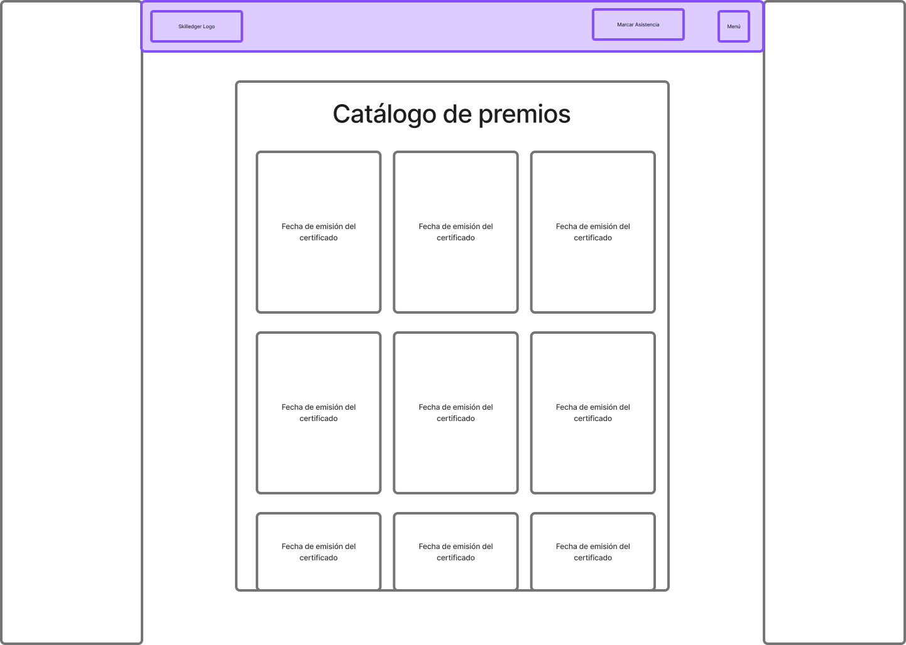

### 5.3.7. Bounded Context Software Architecture Code Level Diagrams

#### 5.3.7.1. Bounded Context Domain Layer Class Diagram

#### 5.3.7.2. Bounded Context Database Design Diagram

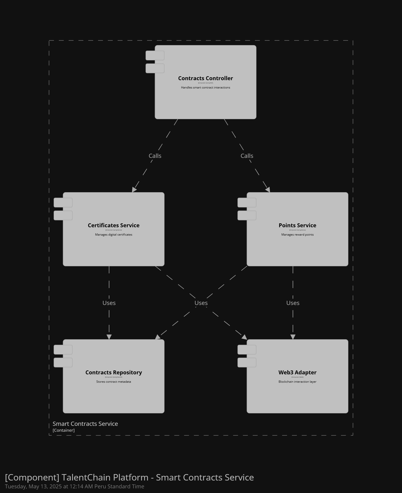

## 5.4. Bounded Context: Authentication

### 5.4.1. Domain Layer

- Entidades:

> **User:** Raíz de agregado con email, contraseña hasheada, rol y
> wallet blockchain.
>
> **AuthToken:** Token JWT con fecha de expiración.

- Value Objects:

> **HashedPassword:** Encriptación BCrypt con validación.
>
> **WalletAddress:** Dirección Ethereum con validación de formato.

- Reglas:

> Las contraseñas nunca se almacenarán en texto plano.

### 5.4.2. Interface Layer

- Endpoints:

> **POST /auth/login:** Retorna JWT al validar credenciales.
>
> **POST /auth/register:** Crea usuario y registra wallet en blockchain.

- Eventos:

**UserRegisteredEvent:** Disparado al registrar un nuevo usuario.

### 5.4.3. Application Layer

- Casos de Uso:

> **LoginUserUseCase:** Valida credenciales y genera token.
>
> **RegisterUserUseCase:** Persiste usuario y llama a smart contract.

- DTOs:

> LoginRequest (email + password).
>
> RegisterRequest (email + password).

### 5.4.4. Infrastructure Layer

- Repositorios:

> **UserRepository:** Persistencia en PostgreSQL con Spring Data JPA.

- Clientes Externos:

> **BlockchainAuthClient:** Registro de wallets vía Web3j.

### 5.4.6. Bounded Context Software Architecture Component Level Diagrams

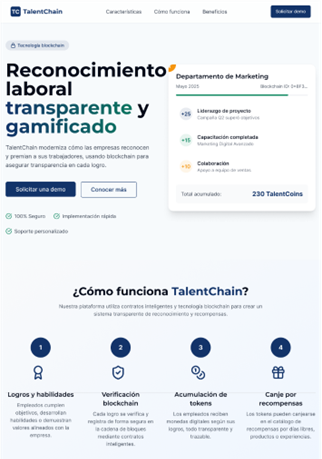

### 5.4.7. Bounded Context Software Architecture Code Level Diagrams

#### 5.4.7.1. Bounded Context Domain Layer Class Diagram

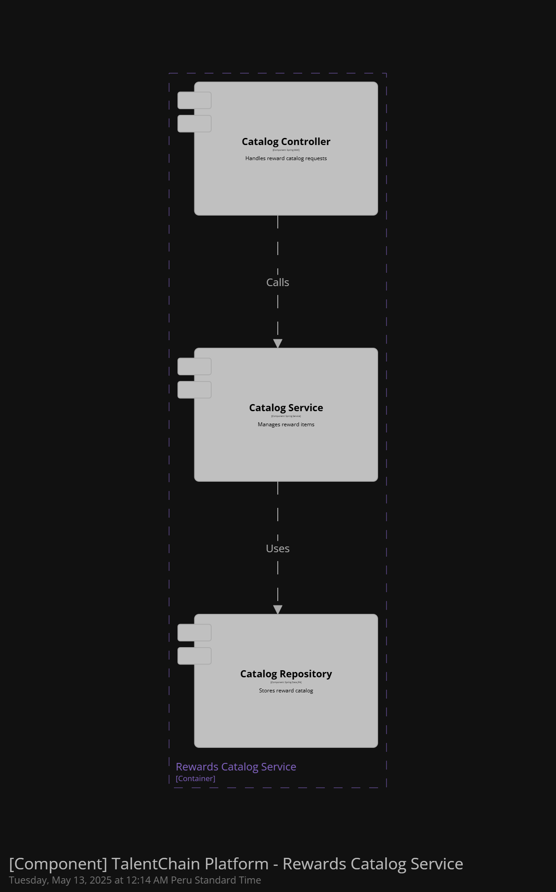

#### 5.4.7.2. Bounded Context Database Design Diagram

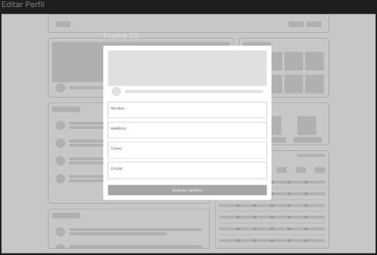

## 5.5. Bounded Context: Profile

### 5.5.1. Domain Layer

- Entidades:

> **EmployeeProfile:** Raíz de agregado con información personal,
> departamento, skills y logros.
>
> **Achievement:** Logro certificado en blockchain (ID, título, tipo,
> fecha, hash de transacción).

- Value Objects:

> **Skill:** Habilidad con nombre y nivel.
>
> **BlockchainCertificate:** Certificado inmutable con hash de
> transacción.

- Reglas:

> Cada logro debe tener un certificado blockchain válido.
>
> Las skills tienen niveles predefinidos.

### 5.5.2. Interface Layer

- Endpoints:

> **GET /profiles/{id}:** Obtiene perfil con logros y skills.
>
> **POST /profiles/{id}/achievements:** Registra un nuevo logro (dispara
> evento a blockchain).

- Eventos:

> **AchievementAddedEvent:** Publicado al agregar un logro.

### 5.5.3. Application Layer

- Casos de Uso:

> **GetProfileUseCase:** Recupera perfil y calcula progreso.
>
> **AddAchievementUseCase:** Valida y registra logros (integra con
> blockchain).

- DTOs:

> SkillResponse (nombre, nivel).
>
> AchievementResponse (título, fecha, certificado).

### 5.5.4. Infrastructure Layer

- Repositorios:

> **ProfileRepository:** Persistencia en PostgreSQL con Spring Data JPA.

- Integraciones:

> **BlockchainVerifier:** Verifica certificados mediante Web3j.

### 5.5.6. Bounded Context Software Architecture Component Level Diagrams

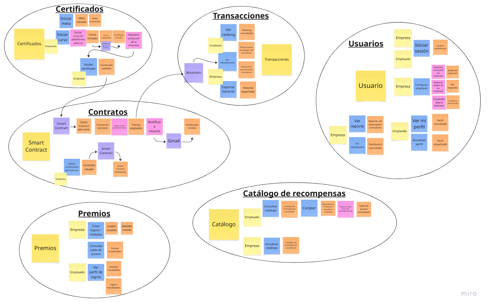

### 5.5.7. Bounded Context Software Architecture Code Level Diagrams

#### 5.5.7.1. Bounded Context Domain Layer Class Diagram

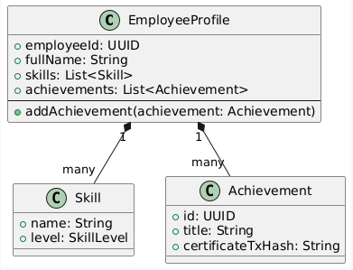

#### 5.5.7.2. Bounded Context Database Design Diagram

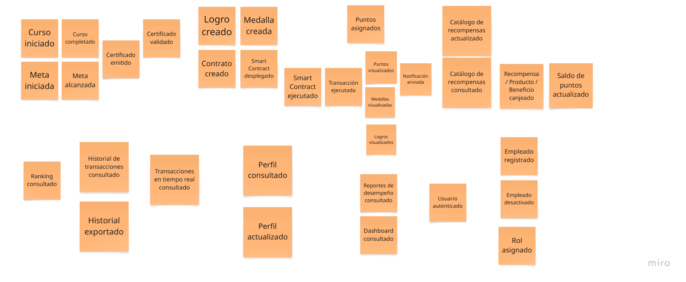

## 5.6. Bounded Context: Reporting 

### 5.6.1. Domain Layer

- Entidades:

> **Report:** Agregado raíz con datos analíticos y metadatos blockchain.
>
> **ReportTemplate**: Plantillas predefinidas (JSON configurable).

- Value Objects:

> **AnalyticsData:** Resultados de métricas calculadas (ej:
> "skillsGrowthRate").
>
> **BlockchainStamp:** Sello blockchain (txHash + timestamp).

- Reglas:

> Los reportes certificados deben incluir un BlockchainStamp válido.
>
> Solo HR/admins pueden generar reportes a nivel departamental.

### 5.6.2. Interface Layer

- Endpoints REST:

> **POST /reports/generate:** Dispara generación asíncrona (retorna ID
> de reporte).
>
> **GET /reports/{id}/download:** Descarga PDF con sello blockchain.

- Eventos:

> **ReportRequestedEvent:** Al iniciar generación.
>
> **ReportCertifiedEvent:** Cuando blockchain valida el documento.

### 5.6.3. Application Layer

- Servicios:

> **ReportOrchestrator:** Coordina generación + certificación
> blockchain.
>
> **AnalyticsCalculator:** Agrega métricas desde PostgreSQL/ClickHouse.

### 5.6.4. Infrastructure Layer

- Repositorios:

> **ReportRepository:** Almacena reportes en PostgreSQL (JSONB para
> datos dinámicos).

- Clientes externos:

> **PDFServiceClient:** Genera documentos usando API externa.
>
> **BlockchainCertifier:** Minting de NFTs (Web3j + Smart Contracts BC).

### 5.6.6. Bounded Context Software Architecture Component Level Diagrams

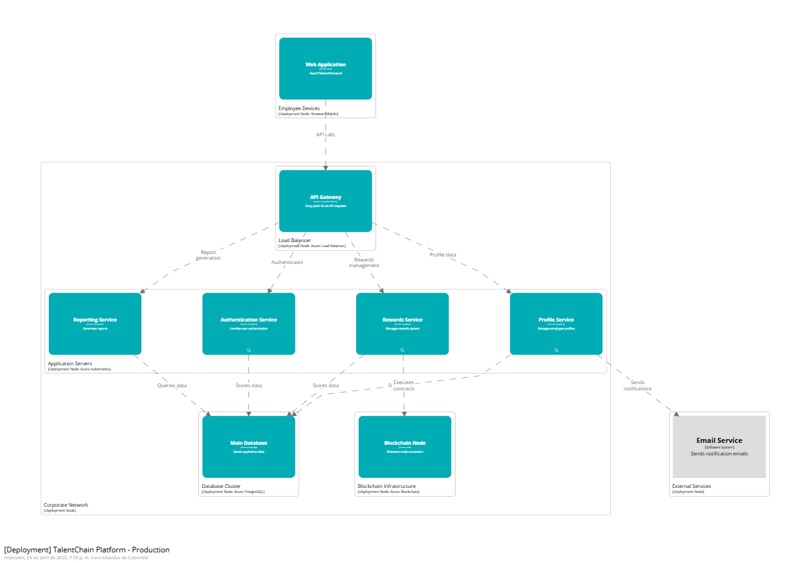

### 5.6.7. Bounded Context Software Architecture Code Level Diagrams

#### 5.6.7.1. Bounded Context Domain Layer Class Diagram

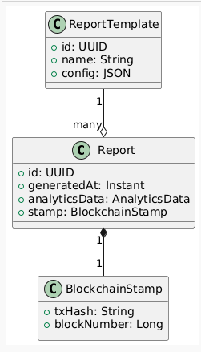

#### 5.6.7.2. Bounded Context Database Design Diagram

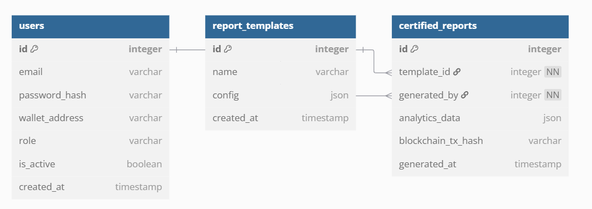

# **Capítulo VI: Solution UX Design**

## 6.1. Style Guidelines

### 6.1.1. General Style Guidelines

Identidad visual propia

**Logotipo**

El cual deberá estar presente en todas las vistas principales, también
debe ser responsivo para dispositivos móviles.

**Tipografía**

La fuente escogida deberá ser legible y limpia, es por eso que se tomó
en cuenta una como Roboto. Puesto que se tiene como prioridad un
apartado visual claro con tamaños distintos para distinguir entre
títulos, subtítulos y textos informativos.

**Roboto - Google fonts**

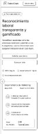

Referencia:
[<u>https://fonts.google.com/specimen/Roboto</u>](https://fonts.google.com/specimen/Roboto)

Paleta de colores

A continuación se especificarán los colores que se emplearán en la
solución para transmitir profesionalismo y confianza (azules, grises y
acentos en dorado o verde para elementos de reconocimiento y éxito)

- Primary: Transmite confianza, seriedad y tecnología. El color será
  utilizado para botones principales y enlaces. El código HEX utilizado
  es \#1E88E5.

> 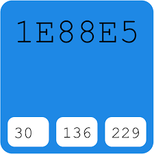 style="width:2.34375in;height:2.34375in" />

- Primary Variant: Será mucho más fuerte que el primary. Su uso se dará
  en los encabezados, barras superiores y énfasis. El código HEX
  utilizado es \#1565C0.

> 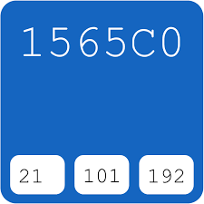 style="width:2.34375in;height:2.34375in" />

- Secondary: Representará logros, recompensas y prestigio. Usado en
  insignias, íconos de éxito. El código HEX utilizado es \#F9A825.

> 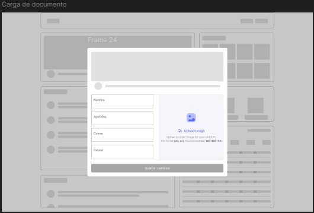 style="width:2.34375in;height:2.34375in" />

- Background: Neutral y suave. Ideal como fondo en general para tener
  cierta limpieza visual. El código HEX a utilizar es \#F5F7FA.

>  style="width:2.34375in;height:2.34375in" />

### 6.1.2. Web, Mobile & Devices Style Guidelines

**Web Style Guidelines**

Diseño:

- Resolución base recomendada: 1440x900 px (adaptable a pantallas desde
  1024px en adelante).

- Diseño fluido y con cuadrícula de 12 columnas, adaptable a pantallas
  anchas.

- Menú lateral disponible para usuarios administradores; menú superior
  presente para empleados.

Interacción:

- Hover states (botones, tarjetas, enlaces).

- Modales y formularios centrados con foco automático.

- Navegación utilizando SPA (Single Page Application) para una
  experiencia fluida.

Comportamiento:

- Soporte completo para navegadores modernos (Chrome, Edge, Firefox,
  Safari).

- Animaciones suaves con framer-motion o CSS3.

- Compatible con pantallas táctiles en laptops 2 en 1.

**Mobile Style Guidelines**

Diseño:

- Diseño responsive con reorganización vertical de componentes.

- Bottom Navigation Bar para las funciones principales: Logros,
  Recompensas, Perfil.

- Tamaño mínimo de tappable areas: 48x48px según recomendaciones de
  accesibilidad.

Interacción:

- Interfaz simplificada: menos opciones por pantalla, acciones rápidas.

- Elementos visuales centrados en el reconocimiento (íconos grandes de
  logros).

- Animaciones cortas para notificaciones de éxito o nuevos premios.

Comportamiento:

- Carga rápida incluso en redes móviles lentas (uso de lazy loading,
  caché local).

- Modo oscuro opcional.

- Integración con cámara para subir certificados o escanear QR de
  premios (si aplica).

**IoT Style Guidelines**

Diseño:

- UI simplificada y legible desde la distancia (fuentes grandes,
  contrastes altos).

- Modo pantalla completa, sin navegación del navegador.

- Navegación táctil con íconos grandes y botones visibles.

Casos de uso:

- Pantallas en oficinas o zonas comunes que muestran:

  - Reconocimientos semanales.

  - Ranking de empleados con más logros.

  - Avisos o incentivos nuevos del catálogo.

Interacción:

- Uso limitado a consulta o visualización, no a edición.

- Interacciones por QR o botón físico (opcional).

- Autenticación rápida mediante PIN, badge RFID o código QR personal.

## 6.2. Information Architecture

### 6.2.1. Labeling Systems

Los sistemas de etiquetado (labeling system) buscan comunicar de forma
clara y concisa las funciones y contenido de la plataforma. Las
etiquetas se diseñan para ser intuitivas, breves y dirigidas a la acción
o propósito, adaptadas tanto para empleados como administradores.

Claridad: Evitar términos técnicos innecesarios (ej. “Smart Contract” se
puede mostrar como “Reglas Automáticas” para empleados).

Consistencia: Usar el mismo término en toda la plataforma (ej.
“Recompensas” en vez de alternar con “Premios” o “Bonos”).

Lenguaje natural: Usar expresiones cercanas al usuario ("Mis logros",
"Canjear", "Subir certificado", etc.).

Acción directa: Etiquetas que sugieren la acción, como "Ver historial",
"Agregar ruta", "Validar logro", etc.

### 6.2.2. Searching Systems

El sistema de búsqueda en SkillLedger está diseñado para ser rápido,
preciso y fácil de usar, permitiendo que tanto empleados como
administradores encuentren información relevante sin esfuerzo. Las
búsquedas se adaptan al contexto del usuario y al módulo en el que se
encuentre.

- Búsqueda global: Barra de búsqueda centralizada accesible desde
  cualquier vista principal. Ejemplo: “certificado de Excel”, “Juan
  Pérez”, “tokens”

- Búsqueda contextual: Barra de búsqueda específica por módulo o
  entidad. Ejemplo: En logros, empleados, catálogo de recompensas

- Búsqueda por filtros: Filtros dinámicos para refinar resultados por
  categoría, estado, fecha, etc. Ejemplo: Estado: “Pendiente”, Tipo:
  “Curso”, Fecha: “Últimos 30 días”

### 6.2.3. SEO Tags and Meta Tags

Se utilizarán estrategias de SEO y metaetiquetas para mejorar la
visibilidad de SkillLedger esto con el objetivo de fortalecer su
identidad digital, y asegurar que motores de búsqueda indexen
correctamente su contenido relevante.

1\. Objetivos SEO

- Mejorar el posicionamiento de SkillLedger en búsquedas relacionadas
  con:

  - Reconocimiento laboral

  - Blockchain en recursos humanos

  - Sistemas de recompensas corporativas

<!-- -->

- Aumentar el tráfico orgánico hacia la página de presentación de la
  plataforma.

<!-- -->

- Facilitar el acceso a documentos públicos, publicaciones técnicas o
  casos de éxito.

2\. Etiquetas HTML (meta tags)

\<title\>SkillLedger - Plataforma de Reconocimiento Laboral con
Blockchain\</title\>

\<meta name="description" content="SkillLedger es una plataforma SaaS
que permite a las empresas reconocer logros de sus colaboradores
mediante recompensas gamificadas, trazables con tecnología
blockchain."\>

\<meta name="keywords" content="reconocimiento laboral, blockchain,
smart contracts, gamificación, retención de talento, plataforma de
recompensas, recursos humanos"\>

\<meta name="author" content="TalentChain - Ingeniería de Software -
UPC"\>

\<meta name="viewport" content="width=device-width, initial-scale=1.0"\>

\<link rel="icon" href="/assets/favicon.ico" type="image/x-icon"\>

3\. Buenas prácticas de SEO técnico.

- Uso de etiquetas semánticas (\<header\>, \<section\>, \<article\>,
  \<footer\>) en la estructura de la landing page.

<!-- -->

- URLs limpias y amigables: Ej. /recompensas/categorias en lugar de
  /page?id=123&cat=true

<!-- -->

- Sitemaps y archivo robots.txt configurados para permitir indexación de
  páginas públicas.

<!-- -->

- Tiempos de carga optimizados con recursos comprimidos (CSS, JS) y lazy
  loading de imágenes.

<!-- -->

- Etiquetas alt descriptivas en todas las imágenes para accesibilidad y
  SEO.

### 6.2.4. Navigation Systems

El sistema de navegación de SkillLedger se diseña para ser intuitivo,
eficiente y coherente a través de todos los dispositivos (web, móvil y
kioscos). Permite que los usuarios encuentren fácilmente las
funcionalidades clave según su perfil y sus necesidades frecuentes,
reduciendo la fricción en el uso diario de la plataforma.

**Principios de navegación**

- Estructura jerárquica clara, desde módulos principales hacia acciones
  específicas.

<!-- -->

- Consistencia en la ubicación de menús y acciones clave.

<!-- -->

- Accesos rápidos a las funciones más usadas (logros, recompensas,
  perfil, validaciones).

<!-- -->

- Visibilidad del estado (señalización clara de la ubicación actual del
  usuario).

**Esquema de navegación por tipo de usuario**

**Empleado (colaborador)**

Menú principal:

- Inicio / Dashboard

<!-- -->

- Mis Logros

<!-- -->

- Recompensas

<!-- -->

- Certificados

<!-- -->

- Perfil

<!-- -->

- Ayuda / Preguntas frecuentes

**Administrador / Recursos Humanos**

Menú principal:

- Panel de control

<!-- -->

- Validaciones pendientes

<!-- -->

- Rutas de desarrollo

<!-- -->

- Recompensas (gestión)

<!-- -->

- Usuarios / Equipos

<!-- -->

- Configuración avanzada

<!-- -->

- Auditoría blockchain

**Componentes de navegación**

Sidebar (Web): Navegación lateral persistente con íconos + etiquetas

Bottom Navigation (Móvil): Íconos grandes para funciones principales (5
máximo)

Breadcrumbs: Mostrar ruta actual en módulos profundos

Menú desplegable: Perfil del usuario, cerrar sesión, configuración

Botones flotantes: Acciones rápidas como “Subir logro” o “Validar”

Search bar: Navegación por búsqueda textual (ver sección previa)

## 6.3. Landing Page UI Design

### 6.3.1. Landing Page Wireframe

- Desktop

- Tablet

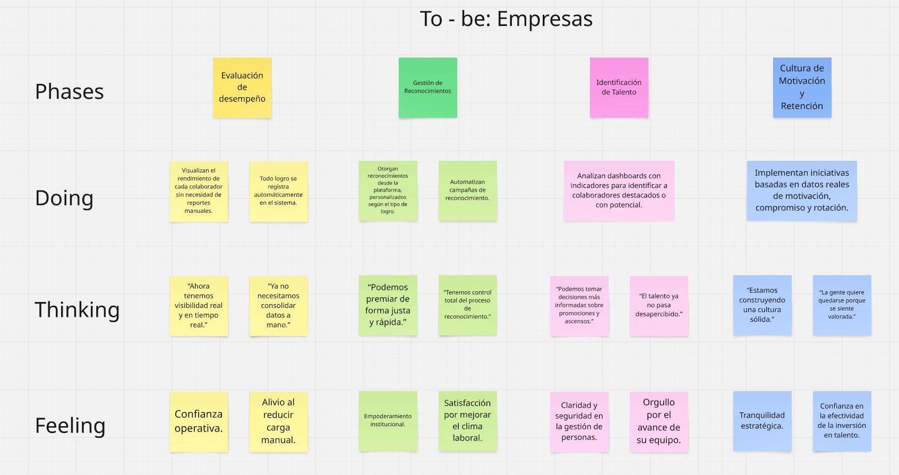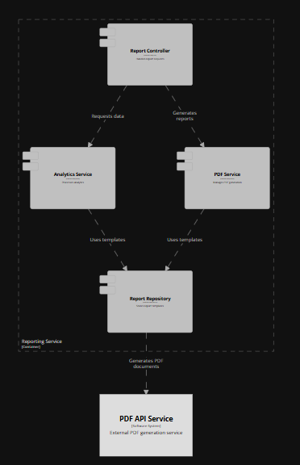

- Phone

> 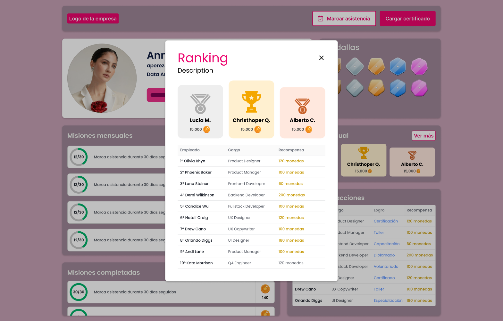 style="width:0.67708in;height:2.38542in" /> style="width:0.6875in;height:2.69792in" />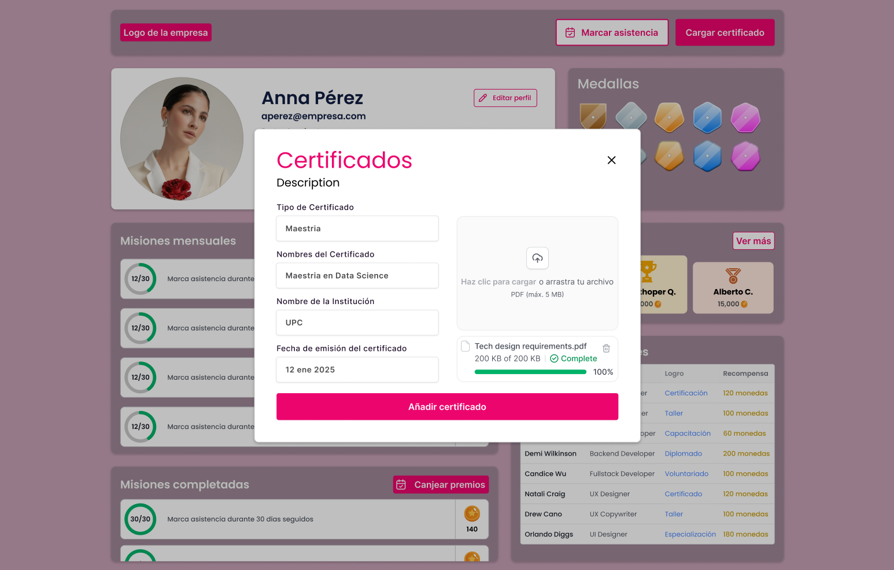 style="width:0.67708in;height:2.52083in" />

### 6.3.2. Landing Page Mock-up

- Desktop

> 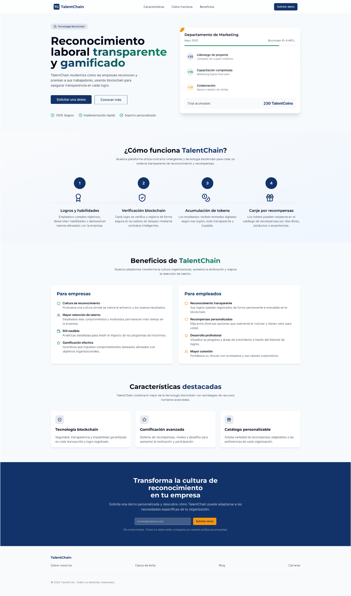 style="width:3.29688in;height:5.58995in" />

- Tablet

> 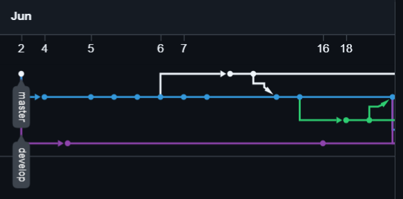 style="width:2.24479in;height:3.19987in" /> style="width:2.30729in;height:4.62173in" />

- Phone

>  style="width:0.71875in;height:2.4375in" /> style="width:0.71875in;height:2.69792in" />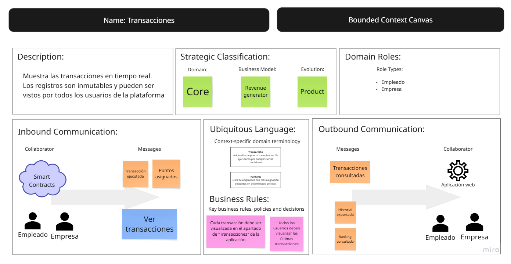 style="width:0.72917in;height:2.52083in" />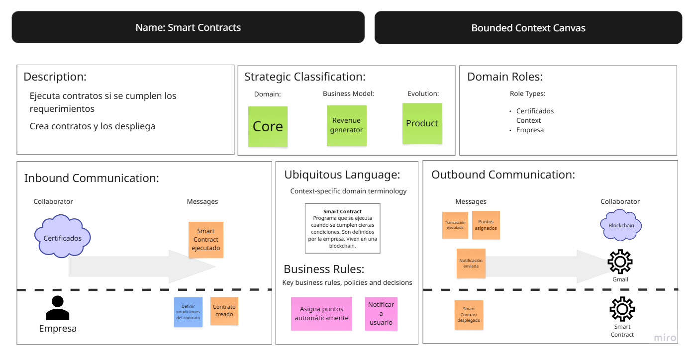 style="width:0.72917in;height:1.80208in" /> style="width:0.72917in;height:2.08333in" />

## 6.4. Applications UX/UI Design

### 6.4.1. Applications Wireframes

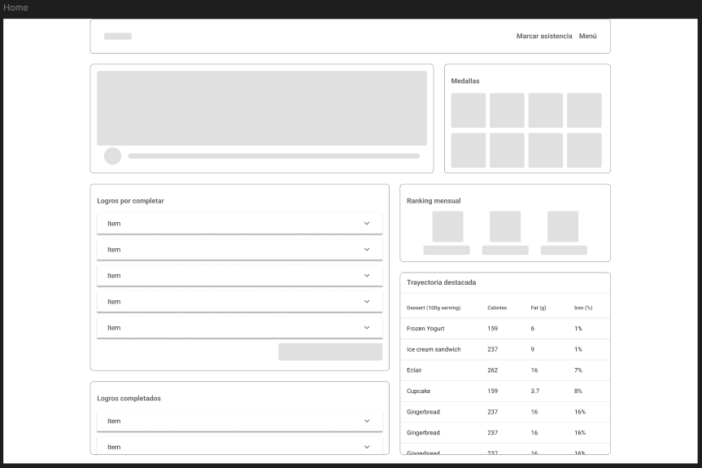

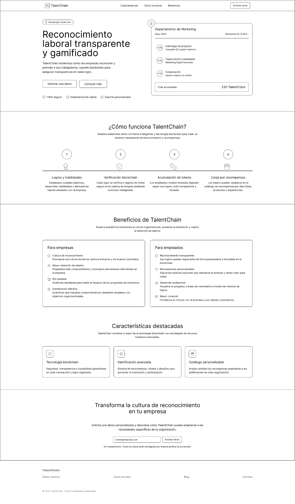

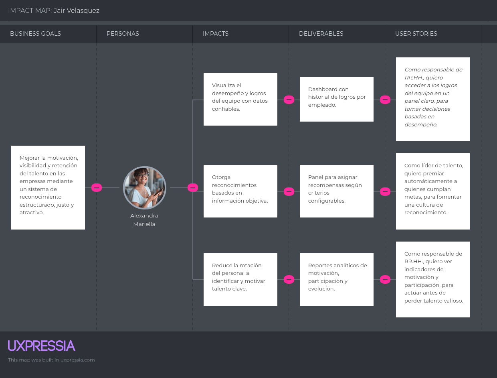

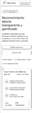

### 6.4.2. Applications Wireframes

### 6.4.2. Applications Wireflow Diagrams

- Editar Perfil

> 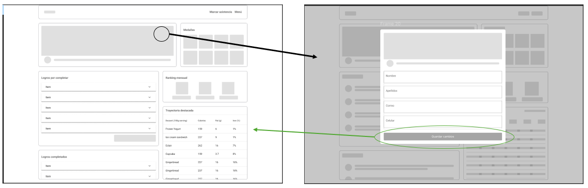 style="width:6.26772in;height:2.01389in" />

- Cargar certificado

> 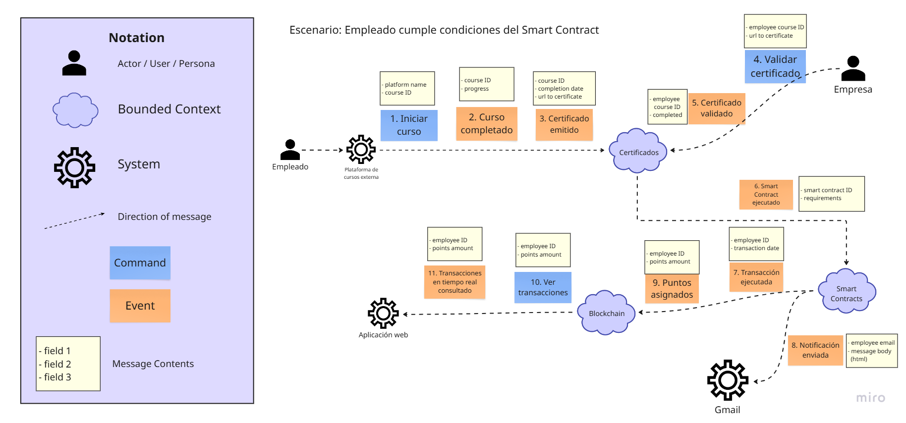 style="width:6.26772in;height:1.84722in" />

- Ranking

>  style="width:6.26772in;height:1.88889in" />

- Mis logros

>  style="width:6.26772in;height:1.88889in" />

- Catálogo de recompensas

> 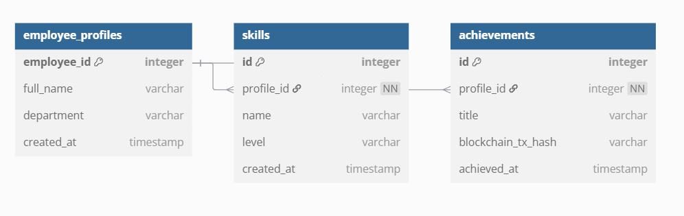 style="width:6.26772in;height:1.86111in" />

### 6.4.3. Applications Mock-ups

  
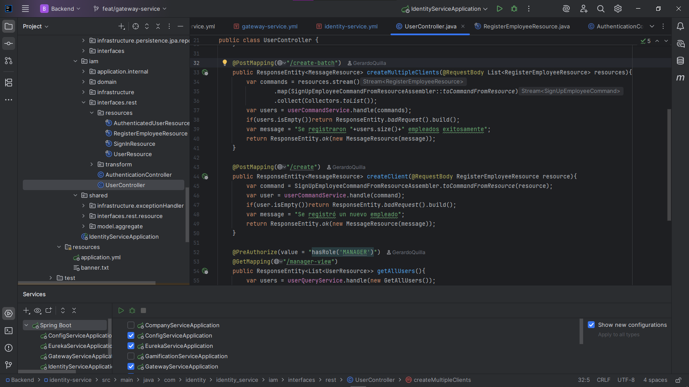

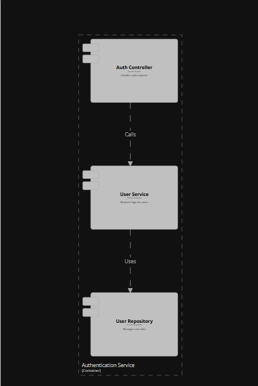

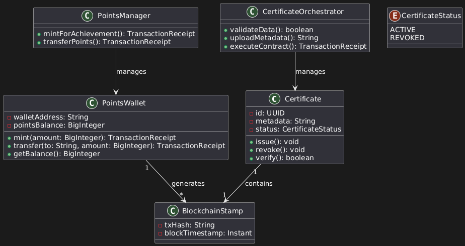

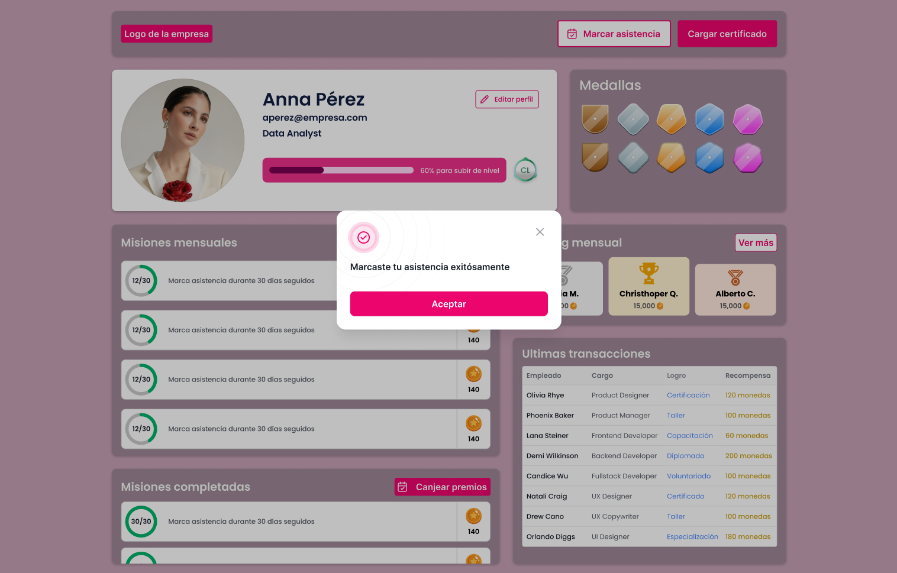

### 6.4.4. Applications User Flow Diagrams

User Flow Nr°1

User: Trabajador

Goal: Subir Certificado

Cuando el trabajador intenta subir un certificado de estudio.

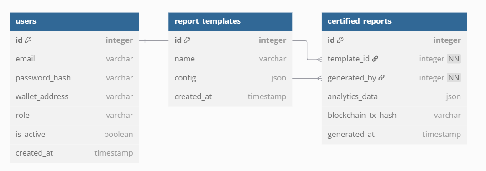

User Flow Nr°2

User: Trabajador

Goal: Editar Perfil

Cuando el trabajador intenta editar el Perfil

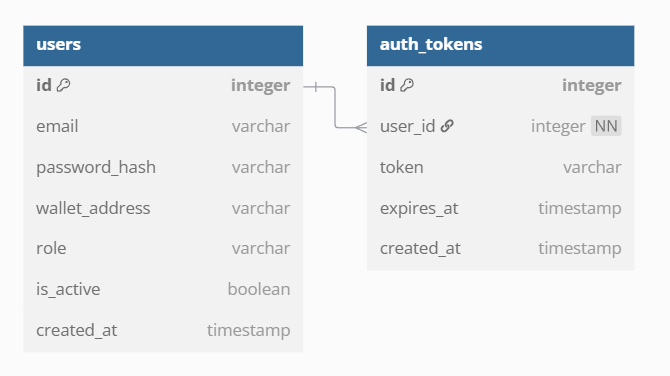.

User Flow Nr°2

User: Trabajador

Goal: Editar Perfil

Cuando el trabajador intenta editar el Perfil

## 6.5. Applications Prototyping

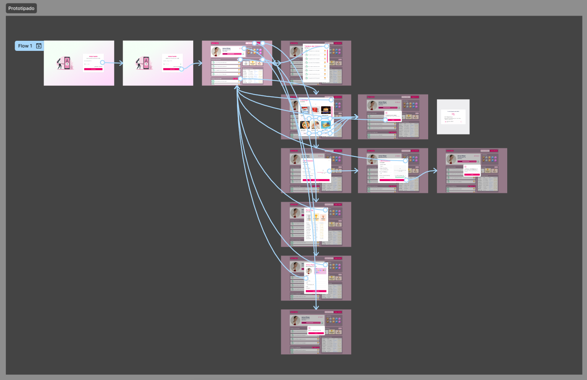

Link del prototipo:
[<u>https://www.figma.com/proto/XYjr6XtfC7IAZYXqJQGjlt/Web-APP---Arqui.-Emergentes?page-id=13%3A49945&node-id=90-14862&viewport=347%2C39%2C0.1&t=ZdQdyNGJ755RwhXz-1&scaling=min-zoom&content-scaling=fixed&starting-point-node-id=90%3A14862</u>](https://www.figma.com/proto/XYjr6XtfC7IAZYXqJQGjlt/Web-APP---Arqui.-Emergentes?page-id=13%3A49945&node-id=90-14862&viewport=347%2C39%2C0.1&t=ZdQdyNGJ755RwhXz-1&scaling=min-zoom&content-scaling=fixed&starting-point-node-id=90%3A14862)

# **Capítulo VII: Product Implementation, Validation & Deployment**

## 7.1. Software Configuration Management

### 7.1.1. Software Development Environment Configuration

Para el desarrollo de este proyecto se ha empleado lo siguiente:

**Product UX/UI Design**

- Miro: https://www.miro.com

Se utilizó el servicio de Miro para el desarrollo del Lean ux canvas,
Análisis de competidores, As-is Scenario mapping, To-be Scenario mapping

- Figma: https://www.figma.com/

El servicio figma se utilizó en la creacion de los wireframes, mock up y
el prototipado del proyecto.

**Software Development**

- Landing Page

En el desarrollo de la Landing Page se utilizó HTML5, CSS y Javascript.

- Frontend Web Application

Para el frontend se utilizó el framework Vue y el Vue Material para el
diseño y reactividad.

- Backend Web API

Para el desarrollo del backend se utilizó el framework de Spring Boot y
una arquitectura basada en microservicios.

- Base de datos

Para la base de datos se está utilizando como motor de base de datos
MySQL el cual nos otorga un sistema confiable y escalable tanto para el
almacenamiento como para su administración de los datos.

**Software Deployment**

- Netlify: https://www.netlify.com/

Para el despliegue del frontend se utilizó el servicio de Netlify, un
servicio de hosting para desplegar aplicaciones web, en este caso
nuestro frontend,

- Google Cloud Platform

Para el despliegue de la base de datos y el backend se utilizará Google
cloud platform, un servicio de hosting para propias bases de datos y
aplicaciones web.

- Github Pages

Para el despliegue de la landing page se utilizó la herramienta de
Github Pages

**Software Documentation**

- Github:

Se utilizó el servicio de Github para la documentación y almacenamiento
del proyecto para mantener un registro de las distintas versiones del
mismo.

- Vertabelo: https://vertabelo.com/

Para el modelado y la posterior documentación de la base de datos se
utilizó el servicio de Vertabelo.

### 7.1.2. Source Code Management

- Repositorios

URL del repositorio de Github para el backend de nuestra aplicación

[<u>https://github.com/TalentChain-UPC/Backend.git</u>](https://github.com/TalentChain-UPC/Backend.git)

URL del repositorio de Github para el frontend de nuestra aplicación

[<u>https://github.com/TalentChain-UPC/Frontend.git</u>](https://github.com/TalentChain-UPC/Frontend.git)

URL del repositorio de Github para la landing page de nuestra aplicación

[<u>https://github.com/TalentChain-UPC/LandingPage.git</u>](https://github.com/TalentChain-UPC/LandingPage.git)

Para el control de versiones de nuestros proyectos se seguirá el modelo
GitFlow, de este modo se llevará a cabo el desarrollo del proyecto de
una forma mucho más ordenada y estructurada. Las ramas que compondrán
este serán las siguientes:

- La rama MASTER será la versión final y estable que estará preparada
  para ser desplegada en producción. Los cambios finales convergen aquí
  y son seguros para ser implementados.

- La rama DEVELOP será en la que se trabajará las nuevas funcionalidades
  y los arreglos que se tengan que hacer.

- La rama FEATURE será en la que se encontrarán las características para
  trabajar en las próximas funciones. Cada característica será
  desarrollada a un lado para ser trabajada individualmente.

- La rama RELEASE son en las cuales se estará terminando la próxima
  versión del software. En esta se arreglaran bugs, se testeando y
  finalmente se combinaran con MASTER y DEVELOP.

- La rama HOTFIX será la encargada de almacenar los bugs que se puedan
  haber dado en producción. Estos se crearán usando como base la rama de
  MASTER y se arreglaran los cambios hacia las ramas MASTER y DEVELOP.

### 7.1.3. Source Code Style Guide & Conventions

HTML:
[<u>https://www.w3schools.com/html/html5_syntax.asp</u>](https://www.w3schools.com/html/html5_syntax.asp)

Index.html

Es la página que se carga por defecto en toda página web.

Convenciones de HTML:

- Se debe declarar el tipo de documento en la primera línea: \<!DOCTYPE
  html\>

- Se recomienda usar minúsculas en las etiquetas y estructuras: \<body\>
  \<p\>

- Se recomienda cerrar todas las etiquetas y estructuras: \<p\>This is a
  paragraph.\</p\>

- Se recomienda usar minúsculas en los atributos: \<a
  href="https://www.google.com/html/"\>

- Se recomienda usar comillas en los valores de atributo: \<table
  class="striped"\>

- Se debe especificar el alt, ancho y alto de las imágenes: \

- Se recomienda no usar espacios a la hora de usar el signo “=”: \<link
  rel="stylesheet" href="styles.css"\>

- Solo se debe usar líneas en blaco para facilitar la lectura de bloques
  de códigos grandes o lógicos.

- No se debe omitir el elemento \<title\> ya que es vital para el motor
  de búsqueda, así como también se recomienda que el contenido de los
  \<title\> sea preciso y significativo: \<title\>HTML Style Guide and
  Coding Conventions\</title\>

- No se recomienda omitir las etiquetas \<html\> y \<body\> ya que puede
  producir errores en navegadores antiguos y puede bloquear el software
  DOM y XML.

- Se debe usar el atributo lang para declarar el idioma de la página
  web: \<html lang="en-us"\>

- Se debe utilizar el atributo meta para una interpretación adecuada e
  indexación correcta en los motores de búsqueda: \<meta
  charset="UTF-8"\>

CSS:
[<u>https://google.github.io/styleguide/htmlcssguide.html</u>](https://google.github.io/styleguide/htmlcssguide.html)

Style.css

Los estilos son mayormente empleados para el color, tamaño o estilos de
tanto el texto como los contenedores.

Convenciones de CSS:

- Utilizar el protocolo HTTPS para imágenes y otros archivos multimedia:
  @import 'https://fonts.googleapis.com/css?family=Open+Sans' ; Todo el
  código debe estar en minúsculas como nombres de elementos HTML,
  atributos, valores de atributo, entre otros: color : \#e5e5e5;

- El nombre de una clase debe transmitir lo que hace de la forma más
  breve posible ya que de esta manera se apoya la comprensibilidad y
  eficiencia del código: navegación {} . autor {} Se debe separar los
  nombres de las clases con un guión (“-”): navegación {} . autor {}

- Se recomienda usar propiedades abreviadas cuando sea posible: border -
  top : 0 ;

- Se recomienda usar la notación hexadecimal de 3 caracteres en colores
  que lo permitan: color : \#ebc;

- Se recomienda ordenar las declaraciones de propiedades y
  características en orden alfabético

- Se debe usar un “;” después de cada declaración: pantalla : bloque ;

- Se debe usar un espacio después de los “:” de cada nombre de la
  propiedad: font - weight : bold ;

- Se debe usar un espacio entre el último sector y la llave “{ “ que
  comienza el bloque de declaración:. vídeo {.....}

- Se debe usar las comillas simples (‘ ‘) para los atributos y valores
  de propiedad: familia de fuentes : ' open sans' , arial , sans - serif
  ;

Java: https://google.github.io/styleguide/javaguide.html

Convenciones de Java:

- Los nombres de clases y tipos deben ser sustantivos en mayúscula
  inicial.

- Los nombres de los métodos deben ser minúsculas.

- El nombre de las variables debe ser en minúsculas y usar camel case.

- Para las sentencias if,else,for,do y while se deben usar “ { } “.

- Los nombres de variables que son Constantes deben ir en mayúsculas.

JavaScript:
[<u>https://google.github.io/styleguide/jsguide.html</u>](https://google.github.io/styleguide/jsguide.html).

Spring Boot :
[<u>https://docs.spring.io/spring-boot/docs/current/reference/html/features.html</u>](https://docs.spring.io/spring-boot/docs/current/reference/html/features.html)

Convenciones de Spring Boot:

- Se debe emplear @Controller, @Service, @Repository, @Component,
  @Autowired, entre otros más, para poder definir y gestionar los
  componentes de Spring.

- Para el manejo de excepciones se debe hacer uso de @ControllerAdvice y
  @ExceptionHandler para poder gestionar los errores de manera
  consistente.

- Se debe usar @Transactional para gestionar las transacciones.

- En el caso que se quiera gestionar la autenticación y autorización de
  una aplicación, se debe usar Spring Security.

- Se debe usar nombre de paquetes y clases descriptivas que reflejan la
  funcionalidad de los componentes.

Vue:
[<u>https://vuejs.org/guide/introduction.html</u>](https://vuejs.org/guide/introduction.html)

Convenciones de Vue

- Se utiliza un archivo único de extensión .vue

- Se utiliza, PascaCase para los nombres de los componentes, Kebab-case
  para los componentes en el template.

- En el script los métodos son: name, components, props, data, computed,
  methods, watch, mounted, created.

- El orden lógico de los atributos en los elementos html son: v-if
  v-for, :key, ref, class, style, @event y binding.

### 7.1.4. Software Deployment Configuration

En esta sección abordaremos el despliegue de nuestro Landing Page ,y
posteriormente nuestro frontend, mediante Netlify. A continuación, se
describirán los pasos a seguir:

En este apartado se abordará el despliegue del Landing Page y por
consiguiente el frontend, esto mediante el servicio de Netlify.

## 7.2. Solution Implementation

### 7.2.1. Sprint 1

#### 7.2.1.1. Sprint Planning 1

| Sprint N | Sprint 1 |
|----|----|
| Sprint Planning Background |  |
| Date | 20/06/2025 |
| Time | 10:00 pm |
| Location | Discord |
| Prepared By | Brayan Gamboa |
| Attendees (to planning meeting) | Rony Ticona, Jeremy Antonio, Jorge Quilla, Luis Aquije |
| Sprint 0 Review Summary | Realizar la primera versión del sistema. |
| Sprint 0 Retrospective Summary | Mejorar tiempos de reunión y entregables. |
| Sprint Goal & User Stories |  |
| Sprint 1 Goal | En este sprint se ha propuesto desarrollar la primera versión del Backend y desplegar la primera versión del Frontend. Se debe implementar las funcionalidades y vistas principales que permitan al usuario obtener su usuario y perfil de empleado de una empresa registrada en la aplicación Talent Chain. |
| Sprint 1 Velocity | 21 |
| Sum of Story Points | 20 |

#### 7.2.1.2. Sprint Backlog 1

<table>
<colgroup>
<col style="width: 8%" />
<col style="width: 16%" />
<col style="width: 6%" />
<col style="width: 11%" />
<col style="width: 17%" />
<col style="width: 15%" />
<col style="width: 12%" />
<col style="width: 12%" />
</colgroup>
<thead>
<tr>
<th style="text-align: left;">Sprint #</th>
<th colspan="7" style="text-align: left;">Sprint 1</th>
</tr>
<tr>
<th colspan="2" style="text-align: left;">User Story</th>
<th colspan="6" style="text-align: left;">Work-Item/Task</th>
</tr>
<tr>
<th style="text-align: left;">Id</th>
<th style="text-align: left;">Title</th>
<th style="text-align: left;">Id</th>
<th style="text-align: left;">Title</th>
<th style="text-align: left;">Description</th>
<th style="text-align: left;">Estimation (Hours)</th>
<th style="text-align: left;">Assigned to</th>
<th style="text-align: left;">Status (To-do/InProcess/To
ReviewDone)</th>
</tr>
<tr>
<th rowspan="2" style="text-align: left;">HU001</th>
<th rowspan="2" style="text-align: left;">Registro de empleados</th>
<th style="text-align: left;">W01-1</th>
<th style="text-align: left;">Registrar empresa y empleados UI</th>
<th style="text-align: left;">Desarrollar interfaz de usuario</th>
<th style="text-align: left;">4</th>
<th style="text-align: left;">Brayan Gamboa, Jeremy Antonio, Rony
Ticona</th>
<th style="text-align: left;">Done</th>
</tr>
<tr>
<th style="text-align: left;">W01-2</th>
<th style="text-align: left;">Guardar empresa y empleados</th>
<th style="text-align: left;">Desarrollar api para almacenamiento de
usuarios</th>
<th style="text-align: left;">4</th>
<th style="text-align: left;">Jorge Quilla, Luis Aquije</th>
<th style="text-align: left;">Done</th>
</tr>
<tr>
<th style="text-align: left;">HU004</th>
<th style="text-align: left;">Registro de cumplimiento de metas</th>
<th style="text-align: left;">
W0

2-1
</th>
<th style="text-align: left;">Subir evidencias y certificados</th>
<th style="text-align: left;">Desarrollar interfaz</th>
<th style="text-align: left;">4</th>
<th style="text-align: left;">Brayan Gamboa, Jeremy Antonio, Rony
Ticona</th>
<th style="text-align: left;">Done</th>
</tr>
<tr>
<th style="text-align: left;">HU006</th>
<th style="text-align: left;">Visualización de logros</th>
<th style="text-align: left;"></th>
<th style="text-align: left;">Visualizacion de logros</th>
<th style="text-align: left;">Desarrollar interfaz</th>
<th style="text-align: left;">4</th>
<th style="text-align: left;">Brayan Gamboa, Jeremy Antonio, Rony
Ticona</th>
<th style="text-align: left;">Done</th>
</tr>
<tr>
<th style="text-align: left;">HU007</th>
<th style="text-align: left;">Registro de logros en blockchain</th>
<th style="text-align: left;"></th>
<th style="text-align: left;">Visualizar transacciones</th>
<th style="text-align: left;">Desarrollar interfaz</th>
<th style="text-align: left;">4</th>
<th style="text-align: left;">Brayan Gamboa, Jeremy Antonio, Rony
Ticona</th>
<th style="text-align: left;">Done</th>
</tr>
<tr>
<th style="text-align: left;">HU009</th>
<th style="text-align: left;">Consulta de trazabilidad de logros</th>
<th style="text-align: left;"></th>
<th style="text-align: left;">Visualizar logros</th>
<th style="text-align: left;">Desarrollar interfaz</th>
<th style="text-align: left;">4</th>
<th style="text-align: left;">Brayan Gamboa, Jeremy Antonio, Rony
Ticona</th>
<th style="text-align: left;">Done</th>
</tr>
</thead>
<tbody>
</tbody>
</table>

#### 7.2.1.3. Development Evidence for Sprint Review

| Repository | Branch | Commit ID | Commit message | Committed on (Date) |
|----|----|----|----|----|
| [<u>https://github.com/TalentChain-UPC/Backend</u>](https://github.com/TalentChain-UPC/Backend) | chore/dockerfile | 2d4c2d3e30aeae117c9bf19104e98711e35e4870 | chore: add company dockerfile | 20/06/2024 |
| [<u>https://github.com/TalentChain-UPC/Backend</u>](https://github.com/TalentChain-UPC/Backend) | feat/gateway-service | aad53452daceb9105fded2784a7bb7d7e18b1dfe | Merge pull request \#6 from TalentChain-UPC/luis | 21/06/2025 |
| [<u>https://github.com/TalentChain-UPC/Backend</u>](https://github.com/TalentChain-UPC/Backend) | feat/labor-record-service | 940baa33f7bbb1fbdd58d6e858ae37b5577dfa8d | fix(evidences): fix employee foreign key | 21/06/2025 |
| [<u>https://github.com/TalentChain-UPC/Frontend</u>](https://github.com/TalentChain-UPC/Frontend) | main | 473fc64713611817f062547512fa3f00d82eef9b | feat:backend connection(create users) | 20/06/2025 |
| [<u>https://github.com/TalentChain-UPC/Frontend</u>](https://github.com/TalentChain-UPC/Frontend) | main | cfbc78a37ea4795170e5fa72de4f9520dac37389 | Login Screen | 06/06/2025 |

#### 7.2.1.4. Testing Suite Evidence for Sprint Review

Para este sprint se realizaron pruebas para el Frontend y el Backend
respectivamente.

#### 7.2.1.5. Execution Evidence for Sprint Review

Para esta entrega los miembros de TalentChain pudieron desplegar y
terminar las primeras funcionalidades de SkillLedger en donde se podrán
encontrar el registro de empleados, empresas entre otros.

**FrontEnd**

**BackEnd**

#### 7.2.1.6. Services Documentation Evidence for Sprint Review

Para esta entrega los miembros de TalentChain lograron completar al 70%
todo lo requerido en las tareas propuestas. El sprint estuvo más que
nada enfocado en la implementación de funciones básicas que tendrán
SkillLedger.

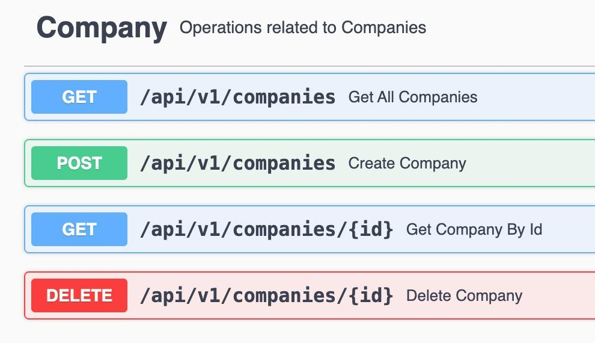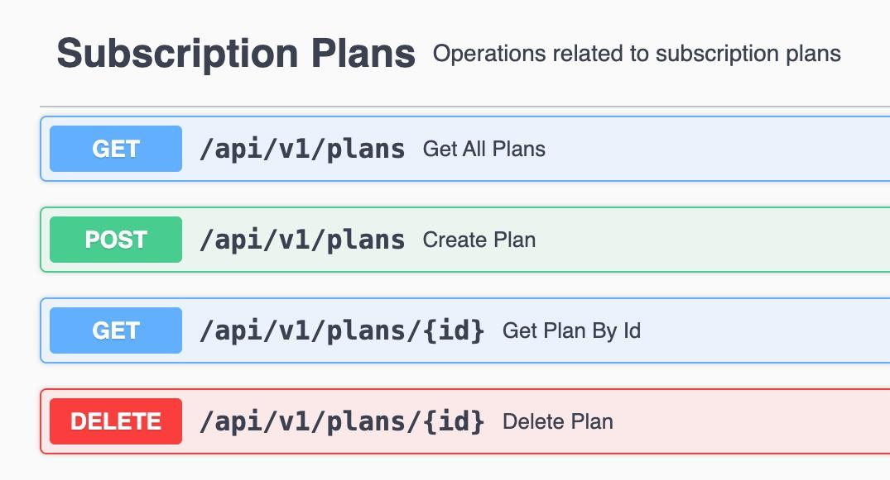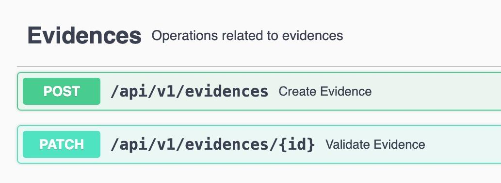

#### 7.2.1.7. Software Deployment Evidence for Sprint Review

El equipo de TalentChain logró desplegar satisfactoriamente el proyecto
en la nube con la cual se podrá evidenciar el funcionamiento del avance
de la misma.

**FrontEnd:**

Link al proyecto desplegado:
[<u>https://skillledger.netlify.app</u>](https://skillledger.netlify.app)

**Backend:**

#### 7.2.1.8. Team Collaboration Insights during Sprint

El equipo desarrolló en conjunto mediante Github aportando cada uno al
proyecto para de ese modo terminarlo lo más pronto posible cumpliendo
con las fechas predefinidas.

Backend Insights:

Frontend Insights:

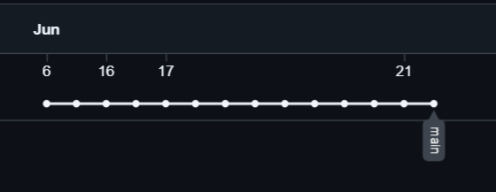

## 7.3. Validation Interviews

### 7.3.1. Diseño de Entrevistas

Validación Entrevistas

Diseño de Entrevistas

Introducción (Mencionar objetivo del proyecto SkillLedger)

Buenas noches me podría brindar su nombre, cuantos años tiene y en qué
trabaja o estudia?

Presentación de las vistas del mockup (Indicando los detalles del
mockup)

¿Te resulta claro el diseño del segmento del trabajador para subir
certificado, canjear promociones y ver ranking?

¿Consideras útil poder ver las transacciones en línea cuando un
trabajador sube un certificado?

¿Qué tan fácil o difícil te resulta agregar un certificado?

¿El diseño visual y los flujos de interacción te parecen intuitivos y
rápidos de aprender? ¿Qué mejorarías?

¿Agregarías algo más en las funcionalidades?

### 7.3.2. Registro de Entrevistas

**Segmento Empresa**

<table>
<colgroup>
<col style="width: 50%" />
<col style="width: 50%" />
</colgroup>
<thead>
<tr>
<th style="text-align: left;">Entrevista 1</th>
<th style="text-align: left;">Rosmel Gomez Benancio</th>
</tr>
<tr>
<th style="text-align: left;">Edad</th>
<th style="text-align: left;">29</th>
</tr>
<tr>
<th style="text-align: left;">Distrito</th>
<th style="text-align: left;">Lima</th>
</tr>
<tr>
<th style="text-align: left;"></th>
<th style="text-align: left;">Alexandra Cabezas considera que la
aplicación es muy intuitiva y fácil de entender para el público objetivo
que sería los trabajadores, en que es fácil de subir un certificado
académico o voluntariado entre las observaciones de mejora en el diseño
seria que pueda ser más personalizable para cada tipo de empresa..</th>
</tr>
<tr>
<th style="text-align: left;">URL de la grabación</th>
<th style="text-align: left;"><a
href="https://youtu.be/zR4g6P0ujY8"><u>https://youtu.be/zR4g6P0ujY8</u></a> 
<a
href="https://upcedupe-my.sharepoint.com/:v:/g/personal/u202011431_upc_edu_pe/EZBKP5JpJdpGuJDuKxl-nloBkKZyq6gaw_hkgfCpmfGfUA?e=8hAZoZ"><u>Entrevistas
2.mp4</u></a></th>
</tr>
<tr>
<th style="text-align: left;">Timing</th>
<th style="text-align: left;">0:00 - 8:23</th>
</tr>
</thead>
<tbody>
</tbody>
</table>

<table>
<colgroup>
<col style="width: 50%" />
<col style="width: 50%" />
</colgroup>
<thead>
<tr>
<th style="text-align: left;">Entrevista 2</th>
<th style="text-align: left;">Nicole Macedo</th>
</tr>
<tr>
<th style="text-align: left;">Edad</th>
<th style="text-align: left;">22 años</th>
</tr>
<tr>
<th style="text-align: left;">Distrito</th>
<th style="text-align: left;">Cercado de Lima</th>
</tr>
<tr>
<th style="text-align: left;">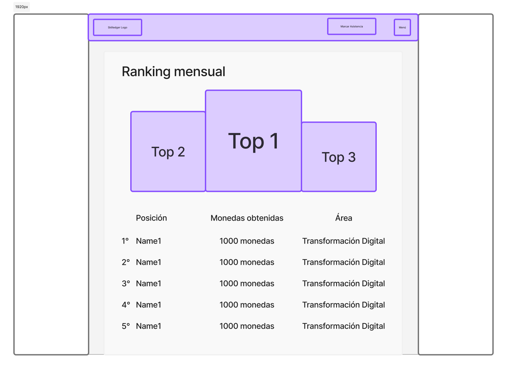</th>
<th style="text-align: left;">Nicole durante las entrevistas se mostró
asertiva y participativa durante la explicación del flujo. Nicole nos
comenta que le parece una excelente idea la propuesta del Startup y que
está muy a favor de que se puedan registrar logros a cambio de una
recompensa. Además, Nicole menciona que le gustó la interfaz, le parece
intuitiva y amigable a la vista.</th>
</tr>
<tr>
<th style="text-align: left;">URL de la grabación</th>
<th style="text-align: left;"><a
href="https://youtu.be/zR4g6P0ujY8"><u>https://youtu.be/zR4g6P0ujY8</u></a> 
<a
href="https://upcedupe-my.sharepoint.com/:v:/g/personal/u202011431_upc_edu_pe/EZBKP5JpJdpGuJDuKxl-nloBkKZyq6gaw_hkgfCpmfGfUA?e=8hAZoZ"><u>Entrevistas
2.mp4</u></a></th>
</tr>
<tr>
<th style="text-align: left;">Timing</th>
<th style="text-align: left;">8:23 - 16:14</th>
</tr>
</thead>
<tbody>
</tbody>
</table>

<table>
<colgroup>
<col style="width: 50%" />
<col style="width: 50%" />
</colgroup>
<thead>
<tr>
<th style="text-align: left;">Entrevista 3</th>
<th style="text-align: left;">Daniel García</th>
</tr>
<tr>
<th style="text-align: left;">Edad</th>
<th style="text-align: left;">22 años</th>
</tr>
<tr>
<th style="text-align: left;">Distrito</th>
<th style="text-align: left;">Breña</th>
</tr>
<tr>
<th style="text-align: left;">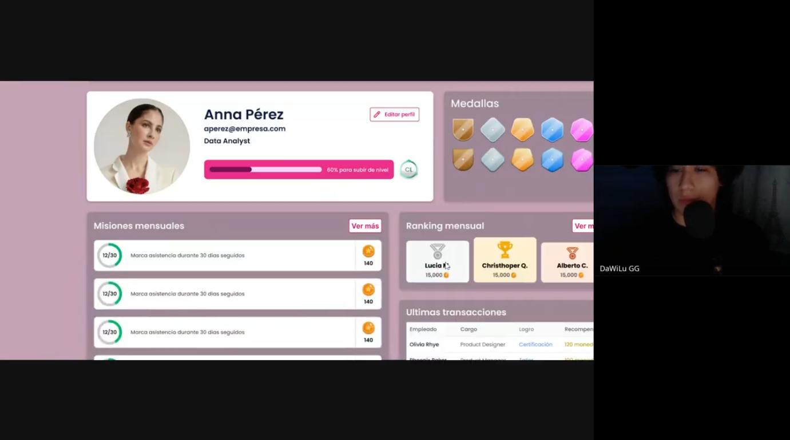</th>
<th style="text-align: left;">Daniel es un practicante de la carrera de
Ingeniería Pesquera, se mostró comprometido al interactuar con el
prototipo, realizaba preguntas acerca de las funcionalidades de los
botones, y sobre el funcionamiento de las recompensas. Daniel nos
comenta; como punto de mejora la reubicación del botón catálogo de
recompensas ya que no se logra diferenciar entre los demás componentes
de la pantalla.</th>
</tr>
<tr>
<th style="text-align: left;">URL de la grabación</th>
<th style="text-align: left;"><a
href="https://youtu.be/zR4g6P0ujY8"><u>https://youtu.be/zR4g6P0ujY8</u></a> 
<a
href="https://upcedupe-my.sharepoint.com/:v:/g/personal/u202011431_upc_edu_pe/EZBKP5JpJdpGuJDuKxl-nloBkKZyq6gaw_hkgfCpmfGfUA?e=8hAZoZ"><u>Entrevistas
2.mp4</u></a></th>
</tr>
<tr>
<th style="text-align: left;">Timing</th>
<th style="text-align: left;">16:14 - 22:51</th>
</tr>
</thead>
<tbody>
</tbody>
</table>

### 7.3.3. Evaluaciones según heurísticas

En base de las entrevistas hemos recolectado lo siguiente:

- La plataforma SkillLedger fue percibida como moderna, clara y fácil de
  usar desde el primer ingreso. La estructura visual y la navegación
  permiten al usuario comprender rápidamente su funcionamiento, incluso
  sin experiencia previa en herramientas similares.

- La interacción con los distintos módulos (registro de logros, canje de
  recompensas, visualización de rankings, etc.) Se consideró fluida e
  intuitiva, lo que facilita la adopción y el uso recurrente de la
  plataforma en el entorno laboral.

- Los usuarios valoraron positivamente la organización de la información
  en pantalla. Las visualizaciones de progreso, historial de recompensas
  y métricas personales permiten entender el impacto de su desempeño y
  fomentan la autogestión del desarrollo profesional.

- SkillLedger genera un valor tanto funcional como emocional: a nivel
  individual, los empleados sienten que su esfuerzo es visibilizado y
  recompensado de forma justa; a nivel organizacional, fortalece la
  cultura interna al promover hábitos positivos y alineación con los
  valores corporativos.

- La trazabilidad y transparencia aportadas por la tecnología blockchain
  fueron destacadas como una garantía de justicia y objetividad en los
  procesos de reconocimiento.

- Los participantes manifestaron una actitud positiva hacia el uso
  frecuente de SkillLedger, indicando que lo perciben como una
  herramienta motivadora, que no sólo recompensa, sino que también
  impulsa el crecimiento profesional y el compromiso con la empresa.

## 7.4. Video About-the-Product

## Conclusiones

- El desarrollo del capítulo introductorio permitió definir claramente
  el propósito, misión y visión de la plataforma, así como detallar la
  problemática central y su impacto en el entorno laboral. Se
  establecieron supuestos de negocio, hipótesis y estrategias Lean UX,
  aportando una base conceptual sólida. Este trabajo permitió al equipo
  comprender el valor de la propuesta desde una perspectiva estratégica
  y orientar correctamente el diseño funcional del producto.

- El análisis de los segmentos objetivos y de la competencia permitió
  enfocar la solución hacia usuarios bien definidos y diferenciar la
  propuesta frente a otras plataformas del mercado. Asimismo, el diseño
  de la arquitectura del sistema integró esos hallazgos para construir
  una solución técnica escalable, segura y orientada a la experiencia
  del usuario. Este trabajo fue clave para alinear los aspectos técnicos
  con las necesidades del mercado y usuarios.

- La etapa de needfinding permitió identificar necesidades reales de los
  usuarios a través de herramientas como user personas, empathy maps y
  task matrix. Estos insumos facilitaron una comprensión empática del
  comportamiento y motivaciones de cada segmento, lo cual fue
  fundamental para priorizar funcionalidades relevantes y definir una
  experiencia de usuario coherente con los objetivos del producto. La
  información obtenida enriqueció la perspectiva del diseño centrado en
  el usuario.

- La especificación de requisitos mediante historias de usuario y
  backlog permitió definir con precisión las funcionalidades clave del
  sistema. Se organizaron en épicas coherentes, considerando criterios
  técnicos y necesidades del negocio. Este trabajo fue esencial para
  establecer un marco estructurado de desarrollo, facilitar la
  estimación del esfuerzo y asegurar que cada funcionalidad responda a
  un objetivo concreto dentro del flujo de la aplicación.

- El diseño estratégico basado en atributos de calidad permitió tomar
  decisiones arquitectónicas fundamentadas en drivers relevantes como
  seguridad, escalabilidad y trazabilidad. A través del uso de
  microservicios y principios de Domain-Driven Design, se lograron
  separar responsabilidades y modelar bounded contexts específicos. Esta
  etapa aportó una base robusta para garantizar la mantenibilidad del
  sistema y responder de manera efectiva a los requerimientos técnicos y
  funcionales del producto.

## Bibliografía

Bagocius T. (2022, 27 de septiembre). *Event storming.* Adictos al
trabajo. Recuperado el 18 de abril del 2025, de
[<u>https://adictosaltrabajo.com/2022/09/27/event-storming/</u>](https://adictosaltrabajo.com/2022/09/27/event-storming/)

ddd-crew. (2023, 27 de diciembre). *Context mapping*. GitHub. Recuperado
el 23 de abril del 2025, de
[<u>https://github.com/ddd-crew/context-mapping</u>](https://github.com/ddd-crew/context-mapping)

ddd-crew. (2024, 20 de octubre). *Bounded context canvas*. GitHub.
Recuperado el 23 de abril del 2025, de
[<u>https://github.com/ddd-crew/bounded-context-canvas</u>](https://github.com/ddd-crew/bounded-context-canvas)

## Anexos

Github:[<u>https://github.com/TalentChain-UPC/Report---TalentChain</u>](https://github.com/TalentChain-UPC/Report---TalentChain)

Video entrevistas completo:
[<u>https://upcedupe-my.sharepoint.com/:v:/g/personal/u202112655_upc_edu_pe/EZ4eIwIzfSxBsZGsE3bONl0BcwuNRcYbwnkuKwkjp-OU_Q?e=o96iQu</u>](https://upcedupe-my.sharepoint.com/:v:/g/personal/u202112655_upc_edu_pe/EZ4eIwIzfSxBsZGsE3bONl0BcwuNRcYbwnkuKwkjp-OU_Q?e=o96iQu)

Video exposición TB1:
[<u>https://upcedupe-my.sharepoint.com/:v:/g/personal/u202112655_upc_edu_pe/EaHMFyC9WjRAqhMMpwjiIi4BFz3wdJ4lQ9cfKdfza_WtdA</u>](https://upcedupe-my.sharepoint.com/:v:/g/personal/u202112655_upc_edu_pe/EaHMFyC9WjRAqhMMpwjiIi4BFz3wdJ4lQ9cfKdfza_WtdA)

Video exposición TP:
[<u>https://upcedupe-my.sharepoint.com/:v:/g/personal/u202112655_upc_edu_pe/Eb-IAiPecqRCooHvBmsHXY8BKlsbsFt6igSYuLgW8iIC3Q?e=sUGj9f</u>](https://upcedupe-my.sharepoint.com/:v:/g/personal/u202112655_upc_edu_pe/Eb-IAiPecqRCooHvBmsHXY8BKlsbsFt6igSYuLgW8iIC3Q?e=sUGj9f)

Link Landing Page:
[<u>https://talentchain.netlify.app/</u>](https://talentchain.netlify.app/)

About the Team Video:
[<u>https://upcedupe-my.sharepoint.com/:v:/g/personal/u202112655_upc_edu_pe/ESUY2Y-eJwpJjG0swKUONY0BDHtxURRvhXNhJJ5obFBQxQ?e=9w8rMm</u>](https://upcedupe-my.sharepoint.com/:v:/g/personal/u202112655_upc_edu_pe/ESUY2Y-eJwpJjG0swKUONY0BDHtxURRvhXNhJJ5obFBQxQ?e=9w8rMm)

Entrevistas TB2:  
[<u>https://upcedupe-my.sharepoint.com/:v:/g/personal/u202011431_upc_edu_pe/EZBKP5JpJdpGuJDuKxl-nloBkKZyq6gaw_hkgfCpmfGfUA?e=8hAZoZ</u>](https://upcedupe-my.sharepoint.com/:v:/g/personal/u202011431_upc_edu_pe/EZBKP5JpJdpGuJDuKxl-nloBkKZyq6gaw_hkgfCpmfGfUA?e=8hAZoZ)

Video Expo TB2:
[<u>https://upcedupe-my.sharepoint.com/:v:/g/personal/u202112655_upc_edu_pe/Ef6JFSwaedBIj_Lz9Ya1xooBKqEOJzPUO9XTqdKf3JzLZA?e=WoFDL5</u>](https://upcedupe-my.sharepoint.com/:v:/g/personal/u202112655_upc_edu_pe/Ef6JFSwaedBIj_Lz9Ya1xooBKqEOJzPUO9XTqdKf3JzLZA?e=WoFDL5)
